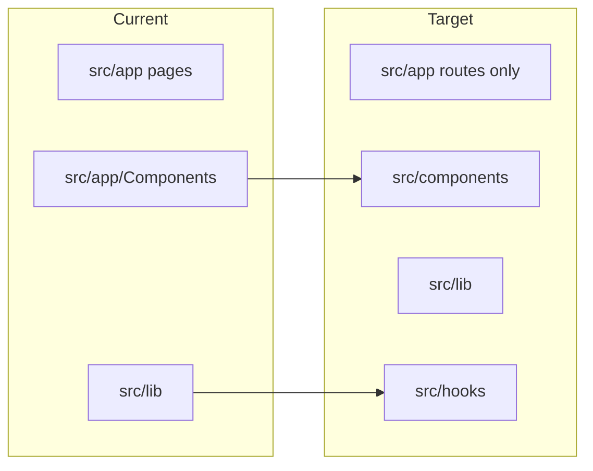

# Restructure codebase to match `.cursor/rules.mdc`

## Gap summary (current vs rules)

| Rule area                       | Current state                                                                                                                                                                                                                                                                 | Target                                                                                                             |
| ------------------------------- | ----------------------------------------------------------------------------------------------------------------------------------------------------------------------------------------------------------------------------------------------------------------------------- | ------------------------------------------------------------------------------------------------------------------ |
| **Shared UI location**          | Reusable UI under `[src/app/Components/](src/app/Components/)`                                                                                                                                                                                                                | `[src/components/](src/components/)` by domain; `app/` keeps routes, layouts, thin `page.tsx` only                 |
| **Server vs client**            | Home and blogs use client components that `fetch` in `useEffect` (`[PortfolioSection](src/app/Components/PortfolioSection/PortfolioSection.tsx)`, `[FeaturedArticles](src/app/Components/FeaturedArticles/FeaturedArticles.tsx)`, `[blogs/page.tsx](src/app/blogs/page.tsx)`) | Fetch in Server Components / route handlers; pass data into small client islands only where needed (interactivity) |
| **Hooks**                       | `[src/lib/hooks/useDebounce.ts](src/lib/hooks/useDebounce.ts)`                                                                                                                                                                                                                | `[src/hooks/](src/hooks/)` per rules                                                                               |
| **Non-route code under `app/`** | `[src/app/lib/mdx.ts](src/app/lib/mdx.ts)`, `[src/app/utils/](src/app/utils/)`                                                                                                                                                                                                | Move to `[src/lib/](src/lib/)` (or `src/utils/` for pure helpers)                                                  |
| **File size**                   | e.g. `ArticleEditor.tsx` ~314 lines, `PortfolioForm.tsx` ~259 lines                                                                                                                                                                                                           | Split into subcomponents / helpers; target <200 lines per file, components <100 lines where practical              |
| **Naming**                      | `ReviewComponet`, `Joke&AdviceComponent` (ampersand in path), `BlogCard.tsx/BlogCard.tsx`                                                                                                                                                                                     | Rename folders for clarity and tooling-friendly paths                                                              |

---

## Phase 1 — Folder layout (mechanical, high impact)

**Goal:** Match “reusable components in `components/` or `src/components/`” without changing behavior.

1. Create `[src/components/](src/components/)` with domain-aligned folders, for example:

- `layout/` or `nav/` — Navigation
- `hero/`, `portfolio/`, `featured-articles/`, `reviews/`, `engineering-philosophy/`, `tech-stack/`, `terminal-loader/`
- `admin/` — admin forms and lists
- `blog/` — blog cards, wrappers, post client
- `animations/` — AnimatedSection, etc.
- `ui/` — shadcn-style primitives (can stay co-located or mirror current structure)

1. Move everything from `[src/app/Components/](src/app/Components/)` into the new tree; delete the old folder when done.
2. Update all imports project-wide (`@/app/Components/...` → `@/components/...`). `[@/`_ maps to `./src/_](tsconfig.json)`— no tsconfig change required if imports use`@/components/...`.
3. Update `[next.config.ts](next.config.ts)` only if the webpack `resolve.alias` for `@` needs adjustment (today it points at `src`; keep consistent).
4. Run `bun run build` and smoke-test critical routes (/, /blogs, /admin, /About).

**Risk:** Large diff; use a single focused PR and rely on TypeScript + build to catch missed imports.

---

## Phase 2 — Hooks and shared lib hygiene

**Goal:** Match “Hooks in `hooks/` or `src/hooks/`” and keep `lib/` for services.

1. Move `[src/lib/hooks/useDebounce.ts](src/lib/hooks/useDebounce.ts)` → `src/hooks/useDebounce.ts` (or split if multiple hooks later).
2. Move `[src/app/lib/mdx.ts](src/app/lib/mdx.ts)` → `src/lib/mdx/` or `src/lib/content/mdx.ts` and fix imports (e.g. API routes, blog admin).
3. Move `[src/app/utils/skills.ts](src/app/utils/skills.ts)` and `[src/app/utils/reviews.ts](src/app/utils/reviews.ts)` into `src/lib/` or `src/constants/` depending on whether they are data vs helpers; update `[About/page.tsx](src/app/About/page.tsx)` imports.
4. Remove empty `src/app/lib` / `src/app/utils` if no longer needed.

---

## Phase 3 — Server-first data on the homepage (rules: fetch in Server Components)

**Goal:** “Fetch data in Server Components whenever possible; pass data down to Client Components via props.”

Today `[src/app/page.tsx](src/app/page.tsx)` is a Server Component but children fetch `/api/` on the client.

**Approach:**

1. In `page.tsx` (or a small `lib/data` aggregator), call existing server functions `[getAllPortfolioItems](src/lib/data/portfolio.ts)`, `[getAllArticles](src/lib/data/articles.ts)`, `[getAllReviews](src/lib/data/reviews.ts)` — **not** HTTP from the server (avoids duplicate stack and matches “defined layer” in-process).
2. Pass serialized props into thin client wrappers:

- Replace or slim `PortfolioSection` / `FeaturedArticles` / `ReviewComponent` so they receive `initialItems` / `initialPosts` / `initialReviews` and only use client state for progressive enhancement if needed (or keep them presentational).

1. Keep API routes for external clients if desired; homepage no longer depends on them for first paint.
2. Revalidate: align with existing `[revalidate](src/app/page.tsx)` on the page.

**Note:** Ensure DB is available at build/request time (same constraints as today). Handle errors at the page level per rules (meaningful messages, no silent failure).

---

## Phase 4 — Blogs and About (incremental)

**Goal:** Reduce full-page `"use client"` where the rules prefer server shells.

1. `[src/app/blogs/page.tsx](src/app/blogs/page.tsx)` — server-fetch article list, client only for search/filter if added later.
2. `[src/app/blogs/[slug]/page.tsx](src/app/blogs/[slug]/page.tsx)` — server-fetch article by slug where possible; keep MDX client boundary minimal.
3. `[src/app/About/page.tsx](src/app/About/page.tsx)` — split into server layout + small client sections for animations if `"use client"` is only needed for framer-motion islands.

---

## Phase 5 — Split oversized components and fix naming

**Goal:** Honor “>200 lines refactor” and “components <100 lines” where feasible.

1. **ArticleEditor** (~314 lines): extract toolbar, preview pane, or field groups into `src/components/admin/article-editor/*.tsx`.
2. **PortfolioForm** (~259 lines): extract field groups (metadata vs links vs extended fields) into subcomponents.
3. **Navigation** (~166 lines): extract mobile drawer into `NavigationMobile.tsx`.
4. **Rename** (separate small PRs to ease review):

- `ReviewComponet` → `ReviewComponent`
- `Joke&AdviceComponent` → `joke-advice` or `JokeAdvice` (avoid `&` in paths)
- Flatten `BlogCard.tsx/BlogCard.tsx` → `blog-card/BlogCard.tsx`

---

## Phase 6 — Consistency pass (optional polish)

1. Import order per rules (external → internal → types) in touched files.
2. Audit for silent `catch` blocks; align with “do not silently fail” where user-visible.
3. Document in-repo (only if you explicitly want it later): the rules say do not create new `.md` files without approval — skip README churn unless requested.

---

## Suggested order and PR boundaries

| PR    | Scope                                               |
| ----- | --------------------------------------------------- |
| **A** | Phase 1 (move to `src/components/`, import updates) |
| **B** | Phase 2 (hooks + lib + utils moves)                 |
| **C** | Phase 3 (homepage server data)                      |
| **D** | Phase 4 (blogs/About)                               |
| **E** | Phase 5 (splits + renames)                          |

---

## Out of scope / decisions to confirm later

- **Full** migration of every admin screen to server actions-only UI is not required by the rules excerpt; focus on public pages first.
- `**server/services/` is optional per rules; only add if `src/lib/data` and `src/lib/actions` become crowded.

