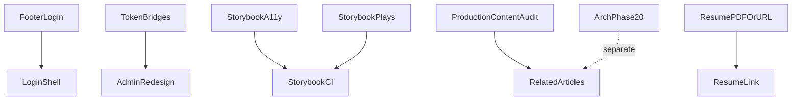

# Deferred Work Roadmap (Post–Design System V1 + Visual Redesign)

**Planning only.** Does not reopen [engineering_design_system.plan.md](.cursor/plans/finished plans/engineering_design_system.plan.md) or [visual_redesign_plan_472cc238.plan.md](.cursor/plans/finished plans/visual_redesign_plan_472cc238.plan.md).

**Sources audited:** [docs/design-system.md](docs/design-system.md), [docs/design-system-changelog.md](docs/design-system-changelog.md), [docs/ARCHITECTURE.md](docs/ARCHITECTURE.md), completed plans, and current `src/` implementation.

**Note:** MDX code-block rendering was fixed separately (changelog: “MDX code block rendering fix”); it is **not** part of this backlog.

---

## 1. Deferred-item inventory

| ID | Item | Documented in |
|----|------|----------------|
| D01 | Footer **Login** link | User roadmap + login route exists at `/login` |
| D02 | Login route visual shell | design-system.md deferred table; visual redesign §17 |
| D03 | Related Articles on case studies | design-system.md, case-study-layout.ts, DS V1 Phase 6 |
| D04 | Dedicated **ProjectTechnologies** section | design-system.md, case-study-layout.ts; component exists unused |
| D05 | Legacy token bridge aliases | tokens.css, design-system.md |
| D06 | Storybook `@storybook/addon-a11y` | design-system.md, DS V1 Phase 10 |
| D07 | Storybook play / `@storybook/test` | design-system.md, gallery stories manual checklist |
| D08 | `build-storybook` in CI | design-system.md, visual redesign out-of-scope |
| D09 | Admin shell full redesign | design-system.md, visual redesign |
| D10 | Resume PDF / nav link | design-system.md, visual redesign |
| D11 | Contact destination expansion (mailto) | visual redesign Phase 0 — LinkedIn-only retained |
| D12 | Extra `jsx-a11y` ESLint rules at error severity | eslint.config.mjs (minimatch@10 blocker) |
| D13 | Architecture “Future Refactors” (V3/Phase 20) | ARCHITECTURE.md — `img` drop, editor legacy fields, draft preview, autosave |
| D14 | Rejected patterns (`TechnologyBadgeList`, `FeatureChecklist`) | design-system.md — **not backlog** (explicit rejections) |

---

## 2. Classification table (A / B / C / D)

| ID | Item | Class | Rationale |
|----|------|-------|-----------|
| D01 | Footer Login link | **A** | Single-file change; clear IA; no auth changes |
| D02 | Login shell polish | **A** (stretch **B** if footer-on-login added) | Mostly presentation; route already uses shadcn + `bg-background` |
| D05 | Legacy token bridges | **A** | **Zero runtime consumers** outside `tokens.css` (repo-wide grep) |
| D06 | Storybook a11y addon | **B** | Pilot install + story smoke; dependency verification needed |
| D07 | Storybook play tests | **B** | Target 2–3 high-behavior stories only |
| D08 | Storybook CI | **B** | CI policy decision; optional non-blocking job |
| D12 | jsx-a11y ESLint expansion | **B** | Coupled to minimatch@10 + plugin compatibility |
| D03 | Related Articles | **D** (conditional **B** after content audit) | No project↔article canonical data; heuristic-only |
| D04 | ProjectTechnologies section | **D** | Duplicates summary badges; no structured stack model |
| D09 | Admin redesign | **C** | Different UX goals; multi-route surface |
| D10 | Resume integration | **D** | No asset in `public/` (grep: no resume files) |
| D11 | Contact mailto expansion | **D** | Explicitly retained LinkedIn-only |
| D13 | Architecture Phase 20 refactors | **C** | Platform/schema work, not presentation polish |
| D14 | Rejected patterns | — | Do not implement |

---

## 3. Current-state findings (per item)

### D01 — Footer Login link
- **Current:** [SiteFooter.tsx](src/components/SiteFooter/SiteFooter.tsx) exposes `navigationLinks` (Home, Work, About, Writing), external “Get in touch”, then GitHub/LinkedIn. No `/login`.
- **Why deferred:** Public redesign scoped nav/footer to visitor journeys; admin auth intentionally secondary.
- **Value now:** Low-friction path to existing admin login without nav clutter.

### D02 — Login shell
- **Current:** [login/page.tsx](src/app/login/page.tsx) — centered card, `bg-background`, shadcn `Button`/`Input`/`Label`, raw `h1`, no `SiteFooter`, no `Navigation`, no `Container`/`Heading`/`Surface`.
- **Why deferred:** Auth surface excluded from visual redesign.
- **Value now:** Visual cohesion with Candidate C tokens (already flow via shadcn `--primary`); reduces “foreign app” feel.

### D03 — Related Articles
- **Current:** No section in [case-study-layout.ts](src/lib/portfolio/case-study-layout.ts). Schema: [Article](prisma/schema.prisma) has `tags[]`; [Portfolio](prisma/schema.prisma) has `category[]` — **no FK or join table**. No MDX frontmatter project links in legacy posts.
- **Why deferred:** DS V1 — “no schema consumer on project pages.”
- **Value now:** Moderate **only if** tag overlap between `category` and `tags` is meaningful in production data (requires content audit, not code assumption).

### D04 — ProjectTechnologies
- **Current:** [ProjectSummary.tsx](src/components/Portfolio/ProjectSummary.tsx) shows same `uniqueCategories(project.category)` badges. [ProjectTechnologies.tsx](src/components/Portfolio/ProjectTechnologies.tsx) duplicates badge list under `#technologies` — **not wired** in `CaseStudyPage`.
- **Why deferred:** Summary badges deemed sufficient; categories are flat strings (not frontend/backend/infra layers).
- **Value now:** Low — dedicated section would largely repeat summary without new data.

### D05 — Legacy token bridges
- **Current:** 10 aliases in [tokens.css](src/design-system/tokens/tokens.css) (`--site-bg-color`, `--blog-card-*`, `--heading-color`, `--skill-bg`, etc.).
- **Consumers:** **None** in `src/` (only definitions). Public components use Tailwind semantic classes (`text-foreground`, `bg-background`, etc.).
- **Why deferred:** Admin/MDX compatibility caution before audit.
- **Value now:** Reduces token confusion; near-zero migration risk.

### D06 — Storybook a11y
- **Current:** Storybook **10.5.10**; `@storybook/addon-docs` only. Manual a11y notes in gallery stories. ESLint runs limited `jsx-a11y` rules.
- **Why deferred:** minimatch@10 override + addon compatibility uncertainty (DS V1 Phase 10).
- **Value now:** Catches presentation regressions in isolated catalog; complements (not replaces) production a11y.

### D07 — Storybook interaction testing
- **Current:** Manual checklist in [EngineeringGallery.stories.tsx](src/components/patterns/EngineeringGallery.stories.tsx). Unit tests cover gallery **helpers** (`engineering-gallery-navigation`, `gallery-lightbox-view`) but not focus trap / keyboard UX.
- **Why deferred:** `@storybook/test` not installed.
- **Value now:** High for **GalleryLightbox** + **Dialog**; low for static patterns.

### D08 — Storybook CI
- **Current:** [ci.yml](.github/workflows/ci.yml) runs audit, lint, prisma migrate, `next build`. **No** `build-storybook`, **no** `bun test`.
- **Why deferred:** Dev-only catalog; build time concern.
- **Value now:** Catches Storybook compile breaks when stories drift from components.

### D09 — Admin redesign
- **Current:** [AdminShellClient.tsx](src/components/Admin/layout/AdminShellClient.tsx) — functional sidebar shell using some `ui/Button`; editors use TipTap + forms. Opportunistic `Dialog`, `EmptyState`, form primitives already adopted.
- **Why deferred:** V1 scoped to public portfolio; internal-tool UX differs.
- **Value now:** Maintainability if editor/list flows feel inconsistent; not required for public site quality.

### D10 — Resume
- **Current:** No resume file in `public/`. Nav/hero/footer have no Resume link (visual redesign explicit deferral).
- **Value now:** Blocked until real PDF or canonical URL exists.

### D11 — Contact mailto
- **Current:** [CONTACT_HREF](src/components/Nav/navigationLinks.ts) → LinkedIn only.
- **Value now:** Low; explicit product decision to defer.

### D12 — jsx-a11y ESLint
- **Current:** [eslint.config.mjs](eslint.config.mjs) documents minimatch@10 blocks full jsx-a11y at error severity.
- **Value now:** Production lint depth; orthogonal to Storybook a11y addon.

### D13 — Architecture Phase 20
- **Current:** ARCHITECTURE.md lists `img` retirement, legacy editor fields on public site, draft preview, autosave, etc.
- **Value now:** Platform evolution — **not** presentation-layer polish.

---

## 4. Dependencies

| Item | Depends on |
|------|------------|
| D01 | None |
| D02 | None (optional: D01 for discoverability) |
| D03 | Production tag/category overlap audit; **no schema** if heuristic |
| D04 | Structured tech metadata **or** accept duplication — neither exists |
| D05 | None |
| D06–D08 | Dependency pilot (`addon-a11y`, `@storybook/test`); CI time budget |
| D09 | Token cleanup (D05) helpful but not blocking |
| D10 | Real resume asset or canonical external URL |
| D13 | Product/schema decisions |

---

## 5. Recommended implementation order

1. **D01** Footer Login link  
2. **D02** Login shell polish  
3. **D05** Remove dead legacy token aliases  
4. **D06** Storybook a11y pilot (1–2 stories)  
5. **D07** Play tests: Dialog + GalleryLightbox  
6. **D08** Storybook CI decision + optional job  
7. **D12** jsx-a11y ESLint (if minimatch path clear)  
8. **D03** Related Articles — **only after** content audit approves heuristic  
9. **D09** Admin redesign — **separate initiative**, not this roadmap’s Phase 3  
10. **D10** Resume — when asset exists  

**Do not schedule:** D04 (keep summary badges), D11 (LinkedIn-only), D14 (rejected patterns).

---

## 6. Prioritization buckets

### Do soon (low-risk / high-value)
- D01 Footer Login  
- D02 Login shell (light pass)  
- D05 Legacy token alias removal  

### Do when dependency exists
- D03 Related Articles (content/tag audit)  
- D10 Resume (asset/URL)  
- D12 Full jsx-a11y ESLint (plugin + minimatch resolution)  

### Separate future initiatives
- **D09 Admin shell redesign** — multi-route internal product; own plan  
- **D13 Architecture Phase 20** — schema, preview routes, data model cleanup  

### Keep deferred
- D04 ProjectTechnologies dedicated section  
- D11 Contact mailto expansion  
- D14 Rejected shared patterns  

---

## 7. Footer Login placement recommendation

**Recommended placement:** [SiteFooter.tsx](src/components/SiteFooter/SiteFooter.tsx) — right column, inside the existing `nav` `Inline` row, **after** the “Get in touch” external link.

**Pattern:**
- Label: `Login`
- `href="/login"`
- Same classes as footer nav links: `text-sm text-muted-foreground no-underline hover:text-ds-accent-hover`
- **Not** in `navigationLinks` (keeps primary nav composer clean)
- **Not** in the social `Inline` row (GitHub/LinkedIn)
- **Not** in [Navigation.tsx](src/components/Nav/Navigation.tsx)

This mirrors “internal access in footer, demoted vs public IA” without CTA styling.

---

## 8. Login shell scope recommendation (when approved)

**Inherit from public platform (yes):**
- `bg-background` canvas (already present)
- Candidate C via existing shadcn token mapping
- [Container](src/components/layout/Container.tsx) + narrow max-width
- [Heading](src/components/typography/Heading.tsx) for title
- [Surface](src/components/layout/Surface.tsx) or elevated card for form panel
- [Text](src/components/typography/Text.tsx) muted description
- Optional “Back to portfolio” [Link](src/components/ui/link.tsx) to `/` (low emphasis)

**Do not add:**
- Full public `Navigation` / marketing sections
- `SiteFooter` with full platform nav (optional single-line home link only)
- Auth flow, API route, or NextAuth changes

---

## 9. Related Articles recommendation

**Recommendation: remain deferred (D)** unless a quick **production content audit** shows consistent overlap between `Portfolio.category` and `Article.tags`.

**If audit passes**, treat as mini-initiative (**B**):
- Lib helper: match published articles by shared tags (case-insensitive), exclude generic tags, cap at 2–3
- Domain section component + `case-study-layout` registry entry **after** `#links` or before footer band
- Reuse [ArticleCard](src/components/patterns/ArticleCard.tsx)
- **No** Prisma migration, **no** recommendation engine, **no** new relationship table

**If audit fails:** keep deferred until explicit `relatedArticleSlugs` (or similar) is a product requirement.

---

## 10. ProjectTechnologies recommendation

**Recommendation: keep current implementation (D)** — improve summary only if needed.

Evidence: `ProjectTechnologies` renders the same flat `category[]` badges as `ProjectSummary`; schema has no layered stack fields. A dedicated section would not add frontend/backend/database semantics without new data.

**Optional micro-improvement (A, only if touching case studies):** refine summary badge grouping/label — **not** a new section or pattern.

---

## 11. Legacy token cleanup recommendation

**Recommendation: independent A task, do not wait for admin redesign.**

| Alias | Consumers | Replacement | Risk |
|-------|-----------|-------------|------|
| All 10 legacy aliases in `tokens.css` | **0** in repo | Tailwind / `--ds-*` / shadcn vars | Very low |

**Process:** delete legacy block in both `:root` and `.dark`, run build + Storybook smoke, update design-system.md deferred table.

---

## 12. Storybook recommendations

### A11y (D06)
- **Pilot** `@storybook/addon-a11y` on Storybook 10.5.10 with repo’s minimatch override
- Start with `UI/Dialog`, `Patterns/GalleryLightbox`, `UI/Button`
- If install conflicts: remain deferred with documented blocker

### Plays (D07)
- Add `@storybook/test` only for:
  - **Dialog** — open, focus trap, Escape close
  - **GalleryLightbox** — prev/next keys, Escape, zoom toggle (controlled story)
- Skip NavigationMobile (E2E-heavy), static cards, token swatches

### CI (D08)
- **Recommendation:** **non-blocking CI validation** — add `npm run build-storybook` as separate workflow job or CI step with `continue-on-error: false` but **not** gating merges on a11y scores
- Alternative: scheduled weekly build if runtime is problematic
- **Not recommended:** required gate on full a11y pass until addon proven stable

---

## 13. Admin redesign (high-level only)

**Assessment:** Admin is **functional** with partial primitive reuse; visual language is utilitarian sidebar + dense forms, not misaligned enough to block public launch.

**Classify as C — separate “Admin Experience” initiative** if pursued:
- Likely scope: shell chrome, list pages, editor layout rhythm, confirm flows, media picker — **not** public `SectionBand` mimicry
- Different priorities: density, keyboard workflows, error states, table scanability
- Estimate: multi-week mini-program (not a single phase in this roadmap)

---

## 14. Resume integration (future)

**Status:** No `public/` resume asset — **keep deferred.**

**When asset exists (A/B):**
- **Preferred:** footer link (same row as social or nav footer group), restrained `text-sm muted`
- **Secondary:** About page secondary link
- **Avoid:** primary nav, hero CTA, accent button treatment

---

## 15. Phased roadmap (small)

### Phase 0 — Audit gates (no code)
- Confirm production DB: portfolio `category` vs article `tags` overlap (D03 gate)
- Pilot Storybook addon installs locally (D06/D07 gate)
- Confirm CI time budget for `build-storybook` (D08 gate)

### Phase 1 — Small public/auth polish
- D01 Footer Login link (placement per §7)
- D02 Login shell light integration (per §8)
- Validation: `/login`, footer link, light/dark, mobile

### Phase 2 — Design-system / Storybook technical debt
- D05 Remove dead legacy token aliases + doc update
- D06 Storybook a11y pilot (if Phase 0 pilot passes)
- D07 Play tests for Dialog + GalleryLightbox
- D08 Non-blocking `build-storybook` CI job (optional)
- D12 jsx-a11y ESLint expansion (only if minimatch path resolved)

### Phase 3 — Case-study/content (only if Phase 0 audit approves)
- D03 Related Articles via tag overlap helper + layout registry + tests
- **Skip** D04 ProjectTechnologies

### Phase 4 — Validation and documentation
- Update [design-system.md](docs/design-system.md) deferred table
- Changelog entries for shipped items
- `lint`, `tsc`, `bun test`, `build`, optional `build-storybook`

**Explicitly out of phases:** D09 Admin redesign, D13 Architecture Phase 20, D10 Resume (until asset), D11 mailto.

---

## 16. Risks and unresolved decisions

| Risk / decision | Notes |
|-----------------|-------|
| Related Articles relevance | Heuristic tags may produce empty or weak sets on many case studies |
| Storybook addon + minimatch@10 | Must verify in Phase 0; may stay deferred |
| CI scope creep | Current CI does not run `bun test`; adding Storybook + tests increases feedback time — decide consciously |
| Login discoverability vs security | Footer link is low emphasis; acceptable for single-admin portfolio |
| Admin token cleanup timing | Safe now (no consumers); admin redesign may introduce new token needs independently |
| Content architecture | Any explicit project↔article mapping is **Phase 20 / separate product work**, not this roadmap |

---

## 17. Final recommendation

Proceed with a **short 4-phase follow-up** focused on:

1. **Footer Login + login shell polish** (immediate, low risk, clear IA win)  
2. **Dead token alias removal** (trivial, improves token clarity)  
3. **Storybook quality pilot** (a11y + selective plays + optional CI build) — gated on dependency check  

**Defer** ProjectTechnologies section, resume, mailto contact, and admin redesign.

**Gate** Related Articles behind a production content audit; do not add schema for presentation alone.

**Track separately:** Admin Experience initiative (D09) and Architecture Phase 20 refactors (D13).

This keeps the roadmap **small**, avoids reopening completed programs, and does not turn every deferred line into its own phase.
