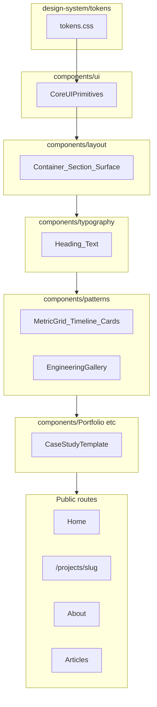
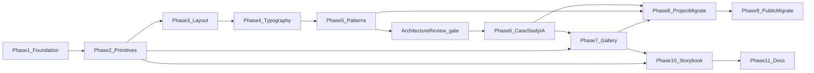

# Engineering Platform Design System — Implementation Plan (v1.3)

**Repository:** This standalone portfolio codebase only. Authoritative workflow: [`.cursor/rules.mdc`](.cursor/rules.mdc). No references to external CRM repos.

**System type:** Public **engineering portfolio / presentation platform** with admin content tooling — **not** a generic CMS, **not** an enterprise internal application, and **not** a second CRM.

**Primary customer:** Public visitors reading case studies, articles, and the home narrative. Admin consumes shared primitives opportunistically; admin shell redesign is out of scope.

**North star:** A visitor cannot name “the design system,” but the site feels cohesive, polished, and consistent—especially home and project case studies.

**Implementation status:** Planning complete (v1.3 operational refinement). **No implementation has begun** until explicit phase approval.

**Portfolio scope (non-negotiable):** This program borrows **engineering discipline** from CRM design-system work—not CRM **scale** or **complexity**. The portfolio stays lightweight, maintainable, server-first, and presentation-focused. Do not introduce unnecessary service layers, enterprise-only infrastructure, or over-generalized APIs. Consistency is the goal, not complexity.

### Enterprise discipline without enterprise complexity

This design-system effort intentionally adopts practices commonly found in larger engineering organizations—applied **proportionally** to a public portfolio:

| Adopted (proportionally) | Explicitly **not** adopted |
|--------------------------|----------------------------|
| Review gates + Architecture Review | Release trains |
| Semantic tokens | Formal RFC bureaucracy |
| Component contracts | Design token build pipelines |
| Accessibility standards | Package publishing / monorepo DS packages |
| Storybook (dev-only) | Dedicated design-system teams or governance committees |
| Architecture boundaries (ESLint) | Cross-repository dependency management |
| Performance budget | Semantic-version automation |
| Deletion discipline | Enterprise observability for UI primitives |
| Change history (changelog doc) | Component governance committees |

**Goal:** Operate one level below enterprise scale while retaining enterprise-quality engineering habits—not replicate enterprise infrastructure.

**Guiding principles:**

- Consistency over novelty; composition over inheritance; server-first; accessibility by default.
- Keep Tailwind + existing CSS Modules where they still earn their place; no styled-components / CSS-in-JS.
- Do **not** recreate or import the CRM design system.

### Extend before Create

Before introducing a new design-system component, evaluate whether the functionality belongs as:

- a **variant** of an existing primitive
- a **slot** on an existing component
- **composition** of existing primitives

**Before creating ANY new component, ask:**

- Can **Button** gain a variant?
- Can **Section** gain a prop?
- Can **Surface** gain a slot?
- Can an existing **pattern** compose this?

Only create a new component if the answer is genuinely **no**.

Avoid multiple components that solve the same problem.

**Preferred**

```tsx
<Button />
<Button size="icon" />
<Button variant="outline" />
```

**Avoid**

```tsx
HeroButton
GalleryButton
ProjectButton
ActionButton
```

Apply this rule in Phase 2 (icon controls via `Button` before a standalone icon component) and in Phase 5 (domain cards vs mega-configurable `Card`).

### Lightweight by Design

The portfolio is **not** intended to become another enterprise application. It is expected to remain **significantly smaller** than the CRM codebase and component surface area.

Every abstraction should have **2–3 legitimate consumers** before being introduced—and should **reduce maintenance burden**, not add files for hypothetical futures.

- Avoid abstractions created only because they *might* be useful later.
- Favor **clarity over flexibility**.
- The design system improves consistency and maintainability; it does **not** maximize component count.

### Domain-first Composition

Favor **domain components** composed from primitives over highly configurable generic components.

**Preferred**

```tsx
<ProjectCard project={item} />
```

**Avoid**

```tsx
<Card variant="portfolio" layout="project" mode="engineering" />
```

Patterns (`MetricGrid`, `Timeline`) are allowed when multiple domains share the same presentation; domain wrappers (`ProjectGallery` → `EngineeringGallery`) keep portfolio-specific mapping out of patterns.

### Preserved architecture (V1 — do not introduce)

Borrow CRM **process** (review gates, deletion budget, layer boundaries)—not CRM **infrastructure**:

| Do **not** add in V1 | Why |
|---------------------|-----|
| Plugin / registry architecture for components | Portfolio-scale DS lives in-repo; no package ecosystem |
| Design-system package publishing or monorepo assumptions | Single Next.js app |
| Component generators or runtime theme engines | Tokens in CSS + `next-themes` suffice |
| Enterprise service layers for UI | Presentation stays in `components/` |
| Overly generic configuration APIs (`<Card columns={n} mode={...} />`) | Domain-first composition |

---

## 1. Program Architecture

### Layer model



### Folder targets (introduced incrementally)

| Layer | Path | ESLint boundary (Phase 2–3) |
|-------|------|-----------------------------|
| Tokens | `src/design-system/tokens/` | `design-system` — no imports from `app`, `data`, `db` |
| Primitives | `src/components/ui/` (existing) | `ui` — presentation only |
| Layout | `src/components/layout/` | `layout` — no data/db |
| Typography | `src/components/typography/` | `typography` — no data/db |
| Patterns | `src/components/patterns/` | `patterns` — no data/db, no Prisma |
| Domain | `src/components/Portfolio/`, etc. | maps DB → presentation contracts |
| IA config | `src/lib/portfolio/case-study-layout.ts` (Phase 6) | business layout rules, not UI |

### Dependency chain



**Architecture Review** (between Phase 5 and Phase 6) is a **review gate**, not a numbered implementation phase.

**Gallery (Phase 7)** depends on **Core UI Primitives (Dialog, icon-sized Button)** from Phase 2 and **Case Study IA (Phase 6)** but does **not** merge with Phase 6.

---

## 2. Current State (baseline for reviewers)

| Area | Today | Pain |
|------|-------|------|
| Tokens | Dual stack: shadcn `oklch` in [`globals.css`](src/app/globals.css) + legacy `--site-bg-color`, `--blog-card-border`, `--card-inner-bg` | Project pages read darker/flatter than home |
| Global CSS | `button { width: 200px; height: 50px }` fights [`Button`](src/components/ui/button.tsx) | Broken button sizing outside shadcn overrides |
| Project styles | [`project-page-styles.ts`](src/lib/portfolio/project-page-styles.ts) TS string map | Duplicates Tailwind; hard to migrate |
| Primitives | Button, Card, Badge, Tabs, Input, Textarea, Label in `ui/` | No Dialog, IconButton, Spinner, Alert |
| Modals | [`ConfirmDialog`](src/components/Admin/shared/ConfirmDialog.tsx), [`MediaPicker`](src/components/Admin/media/MediaPicker.tsx) | Bespoke overlays; no shared focus model |
| Gallery | [`ProjectGallery.tsx`](src/components/Portfolio/ProjectGallery.tsx) — 2-col grid, `object-cover`, no lightbox | Screenshots too small to inspect |
| Case study order | Ad hoc in [`projects/[slug]/page.tsx`](src/app/projects/[slug]/page.tsx) | No canonical IA document |
| CSS Modules | Active: About, blog post, animations; **dead:** PortfolioSection, BlogCard, ReviewComponent, blogPage modules | Dead files add noise |
| Storybook | Not installed | ESLint already ignores `storybook-static/**` |
| ESLint boundaries | `components`, `lib`, `app` — no `layout`/`patterns`/`design-system` | New folders unprotected until Phase 2–3 |

---

## 3. Phase Rules (all phases)

Every phase MUST:

1. Have **one primary objective**
2. List dependencies on prior phases (no forward dependencies)
3. Define **in-scope** and **explicit out-of-scope** work
4. Include **deletion goal**, validation checklist, and acceptance criteria
5. Preserve unrelated production behavior
6. Not refactor unrelated code merely because it is nearby
7. Follow [`.cursor/rules.mdc`](.cursor/rules.mdc) — services, file placement, lint fixes in source
8. End with **STOP FOR REVIEW** + **Review Questions** + **Phase Retrospective** — no next phase without explicit approval

**Phase Retrospective (every implementation phase):** After Review Questions, capture learnings using the standard retrospective block. Retrospectives improve the **next** phase’s execution—they do **not** automatically change roadmap scope, order, or acceptance criteria. If a retrospective recommends editing a later phase, report the recommendation with rationale and wait for explicit approval before updating the plan.

**Deletion budget:** Whenever a primitive or pattern replaces an older implementation, **remove or explicitly deprecate** the legacy path in the same phase. Avoid parallel implementations. The codebase should become **smaller and cleaner** after each phase—not larger with duplicate UI paths.

- **Every implementation phase should remove more legacy code than it adds** (net reduction in duplicated styling, dead modules, parallel modals, or ad hoc layout strings).
- Avoid temporary compatibility layers unless technically required for a single phase boundary—and document the removal phase.
- When a component or style path has been migrated successfully, **delete the old implementation in the same phase** whenever practical.

**After each phase completes, report:**

1. Tests run (if applicable)
2. `npx tsc` / build typecheck
3. `npm run lint`
4. Modified files + rationale
5. Schema / dependency / env changes
6. Manual verification performed
7. Known risks and deferred items

**Dependency changes** (Storybook, Radix Dialog package additions): require explicit user approval before `npm install`.

**ESLint config changes** (`eslint.config.mjs`): allowed in **Phase 2 and Phase 3 only** for boundary architecture—not deferred to documentation phase.

### Phase dependency validation (confirmed v1.3)

No phase depends on work from a later phase. STOP gates align with architectural boundaries (foundation → primitives → layout → typography → patterns → **Architecture Review** → IA → gallery → migrations → Storybook → docs).

| Phase / gate | Depends on | Notes |
|--------------|------------|-------|
| 1 Foundation | — | No new components |
| 2 Core UI Primitives | 1 | Dialog required before Phase 7 gallery |
| 3 Layout | 2 | ESLint boundaries complete here |
| 4 Typography | 3 | Uses layout `Section` shells |
| 5 Patterns | 3, 4 | May use typography in card headers |
| **Architecture Review** | 5 complete + STOP approved | **Not implementation** — gate before Phase 6 |
| 6 Case Study IA | 5 + Architecture Review | Composition only; no new UI |
| 7 Gallery | 2, 6 | Dialog from Phase 2; slot from Phase 6 registry |
| 8 Project migrate | 5, 6, 7 | Gallery must ship before visual migration |
| 9 Public migrate | 8 | Case studies first avoids two public dialects |
| 10 Storybook | 2+ (incremental) | Completion pass; no production dependency |
| 11 Documentation | 10 | Prose only; no ESLint work |

Phase 10 stories may be added incrementally from Phase 2 onward; Phase 10 **completion** still depends on Phases 5–7 components existing.

---

## 4. Implementation Phases

---

### Phase 1 — Foundation: tokens, theme, background consistency

**Depends on:** nothing

#### Objective

Establish a single coherent visual foundation so project case studies and the home page share the same canvas, surface hierarchy, and token vocabulary.

#### Why this phase exists

Without aligned tokens and theme, every later component will reintroduce legacy variables (`--blog-card-border`, `--card-inner-bg`) and visual drift will persist. This phase removes global CSS conflicts that break primitives today.

#### Scope

**In scope:**

- Add `src/design-system/tokens/tokens.css`; import from [`globals.css`](src/app/globals.css)
- Semantic aliases: canvas, surface, elevated, border-subtle, text-primary, text-muted (bridge from existing shadcn vars)
- Consolidate conflicting `.dark` / `prefers-color-scheme` token blocks; align `--site-bg-color` with canvas token
- Remove destructive global `button` element rules; ensure shadcn `Button` is authoritative
- Delete **dead** CSS module files (not imported): `PortfolioSection.module.css`, `blogPage.module.css`, `BlogCard.module.css`, `ReviewComponent.module.css`
- Align project page outer wrapper with home canvas (`bg-background` / canvas token)
- Document token list in plan appendix stub (full docs in Phase 11)

**Out of scope:**

- New React components
- Storybook
- Gallery, layout primitives, case study IA
- Migrating About/blog CSS Modules
- ESLint boundary changes (Phase 2)

#### Files expected to change

- `src/design-system/tokens/tokens.css` (new)
- `src/app/globals.css`
- `src/lib/portfolio/project-page-styles.ts` (bridge aliases only if needed)
- `src/app/projects/[slug]/page.tsx`
- `src/components/Portfolio/ProjectDetailHero.tsx`
- Deletions: dead `*.module.css` files listed above

#### Components affected

- None new; visual-only touch: `ProjectDetailHero`, project page shell

#### Risks

- Dark/light mode regressions across `next-themes` class vs media query
- Unexpected breakage from removing global `button` styles on legacy markup

#### Validation checklist

- [ ] Home and project detail: same perceived background hierarchy
- [ ] Light and dark mode spot-check (home + one project)
- [ ] shadcn buttons render correct size in admin and public
- [ ] `npm run lint` — 0 errors
- [ ] `npx tsc --noEmit` clean
- [ ] `npm run build` succeeds

#### Acceptance criteria

- Legacy canvas vars map to semantic tokens (or are deprecated with aliases)
- No global `button` width/height overrides remain
- Dead CSS modules removed
- Project pages no longer read as a separate “dark flat” skin vs home

#### Deletion goal

- Remove four **dead** CSS module files (unreferenced)
- Remove global `button` width/height rules from `globals.css`
- Consolidate duplicate `.dark` / `prefers-color-scheme` token blocks where safe (no parallel theme paths)

#### Estimated effort

**2–3 days**

#### STOP FOR REVIEW

**Implementation pauses here.** Do not begin Phase 2 until this phase has been evaluated against acceptance criteria, visually reviewed on home + at least one case study, and explicitly approved.

**Review Questions**

- Did this phase reduce duplication?
- Did consistency improve?
- Did we introduce unnecessary abstraction?
- Would we design this component the same way if starting today?

#### Phase Retrospective

- **What went well?**
- **What caused unexpected friction?**
- **Were any assumptions in the plan incorrect?**
- **Did we discover a reusable pattern that should influence a later phase?**
- **Did we create anything more generic than necessary?**
- **Should any later phase be adjusted before continuing?**

*If this retrospective suggests changing a later phase: report the recommendation, explain why, and wait for approval before editing plan scope or order. Retrospectives do not automatically rewrite the roadmap.*

---

### Phase 2 — Core UI primitives

**Depends on:** Phase 1

#### Objective

Introduce shared interactive and feedback primitives required by gallery, admin dialogs, and future public patterns—described by **capability**, not library name.

#### Why this phase exists

Gallery lightbox, confirm flows, and loading states need a **single** accessible Dialog, icon-sized controls, and feedback primitives. Building gallery or patterns first would duplicate modal/focus logic.

#### Scope

**In scope:**

- **Dialog** (modal): focus trap, Escape, scroll lock, labelled close — for future gallery and admin
- **Icon-sized controls**: extend existing **Button** with `size="icon"` (and focus/hit-target classes) per **Extend before Create**; add a separate icon-only wrapper only if `Button` variants cannot satisfy gallery/admin needs
- **Link** (styled Next.js link): internal + external affordance, focus visible
- **Spinner** / **LoadingState** wrapper
- **Alert** (inline banner): preview banner pattern on project pages
- **Separator** / **Divider** where needed for story sections
- Extend existing **Button**, **Badge** only if gaps found (no duplicate button system)
- **Storybook bootstrap** (dependency approval required): minimal config, ThemeProvider in preview, first stories for Dialog + Button (including icon size)
- **ESLint boundary foundation** in [`eslint.config.mjs`](eslint.config.mjs) (explicit user approval for config edit):
  - Add `design-system` category for `src/design-system/**`
  - Document rule: `design-system` / `ui` / future `layout` / `patterns` / `typography` must not import `@/lib/data`, `@/lib/db`, server actions
  - Add `files` patterns for `src/design-system/**/*`

**Out of scope:**

- Layout (`Container`, `Section`) — Phase 3
- Gallery — Phase 7
- Refactoring all admin modals (optional: one ConfirmDialog → Dialog pilot)
- Full Storybook catalog — Phase 10
- Typography components — Phase 4

#### Files expected to change

- `src/components/ui/dialog.tsx` (or equivalent primitive)
- `src/components/ui/button.tsx` (extend variants if needed — prefer over new icon component)
- `src/components/ui/alert.tsx`, `separator.tsx`, spinner helper
- `src/components/ui/link.tsx` (optional)
- `.storybook/main.ts`, `.storybook/preview.ts` (new)
- `package.json` / lockfile (Storybook — **approval required**)
- `eslint.config.mjs` (boundaries — **approval required**)
- Optional: `src/components/Admin/shared/ConfirmDialog.tsx` pilot migration

#### Components affected

- New primitives in `ui/`
- Optional: `ConfirmDialog`, `ProjectPreviewBanner` (if Alert adopted early)

#### Risks

- Storybook + `minimatch@10.2.6` override may block some a11y addons (pilot install early)
- Dialog client boundary: keep islands small; server pages import patterns not Dialog directly
- ESLint boundary misconfiguration blocking legitimate imports

#### Validation checklist

- [ ] Dialog: Escape closes, focus trapped, focus restored on close (manual)
- [ ] Button `size="icon"`: 44px min touch target on mobile (gallery-ready)
- [ ] Storybook runs locally (`npm run storybook` script added)
- [ ] ESLint: importing `@/lib/data` from `src/components/patterns/` fails (fixture or comment test)
- [ ] `npm run lint` / `tpx tsc` / build clean

#### Acceptance criteria

- Dialog + icon-sized Button exist and are documented in Storybook (minimal stories)
- ESLint protects `design-system` layer; foundation for layout/patterns in Phase 3
- No new domain logic in `ui/`
- At least one real consumer OR gallery-ready contract demonstrated in Storybook

#### Deletion goal

- If `ConfirmDialog` pilot migrates to Dialog: remove bespoke overlay/focus markup from pilot path (full admin migration may defer to Phase 11)
- Do **not** add `HeroButton` / `GalleryButton` — extend `Button` only
- No duplicate modal implementations alongside Dialog

#### Estimated effort

**3–4 days** (includes Storybook bootstrap + ESLint)

#### STOP FOR REVIEW

**Implementation pauses here.** Approve primitive APIs, Dialog accessibility behavior, Storybook setup, and ESLint boundary rules before layout folders land in Phase 3.

**Review Questions**

- Did this phase reduce duplication?
- Did consistency improve?
- Did we introduce unnecessary abstraction?
- Would we design this component the same way if starting today?

#### Phase Retrospective

- **What went well?**
- **What caused unexpected friction?**
- **Were any assumptions in the plan incorrect?**
- **Did we discover a reusable pattern that should influence a later phase?**
- **Did we create anything more generic than necessary?**
- **Should any later phase be adjusted before continuing?**

*If this retrospective suggests changing a later phase: report the recommendation, explain why, and wait for approval before editing plan scope or order. Retrospectives do not automatically rewrite the roadmap.*

---

### Phase 3 — Layout components

**Depends on:** Phase 2

#### Objective

Replace repeated container/section/surface Tailwind strings with a small layout vocabulary shared by public pages and case studies.

#### Why this phase exists

`container mx-auto max-w-7xl px-4 py-16` and `projectPageStyles.sectionElevated` are duplicated across home, project pages, and blogs. Layout primitives reduce drift before typography and patterns multiply.

#### Scope

**In scope:**

- `Container` — max width, horizontal padding from tokens
- `Section` — `id`, `scroll-mt-20`, vertical rhythm, optional `aria-labelledby`
- `Stack` / `Inline` — gap presets from spacing tokens
- `Surface` — card / elevated / inner nested surfaces (replaces most `projectPageStyles` shells)
- `ContentWidth` — narrow / article / wide (from `projectSectionWidthClasses`)
- Migrate [`ProjectPageSection`](src/components/Portfolio/ProjectPageSection.tsx) internals to use `Section` + `ContentWidth` (keep export for compatibility)
- **ESLint boundary completion** in `eslint.config.mjs`:
  - Categories: `layout`, `typography` (stub), `patterns` (stub)
  - `boundaries/dependencies`: patterns ↛ data; components ↛ data (defense in depth with existing rules)

**Out of scope:**

- Typography components (Phase 4)
- Changing case study section order (Phase 6)
- Public route migration (Phases 8–9)
- Engineering patterns (Phase 5)

#### Files expected to change

- `src/components/layout/Container.tsx`, `Section.tsx`, `Stack.tsx`, `Surface.tsx`, `ContentWidth.tsx`
- `src/components/Portfolio/ProjectPageSection.tsx`
- `eslint.config.mjs`
- `src/lib/portfolio/project-page-styles.ts` (reduce; defer full removal to Phase 8)

#### Components affected

- New: `layout/*`
- Updated: `ProjectPageSection`

#### Risks

- Over-abstraction: keep 5 layout components max in V1
- Server vs client: layout components stay server-safe (no hooks)

#### Validation checklist

- [ ] Home `Featured Projects` section could use `Section` (pilot one section OR document defer to Phase 9)
- [ ] Project page sections render identically before/after `ProjectPageSection` refactor
- [ ] ESLint rejects `layout` → `@/lib/data` import test
- [ ] Lint, tsc, build pass

#### Acceptance criteria

- Layout primitives used by `ProjectPageSection`
- ESLint boundaries active for `layout`, `patterns`, `typography`, `design-system`
- `projectPageStyles` reduced but not required to be empty yet

#### Deletion goal

- Remove layout/shell string entries from `project-page-styles.ts` superseded by `Surface` / `Section`
- Remove duplicated container/section class strings from `ProjectPageSection` internals (not from home yet)

#### Estimated effort

**2–3 days**

#### STOP FOR REVIEW

**Implementation pauses here.** Confirm layout API (`Section` props, `Surface` variants) before typography and patterns build on them.

**Review Questions**

- Did this phase reduce duplication?
- Did consistency improve?
- Did we introduce unnecessary abstraction?
- Would we design this component the same way if starting today?

#### Phase Retrospective

- **What went well?**
- **What caused unexpected friction?**
- **Were any assumptions in the plan incorrect?**
- **Did we discover a reusable pattern that should influence a later phase?**
- **Did we create anything more generic than necessary?**
- **Should any later phase be adjusted before continuing?**

*If this retrospective suggests changing a later phase: report the recommendation, explain why, and wait for approval before editing plan scope or order. Retrospectives do not automatically rewrite the roadmap.*

---

### Phase 4 — Typography components

**Depends on:** Phase 3

#### Objective

Centralize heading, body, label, and caption styles tied to tokens—replacing ad hoc `text-3xl md:text-4xl` and `projectPageStyles.sectionTitle`.

#### Why this phase exists

Section headers are copy-pasted across home, reviews, portfolio, and case studies. One typography scale prevents subtle size/weight drift.

#### Scope

**In scope:**

- `Heading` — levels + `eyebrow` variant
- `Text` — body, bodyLarge, muted description
- `Label` / `Caption` — metric labels, figcaptions
- Optional thin `Code` / `Quote` for blog/story (only if used in Phase 5 or 8)
- Replace typography classes inside `ProjectPageSection` and portfolio section headers where touched

**Out of scope:**

- Engineering patterns (Phase 5)
- Case study IA (Phase 6)
- About/blog CSS Module typography

#### Files expected to change

- `src/components/typography/Heading.tsx`, `Text.tsx`, `Label.tsx`, `Caption.tsx`
- `src/components/Portfolio/ProjectPageSection.tsx`
- `src/components/PortfolioSection/PortfolioSection.tsx` (header only, optional pilot)
- `src/lib/portfolio/project-page-styles.ts` (remove typography entries)

#### Components affected

- New: `typography/*`
- Updated: `ProjectPageSection`, optional home section headers

#### Risks

- Conflicts with global `h1` rules in `globals.css` — may need scoped reset in Phase 1 follow-up

#### Validation checklist

- [ ] Section titles consistent home vs project page
- [ ] Eyebrow + metric label styles match prior visuals
- [ ] Lint, tsc, build pass

#### Acceptance criteria

- No `projectPageStyles.sectionTitle` / `body` / `eyebrow` in active code paths
- Typography components are server-safe presentational wrappers

#### Deletion goal

- Delete typography-related keys from `project-page-styles.ts`
- Remove ad hoc `text-3xl md:text-4xl` section headers replaced in touched files

#### Estimated effort

**1–2 days**

#### STOP FOR REVIEW

**Implementation pauses here.** Approve typography scale and component props before pattern composition.

**Review Questions**

- Did this phase reduce duplication?
- Did consistency improve?
- Did we introduce unnecessary abstraction?
- Would we design this component the same way if starting today?

#### Phase Retrospective

- **What went well?**
- **What caused unexpected friction?**
- **Were any assumptions in the plan incorrect?**
- **Did we discover a reusable pattern that should influence a later phase?**
- **Did we create anything more generic than necessary?**
- **Should any later phase be adjusted before continuing?**

*If this retrospective suggests changing a later phase: report the recommendation, explain why, and wait for approval before editing plan scope or order. Retrospectives do not automatically rewrite the roadmap.*

---

### Phase 5 — Engineering content patterns

**Depends on:** Phases 3, 4

#### Objective

Extract **reusable compositions** where the same UI appears 2+ times: metric grids, timelines, technology lists, and card grids—not one-off wrappers.

#### Why this phase exists

`ProjectMetrics`, `ProjectEvolution`, `PortfolioSectionClient`, `ReviewComponent`, and `BlogCard` share grid/card DNA but implement it separately. Patterns reduce duplication before case study IA locks section internals.

#### Pattern rules (Phase 5)

Patterns exist **only** when there are **multiple consumers** (≥2). One-off UI stays in domain components.

| Layer | Owns | Example |
|-------|------|---------|
| **Domain** (`Portfolio/`, etc.) | Business naming, data mapping, section wiring | `ProjectGallery` maps portfolio JSON → `GalleryImage[]` |
| **Pattern** (`components/patterns/`) | Reusable presentation, typed props | `EngineeringGallery`, `MetricGrid`, `Timeline` |

**Composition direction (domain → pattern):**

```
ProjectGallery  →  EngineeringGallery  (gallery pattern)
ProjectCard     →  card pattern        (home + portfolio grid)
MetricGrid      →  grid pattern        (metrics presentation)
```

**Patterns never import:** Prisma, `@/lib/data`, Portfolio models, storage, or server actions.

Reject speculative patterns “for later.” If Phase 5 introduces a pattern without a second consumer, remove it in the **Architecture Review** gate before Phase 6.

#### Scope

**In scope (only where ≥2 consumers exist):**

- `MetricGrid` + `MetricCard` (from [`ProjectMetrics`](src/components/Portfolio/ProjectMetrics.tsx), [`ProjectMetricCard`](src/components/Portfolio/ProjectMetricCard.tsx))
- `Timeline` + `TimelineItem` (from [`ProjectEvolution`](src/components/Portfolio/ProjectEvolution.tsx))
- `TechnologyBadgeList` (from [`ProjectTechnologies`](src/components/Portfolio/ProjectTechnologies.tsx), [`TechStack`](src/components/TechStack/TechStack.tsx) if overlap warrants)
- `ProjectCard` (from [`PortfolioSectionClient`](src/components/PortfolioSection/PortfolioSectionClient.tsx))
- `ArticleCard` (from [`BlogCard`](src/components/blog-card/BlogCard.tsx))
- `ReviewCard` (from [`ReviewComponent`](src/components/ReviewComponent/ReviewComponent.tsx))
- `FeatureChecklist` (from [`PlatformShowcase`](src/components/Portfolio/PlatformShowcase.tsx)) **if** platform + story features share shape
- `EmptyState` — move from Admin to `patterns/`; admin re-imports
- Storybook stories for each pattern introduced

**Out of scope:**

- Gallery / lightbox (Phase 7)
- Case study page order / template (Phase 6)
- New generic `<CardGrid columns={n}>` configuration framework
- Admin editor UI

#### Files expected to change

- `src/components/patterns/*` (new)
- `src/components/Portfolio/ProjectMetrics.tsx`, `ProjectEvolution.tsx`, etc. (thin wrappers)
- `src/components/PortfolioSection/PortfolioSectionClient.tsx`
- `src/components/ReviewComponent/ReviewComponent.tsx`
- `src/components/blog-card/BlogCard.tsx`
- `src/components/Admin/shared/EmptyState.tsx` → re-export from patterns
- `*.stories.tsx` for patterns

#### Components affected

- New patterns; Portfolio/public components become thin mappers

#### Risks

- Over-generalization — **reject** patterns with only one consumer
- Framer-motion: keep motion in page/section wrappers, not inside pattern cores

#### Validation checklist

- [ ] Each new pattern has ≥2 call sites OR explicit documented second consumer
- [ ] Visual parity on home portfolio grid, reviews, project metrics, timeline
- [ ] Pattern files import no `@/lib/data` / Prisma
- [ ] Storybook stories for each pattern
- [ ] Lint, tsc, build pass

#### Acceptance criteria

- Duplicated grid/card markup removed from domain components
- Patterns are presentation-only with typed props
- No new case study section order changes

#### Deletion goal

- Remove inlined grid/card markup from domain components replaced by patterns (keep thin domain wrappers)
- Relocate `EmptyState` to `patterns/`; delete duplicate Admin-only copy after re-export
- Reject and **do not add** any pattern with only one consumer (no speculative components)

#### Estimated effort

**3–5 days**

#### STOP FOR REVIEW

**Implementation pauses here.** Verify each pattern earns its place (2–3 consumers). **Next:** Architecture Review gate (not a new phase)—then explicit approval before Phase 6.

**Review Questions**

- Did this phase reduce duplication?
- Did consistency improve?
- Did we introduce unnecessary abstraction?
- Would we design this component the same way if starting today?

#### Phase Retrospective

- **What went well?**
- **What caused unexpected friction?**
- **Were any assumptions in the plan incorrect?**
- **Did we discover a reusable pattern that should influence a later phase?**
- **Did we create anything more generic than necessary?**
- **Should any later phase be adjusted before continuing?**

*If this retrospective suggests changing a later phase: report the recommendation, explain why, and wait for approval before editing plan scope or order. Retrospectives do not automatically rewrite the roadmap.*

---

## Architecture Review (required gate — not an implementation phase)

**When:** After Phase 5 **STOP FOR REVIEW** is approved. **Before** Phase 6 (Case Study Standardization) begins.

**Purpose:** Phase 5 is the first point where the full design-system **foundation** exists (tokens, primitives, layout, typography, patterns). This review prevents architectural drift before IA work and the remaining migrations lock in structure.

This is **not** a numbered implementation phase. No new features. No new phases. A required **review checkpoint** only.

### Review checklist

- [ ] **Component APIs:** props are minimal; no configuration-heavy generics
- [ ] **Extend before Create:** no duplicate button/modal/card types; variants/slots used where appropriate
- [ ] **Naming consistency:** folders (`ui/`, `layout/`, `typography/`, `patterns/`) and file names align with layer responsibilities
- [ ] **Folder organization:** ESLint boundaries match actual imports; no `data/` leakage into patterns
- [ ] **Consumer audit:** remove or defer any primitive/pattern that never earned a **second consumer**
- [ ] **Token naming:** semantic tokens stable; legacy aliases documented; ready for Phase 8–9 migration
- [ ] **Deletion budget:** Phase 5 net removed duplicated markup; no parallel pattern + legacy grid both active
- [ ] **Scope control:** nothing added that belongs in Future Design System Enhancements (V2)
- [ ] **Performance — server boundaries:** `Container`, `Section`, `Surface`, `Stack`, `Heading`, `Text`, and presentation-only patterns (timeline, metric grid) remain **Server Components** unless interaction requires client state
- [ ] **Performance — client islands:** patterns do not introduce unnecessary `"use client"` parents; Dialog remains the primary interactive primitive so far
- [ ] **Performance — dependencies:** no major runtime dependency added without clear value; Storybook packages remain **development-only**
- [ ] **Performance — complexity:** token and component abstractions have not increased runtime/hydration cost unnecessarily

### Outcomes

| Outcome | Action |
|---------|--------|
| Pattern with one consumer | Delete or merge before Phase 6 |
| Over-generic component | Simplify API or split into domain wrapper + pattern |
| Token naming unclear | Adjust in small follow-up commit **before** Phase 6 (still within review gate) |
| Layout/typography wrongly client-bound | Refactor to server-safe before Phase 6 |
| New heavy runtime dependency | Remove or justify before Phase 6 |
| Foundation approved | Explicit approval to start Phase 6 |

### STOP FOR REVIEW (Architecture Review)

**Implementation pauses here.** Do not begin Phase 6 until Architecture Review checklist is complete and explicitly approved.

**Review Questions**

- Did this phase reduce duplication?
- Did consistency improve?
- Did we introduce unnecessary abstraction?
- Would we design this component the same way if starting today?

#### Phase Retrospective

- **What went well?**
- **What caused unexpected friction?**
- **Were any assumptions in the plan incorrect?**
- **Did we discover a reusable pattern that should influence a later phase?**
- **Did we create anything more generic than necessary?**
- **Should any later phase be adjusted before continuing?**

*If this retrospective suggests changing a later phase: report the recommendation, explain why, and wait for approval before editing plan scope or order. Retrospectives do not automatically rewrite the roadmap.*

---

### Phase 6 — Project case study standardization

**Depends on:** Phase 5 complete; **Architecture Review** approved

#### Objective

Define the **canonical information architecture** for every engineering project page—section order, IDs, omit rules, and data mapping—without creating new reusable UI components.

#### Why this phase exists

Today section order lives inline in [`projects/[slug]/page.tsx`](src/app/projects/[slug]/page.tsx). New projects risk ad hoc layouts. Standardizing IA before gallery ensures gallery slots into a stable template and surfaces duplication to remove in Phase 8.

#### Scope

**In scope:**

- Author `src/lib/portfolio/case-study-layout.ts` (or equivalent **lib** layer — layout rules, not UI):
  - Canonical section registry: id, title, omit predicate, data dependencies
  - Target sections to evaluate and map to existing `Portfolio` fields:

| Canonical section | Current source | Notes |
|-------------------|----------------|-------|
| Hero | `ProjectDetailHero` | caption, subtitle, hero image, actions |
| Summary | `ProjectSummary` | summary field |
| Metrics (Results) | `ProjectMetrics` | omit if zero metrics |
| Engineering story | `ProjectStory` | problem → solution → architecture |
| Features | `ProjectFeatureList` / story | consolidate display rules |
| Responsibilities | `ProjectResponsibilityList` | optional block |
| Technology | `ProjectTechnologies` | categories |
| Timeline (Evolution) | `ProjectEvolution` | omit if no versions |
| Platform showcase | `ProjectPlatformShowcase` | omit if disabled/empty |
| Gallery | `ProjectGallery` | placeholder for Phase 7 component |
| Challenges | story subsection | within story, not new component |
| Lessons learned | story subsection | within story |
| Future improvements | story subsection | optional |
| External links | `ProjectPageFooter`, `ProjectActions` | github, live, docs |
| Related articles | **evaluate** | omit in V1 unless data exists |
| Preview banner | `ProjectPreviewBanner` | admin preview only |

- `CaseStudyPage` **composer** in `src/components/Portfolio/CaseStudyPage.tsx`: server component that reads registry and renders **existing** domain components in order (no new visual components)
- Document mapping in plan section + inline comments in layout module
- Identify duplication opportunities list for Phase 8 (e.g. repeated story wrappers)

**Out of scope:**

- New UI primitives or patterns
- Gallery/lightbox implementation (Phase 7)
- Visual redesign
- Database schema changes
- Related articles feature (unless already in schema — document as deferred)

#### Files expected to change

- `src/lib/portfolio/case-study-layout.ts` (new)
- `src/components/Portfolio/CaseStudyPage.tsx` (new composer)
- `src/app/projects/[slug]/page.tsx` (delegate to composer)
- Optional: `tests/unit/portfolio/case-study-layout.test.ts`

#### Components affected

- New: `CaseStudyPage` (composition only)
- Unchanged visuals: existing `Project*` components

#### Risks

- Scope creep into “build Related Articles” — defer unless data exists
- Composer becoming a god-component — keep registry data-driven

#### Validation checklist

- [ ] All published projects render same section order via composer
- [ ] Empty sections omitted (metrics, evolution, gallery, platform)
- [ ] Preview mode still works
- [ ] Unit tests: omit predicates for empty data
- [ ] No new pattern/ui files in this phase
- [ ] Lint, tsc, build pass

#### Acceptance criteria

- Single registry defines case study IA for all projects
- Adding a project = populate data, not reorder JSX in route file
- Duplication inventory documented for Phase 8
- Gallery slot exists in registry as stub/wiring to current `ProjectGallery`

#### Deletion goal

- Remove inline section-order JSX from `projects/[slug]/page.tsx` (route delegates to `CaseStudyPage` only)
- No new UI files beyond the composer—avoid parallel “template” components

#### Estimated effort

**2–3 days**

#### STOP FOR REVIEW

**Implementation pauses here.** Approve canonical section list, order, and omit rules before gallery implementation.

**Review Questions**

- Did this phase reduce duplication?
- Did consistency improve?
- Did we introduce unnecessary abstraction?
- Would we design this component the same way if starting today?

#### Phase Retrospective

- **What went well?**
- **What caused unexpected friction?**
- **Were any assumptions in the plan incorrect?**
- **Did we discover a reusable pattern that should influence a later phase?**
- **Did we create anything more generic than necessary?**
- **Should any later phase be adjusted before continuing?**

*If this retrospective suggests changing a later phase: report the recommendation, explain why, and wait for approval before editing plan scope or order. Retrospectives do not automatically rewrite the roadmap.*

---

### Phase 7 — Gallery / Lightbox (dedicated STOP gate)

**Depends on:** Phases 2, 6

#### Objective

Ship a reusable **engineering screenshot gallery** with inspectable thumbnails and an accessible full-size lightbox—optimized for UI screenshots, not photography.

#### Why this phase exists

Current gallery is a usability defect: small cropped thumbnails, no in-page inspection. This is a design-system composition built on Phase 2 Dialog + icon-sized Button controls, not a one-off page fix.

#### Scope

**In scope:**

- `GalleryImage` type in `src/design-system/types/gallery.ts` (presentation contract only)
- `EngineeringGallery` in `src/components/patterns/EngineeringGallery.tsx` (`"use client"`)
- Thumbnail grid: responsive, **object-contain**, min heights (~220px mobile, ~280px desktop), 1–2 columns, keyboard-focusable buttons
- Lightbox via **Dialog** primitive: large image, prev/next, close, counter (`3 / 7`), caption/title, scroll lock
- Keyboard: ArrowLeft/ArrowRight, Escape, Enter/Space on thumbnail
- Focus: trap in dialog; restore on close (Radix Dialog)
- `next/image` for thumbnails; full size on open; existing R2 remote patterns unchanged
- Domain adapter: [`ProjectGallery.tsx`](src/components/Portfolio/ProjectGallery.tsx) maps `PortfolioGalleryItem` → `GalleryImage` only
- Storybook: full matrix (single/two/many, landscape/portrait, captions, mobile/desktop, lightbox positions)
- Interaction tests if `@storybook/addon-interactions` approved

**Out of scope:**

- Zoom/pan, swipe-only nav, annotations, download, image editing
- Prisma / MediaAsset imports inside gallery
- R2 / media schema changes
- Merging with Phase 6 IA work (wiring only)

#### Files expected to change

- `src/design-system/types/gallery.ts`
- `src/components/patterns/EngineeringGallery.tsx`
- `src/components/Portfolio/ProjectGallery.tsx`
- `src/components/patterns/EngineeringGallery.stories.tsx`
- Optional: `tests/unit/patterns/engineering-gallery.test.ts` (keyboard index logic)

#### Components affected

- New: `EngineeringGallery`
- Updated: `ProjectGallery` (adapter)

#### Risks

- Mobile Safari focus/scroll lock edge cases
- Layout shift with varied aspect ratios
- Large images performance — lazy full size until open

#### Validation checklist

- [ ] Thumbnails readable without opening new tab
- [ ] Lightbox: prev/next, counter, caption, Escape close
- [ ] Keyboard navigation manual pass
- [ ] Mobile: touch targets ≥44px; no horizontal overflow
- [ ] Storybook stories cover required matrix
- [ ] Lint, tsc, build pass
- [ ] a11y: dialog labels, alt text required on type
- [ ] **Performance — thumbnails:** responsive `next/image` sizes; appropriate `sizes` attribute; lazy-load non-critical thumbnails
- [ ] **Performance — full-size on demand:** full-resolution image loads when lightbox opens—not eagerly for every gallery item
- [ ] **Performance — no preload storm:** gallery does not preload an excessive number of full-resolution assets
- [ ] **Performance — client island:** lightbox client code isolated to `EngineeringGallery`; case-study page route and `CaseStudyPage` composer remain Server Components
- [ ] **Performance — layout stability:** no horizontal layout shift from mixed image dimensions (min-height / aspect handling)
- [ ] **Performance — Next.js images:** existing `next.config` remote patterns for R2 unchanged; image optimization preserved

#### Acceptance criteria

- Meets full gallery acceptance checklist from product requirements
- API reusable and typed; no domain imports in pattern
- Case studies use adapter; registry from Phase 6 points to gallery section
- **STOP gate:** no Phase 8 until gallery reviewed in Storybook + one production case study
- **Performance:** thumbnails responsive; full-size media on demand; no case-study page converted to Client Component because of gallery; no complex image caching/prefetch infrastructure in V1

#### Deletion goal

- Remove old static thumbnail grid implementation from `ProjectGallery` (adapter + `EngineeringGallery` only)
- No second lightbox/modal implementation outside Dialog + `EngineeringGallery`

#### Estimated effort

**4–5 days**

#### STOP FOR REVIEW

**Implementation pauses here.** This is a hard gate. Do not begin project visual migration until gallery behavior, accessibility, and Storybook coverage are approved.

**Review Questions**

- Did this phase reduce duplication?
- Did consistency improve?
- Did we introduce unnecessary abstraction?
- Would we design this component the same way if starting today?

#### Phase Retrospective

- **What went well?**
- **What caused unexpected friction?**
- **Were any assumptions in the plan incorrect?**
- **Did we discover a reusable pattern that should influence a later phase?**
- **Did we create anything more generic than necessary?**
- **Should any later phase be adjusted before continuing?**

*If this retrospective suggests changing a later phase: report the recommendation, explain why, and wait for approval before editing plan scope or order. Retrospectives do not automatically rewrite the roadmap.*

---

### Phase 8 — Project case study migration

**Depends on:** Phases 5, 6, 7

#### Objective

Migrate all case study **presentation** onto layout, typography, and patterns—while preserving Phase 6 IA and Phase 7 gallery.

#### Why this phase exists

Domain `Project*` components still carry legacy classes (`projectPageStyles`, `--heading-color`). This phase completes visual alignment with home canvas and removes duplication identified in Phase 6.

#### Scope

**In scope:**

- Refactor `ProjectDetailHero`, `ProjectSummary`, `ProjectStory`, `ProjectMetrics`, `ProjectEvolution`, `ProjectPlatformShowcase`, `ProjectPageFooter`, `ProjectActions` to use `layout/`, `typography/`, `patterns/`
- Remove or empty [`project-page-styles.ts`](src/lib/portfolio/project-page-styles.ts)
- `CaseStudyPage` composer uses standardized sections only
- Preview banner → `Alert` pattern
- Visual parity: project pages match home hierarchy (canvas → surface → elevated)

**Out of scope:**

- Home, About, blogs (Phase 9)
- Admin editor
- New sections (Related Articles)

#### Files expected to change

- All `src/components/Portfolio/*.tsx` used on case study route
- `src/lib/portfolio/project-page-styles.ts` (delete or deprecate)
- `src/components/Portfolio/CaseStudyPage.tsx`

#### Components affected

- Full Portfolio public set on `/projects/[slug]`

#### Risks

- Visual regression across many sections — use one reference project (e.g. engineering platform slug) for sign-off

#### Validation checklist

- [ ] Reference case study + one other project: visual review light/dark
- [ ] All sections omit correctly when empty
- [ ] Gallery from Phase 7 integrated
- [ ] No `var(--blog-card-border)` in Portfolio components
- [ ] Lint, tsc, build pass

#### Acceptance criteria

- Case studies are template-driven (Phase 6) and design-system-driven (this phase)
- `projectPageStyles` removed from active use
- Home vs case study: cohesive background and card hierarchy

#### Deletion goal

- **Delete** `project-page-styles.ts` when no remaining imports
- Remove legacy `var(--blog-card-border)` / `--heading-color` classes from Portfolio components
- Close Phase 6 duplication inventory items (no parallel styling paths)

#### Estimated effort

**3–4 days**

#### STOP FOR REVIEW

**Implementation pauses here.** Approve case study visual migration before broad public route work.

**Review Questions**

- Did this phase reduce duplication?
- Did consistency improve?
- Did we introduce unnecessary abstraction?
- Would we design this component the same way if starting today?

#### Phase Retrospective

- **What went well?**
- **What caused unexpected friction?**
- **Were any assumptions in the plan incorrect?**
- **Did we discover a reusable pattern that should influence a later phase?**
- **Did we create anything more generic than necessary?**
- **Should any later phase be adjusted before continuing?**

*If this retrospective suggests changing a later phase: report the recommendation, explain why, and wait for approval before editing plan scope or order. Retrospectives do not automatically rewrite the roadmap.*

---

### Phase 9 — Public experience migration

**Depends on:** Phase 8

#### Objective

Migrate **all public routes** onto the shared design system—not page-by-page heroics, but one coherent public layer.

#### Why this phase exists

Consistency requires home, about, articles, reviews, and shared chrome (nav, footer patterns) to use the same `Container`, `Section`, `Typography`, and card patterns. Partial migration leaves two visual dialects.

#### Scope

**In scope:**

- Routes: [`src/app/page.tsx`](src/app/page.tsx), [`About`](src/app/About/page.tsx), [`blogs`](src/app/blogs/page.tsx), [`blogs/[slug]`](src/app/blogs/[slug]/page.tsx), shared [`Navigation`](src/components/Nav/Navigation.tsx)
- Sections: Hero, EngineeringPhilosophy, TechStack, WhatIEnjoyBuilding, PortfolioSection, FeaturedArticles, ReviewComponent
- Migrate to `Container`, `Section`, `Heading`, `Text`, `ProjectCard`, `ArticleCard`, `ReviewCard`, `TechnologyBadgeList` as applicable
- Retire or migrate CSS Modules on About/blog post **where parity is straightforward**; document exceptions
- Nav: focus states consistent with Button (including icon size) and Link primitives

**Out of scope:**

- Admin routes
- New public features
- Case study route (Phase 8)

#### Files expected to change

- `src/app/page.tsx`, `src/app/About/*`, `src/app/blogs/*`
- `src/components/Hero/Hero.tsx`, `EngineeringPhilosophy/*`, `TechStack/*`, `WhatIEnjoyBuilding/*`
- `src/components/PortfolioSection/*`, `FeaturedArticles/*`, `ReviewComponent/*`
- `src/components/Nav/Navigation.tsx`, `NavigationMobile.tsx`
- `src/components/BlogPostClient/*`, `about/*`
- CSS module files (About, blogPostClient) — migrate or document deferral

#### Components affected

- All public marketing/content components outside Portfolio case study

#### Risks

- About/blog CSS Modules entangled — timebox migration; don’t block on perfect parity
- Framer-motion sections: keep motion wrappers, swap inner layout/typography

#### Validation checklist

- [ ] Smoke: home, about, blog list, one article, nav mobile/desktop
- [ ] Section spacing consistent with case studies
- [ ] Lint, tsc, build pass
- [ ] No new legacy color vars introduced
- [ ] **Performance — server-first audit:** migrating Home, About, Articles, Reviews, and navigation did not unnecessarily convert server-rendered content to client-rendered content
- [ ] **Performance — `use client` audit:** list all new/changed client boundaries; interactive islands remain small (nav mobile menu, existing motion wrappers—not whole pages or sections)
- [ ] **Performance — hydration:** no unexpected hydration growth vs pre-migration spot check when practical
- [ ] **Performance — Lighthouse/CWV spot check:** when practical, compare before/after on home and one case study; regressions attributable to DS migration block phase approval

#### Acceptance criteria

- Public routes share container width, section rhythm, typography scale
- Card patterns reused from Phase 5 (not duplicated markup)
- Documented list of any intentional CSS Module exceptions
- **Program success metric:** By completion of Phase 9, new and migrated **public pages** are composed primarily from design-system primitives, layout, typography, and patterns—with **minimal page-specific CSS** (only documented exceptions, e.g. About/blog modules not yet migrated). A quick audit of `src/app/page.tsx`, About, and blogs should show `Container`/`Section`/`Heading` and pattern cards rather than one-off layout strings.

#### Deletion goal

- Remove duplicated section header/container markup from home, reviews, featured articles where patterns apply
- Delete or shrink CSS Modules migrated to tokens + layout (document any retained modules)
- Remove legacy breakpoint blocks from `globals.css` if consolidated in this phase

#### Estimated effort

**4–5 days**

#### STOP FOR REVIEW

**Implementation pauses here.** Approve full public experience before Storybook completion pass.

**Review Questions**

- Did this phase reduce duplication?
- Did consistency improve?
- Did we introduce unnecessary abstraction?
- Would we design this component the same way if starting today?

#### Phase Retrospective

- **What went well?**
- **What caused unexpected friction?**
- **Were any assumptions in the plan incorrect?**
- **Did we discover a reusable pattern that should influence a later phase?**
- **Did we create anything more generic than necessary?**
- **Should any later phase be adjusted before continuing?**

*If this retrospective suggests changing a later phase: report the recommendation, explain why, and wait for approval before editing plan scope or order. Retrospectives do not automatically rewrite the roadmap.*

---

### Phase 10 — Storybook completion

**Depends on:** Phases 2–9 (catalog completeness); incremental stories from Phase 2 onward

#### Objective

Complete the design system catalog: primitives, layout, typography, patterns, gallery, and representative domain examples—with accessibility and responsive stories.

#### Why this phase exists

Early Storybook bootstrap (Phase 2) prevents primitive drift; this phase ensures **documentation matches shipped UI** before contributor docs.

#### Scope

**In scope:**

- Stories for all `ui/`, `layout/`, `typography/`, `patterns/` components
- Gallery matrix + interaction tests (open, next, prev, Escape, focus)
- Theme toggle in preview (light/dark)
- Responsive viewport stories (`sm`, `md`, `lg`)
- a11y addon (if compatible with minimatch) or manual a11y notes per story
- `npm run storybook` + optional `build-storybook` in CI (non-blocking unless approved)

**Out of scope:**

- Contributor prose docs (Phase 11)
- Chromatic / visual regression CI (future)

#### Files expected to change

- `src/**/*.stories.tsx`
- `.storybook/*`
- `package.json` scripts
- Optional: CI workflow

#### Components affected

- Storybook only; no production UI changes unless gaps found

#### Risks

- a11y addon + minimatch conflict — fallback checklist in stories

#### Validation checklist

- [ ] Every primitive and pattern has a story
- [ ] Gallery interaction story passes manual + automated if configured
- [ ] `build-storybook` succeeds
- [ ] Lint includes stories (existing eslint storybook comment block if plugin added)

#### Acceptance criteria

- Storybook is the visual source of truth for DS components
- New contributor can browse catalog without reading all TSX

#### Deletion goal

- Remove obsolete or duplicate Storybook stubs superseded by final stories
- No production code changes unless closing a documented gap (avoid drive-by refactors)

#### Estimated effort

**3–4 days**

#### STOP FOR REVIEW

**Implementation pauses here.** Approve Storybook coverage before final documentation phase.

**Review Questions**

- Did this phase reduce duplication?
- Did consistency improve?
- Did we introduce unnecessary abstraction?
- Would we design this component the same way if starting today?

#### Phase Retrospective

- **What went well?**
- **What caused unexpected friction?**
- **Were any assumptions in the plan incorrect?**
- **Did we discover a reusable pattern that should influence a later phase?**
- **Did we create anything more generic than necessary?**
- **Should any later phase be adjusted before continuing?**

*If this retrospective suggests changing a later phase: report the recommendation, explain why, and wait for approval before editing plan scope or order. Retrospectives do not automatically rewrite the roadmap.*

---

### Phase 11 — Documentation

**Depends on:** Phase 10

#### Objective

Produce contributor-facing documentation for tokens, layers, when to add a primitive vs pattern vs domain component, and how to add a case study section.

#### Why this phase exists

Code without guardrails reintroduces CRM-style abstraction. Docs encode the **lightweight** rules: 2–3 consumers, composition, no data in patterns.

#### Scope

**In scope:**

- `docs/design-system.md` (or `.cursor/design-system.mdc` if preferred): token table, layer diagram, folder rules, case study workflow, Storybook link
- **`docs/design-system-changelog.md`** (new): lightweight API evolution log—**initialized at V1 completion** with components, patterns, variants, and token changes actually delivered (do not pre-write final V1 entries during planning)
- Document **Extend before Create**, **Lightweight by Design**, **Domain-first Composition**, **deletion budget**, and **performance budget** expectations
- “When not to abstract” section with examples from this repo
- Admin note: reuse Dialog, EmptyState from patterns (optional small admin alignments)
- Update plan file status when program complete

**Out of scope:**

- ESLint boundary work (completed Phase 2–3)
- New components
- Video walkthroughs

#### Files expected to change

- `docs/design-system.md` (new)
- `docs/design-system-changelog.md` (new — populated from shipped V1, not speculative)
- Optional: README link to docs

#### Components affected

- None (documentation only)

#### Risks

- Docs diverge from code — link to Storybook as living catalog

#### Validation checklist

- [ ] Doc describes all folders and import rules
- [ ] Case study addition workflow matches Phase 6 registry
- [ ] Gallery usage example with `GalleryImage` type
- [ ] **Changelog initialized:** `docs/design-system-changelog.md` lists V1.0 delivered primitives, patterns, variants, deprecations, and material token changes from actual implementation

#### Acceptance criteria

- New engineer can add a case study field section following docs without architectural drift
- Program success criteria (below) met
- **V1 changelog** documents the public design-system API surface as shipped—not a speculative future catalog

#### Deletion goal

- Remove outdated inline styling guidance from README/plan that conflicts with `docs/design-system.md`
- Documentation only—no parallel “second doc” for the same rules

#### Estimated effort

**1–2 days**

#### STOP FOR REVIEW

**Implementation pauses here.** Final program sign-off before treating design system V1 as complete.

**Review Questions**

- Did this phase reduce duplication?
- Did consistency improve?
- Did we introduce unnecessary abstraction?
- Would we design this component the same way if starting today?

#### Phase Retrospective

- **What went well?**
- **What caused unexpected friction?**
- **Were any assumptions in the plan incorrect?**
- **Did we discover a reusable pattern that should influence a later phase?**
- **Did we create anything more generic than necessary?**
- **Should any later phase be adjusted before continuing?**

*If this retrospective suggests changing a later phase: report the recommendation, explain why, and wait for approval before editing plan scope or order. Retrospectives do not automatically rewrite the roadmap.*

---

## 5. Gallery reference (Phase 7 detail)

### API

```ts
// src/design-system/types/gallery.ts
export type GalleryImage = {
  id?: string;
  src: string;
  alt: string;
  caption?: string;
  title?: string;
  width?: number;
  height?: number;
};
```

```tsx
// Presentation only — client component
<EngineeringGallery images={images} />
```

### Thumbnail strategy (V1)

- 1 column mobile, 2 columns `sm+`; `object-contain` on `bg-muted`; min-height targets for inspectability
- No `object-cover` on engineering screenshots
- Featured-first layout: **optional** post-V1; not required for acceptance

### Lightbox

- Dialog-based; counter; caption via `aria-describedby` when present
- Prev/next disabled at ends; visible controls (not swipe-only)

### Domain adapter

```tsx
// ProjectGallery.tsx — maps portfolio JSON → GalleryImage[]
// No Prisma in EngineeringGallery
```

---

## 6. Storybook organization

| Group | Contents |
|-------|----------|
| Foundation | Token swatches (CSS vars), theme toggle |
| Primitives | Button, Dialog, Link, Alert, Badge |
| Layout | Container, Section, Surface, Stack |
| Typography | Heading, Text, Label, Caption |
| Patterns | MetricGrid, Timeline, cards, EmptyState |
| Gallery | EngineeringGallery full matrix |
| Examples | Case study section slice (mock data) |

---

## 7. Accessibility program

| Area | Phase |
|------|-------|
| Semantic sections + `aria-labelledby` | 3, 6 |
| Dialog focus trap + restore | 2, 7 |
| Keyboard gallery | 7 |
| Focus visible on all interactive thumbnails | 7 |
| `prefers-reduced-motion` | 1 (tokens), 9 (motion wrappers) |
| Contrast audit on elevated surfaces | 1, 8 |
| Storybook a11y | 2 bootstrap, 10 completion |

---

## 8. Responsive program

- Standardize on Tailwind `sm/md/lg/xl/2xl`; retire legacy 1350/1175 breakpoints in `globals.css` during Phase 1 or 9
- `Container` owns max-width; gallery touch targets Phase 7
- Timeline vertical stack unchanged; verify 320px width in Phase 8

---

## 9. Performance Budget (program-level)

This is a **public engineering portfolio**. The design system must not significantly degrade performance. Preserve existing Core Web Vitals and Lighthouse behavior rather than inventing arbitrary numeric targets—the repository does not track a formal baseline today.

### Preserve

- Server Components by default
- Minimal client-side JavaScript on public routes
- Current Core Web Vitals and good Lighthouse performance where already achieved
- Responsive image behavior via `next/image`
- Reasonable production bundle size
- SSR / static rendering behavior
- Low hydration cost

### Server-first

Primitives and layout components should remain **Server Components** unless interaction requires client state.

**Normally server-safe:**

- `Container`, `Section`, `Surface`, `Stack`
- `Heading`, `Text`, `Label`, `Caption`
- Card presentation, timeline presentation, metric presentation
- `CaseStudyPage` composer and domain section wrappers (except gallery island)

**Client Components — interactive islands only:**

- `Dialog` (lightbox, modals)
- `EngineeringGallery` (gallery + lightbox)
- Interactive navigation (e.g. mobile menu)
- Stateful controls (buttons with local UI state)

Do **not** mark a parent `"use client"` merely because one child is interactive. Keep interactive islands small.

### Bundle impact

Avoid dependencies that add significant runtime weight when CSS, Tailwind utilities, existing Radix/shadcn primitives, or browser APIs suffice.

- Storybook and Storybook addons remain **development-only**—never in production bundles
- Do not introduce large client-side libraries solely for visual effects
- Do not add motion/animation libraries to design-system primitives in V1

### Images

For gallery and public project media:

- Preserve Next.js image optimization and existing R2 delivery architecture
- Use appropriate responsive `sizes`
- Lazy-load non-critical images
- Load full-resolution gallery assets **on demand** (lightbox open)—not eagerly for every item
- No complex image caching or prefetch infrastructure in V1

### Motion

Existing Framer Motion usage may remain where it already provides value (page-level wrappers). Do **not** move animation into design-system primitives by default. Respect `prefers-reduced-motion` (tokens Phase 1; motion wrappers Phase 9).

### Performance validation

During migration phases (especially 7, 8, 9), when practical:

- Compare before/after page behavior on representative routes
- Watch for unexpected hydration growth
- Avoid turning previously server-rendered sections into client components
- Run Lighthouse or equivalent spot checks

**Performance regressions clearly caused by design-system migration should block phase approval** until addressed or explicitly accepted with rationale.

---

## 10. Risks (program-level)

| Risk | Mitigation |
|------|------------|
| CRM-style over-abstraction | 2–3 consumer rule; phase STOP gates |
| Theme regressions | Storybook theme + visual sign-off per phase |
| Storybook/minimatch | Pilot addons Phase 2; manual a11y fallback |
| ESLint boundary churn | Only Phase 2–3; documented in docs Phase 11 |
| Gallery scope creep | Explicit out-of-scope list Phase 7 |
| Architectural drift | Phase 6 IA before gallery; ESLint early; **Architecture Review after Phase 5** |
| Performance regression | Performance budget (§9); Architecture Review performance checklist; Phase 7/9 validation |
| Hydration creep | Server-first rules; `use client` audit in Phase 9; small interactive islands |

---

## 11. Success criteria (program-level)

### Qualitative

- Home, About, and project case studies feel one product (canvas, surfaces, typography)
- Screenshots inspectable in-gallery without opening raw R2 URLs
- Case studies follow canonical IA (Phase 6) on shared design system (Phases 8–9)
- Contributor docs explain how to extend without building a second CRM
- Lint + typecheck + build pass
- **Server-first behavior** preserved across migrated public pages
- **Client Components** isolated to genuinely interactive features (Dialog, gallery, nav menu—not whole pages)
- **No major Lighthouse / Core Web Vitals regression** attributable to the design system (spot-check when practical; preserve existing performance)
- **Storybook / tooling** dependencies do not enter production bundles
- **Gallery** full-size media loads on demand; thumbnails optimized via `next/image`
- **No unnecessary new runtime dependency** introduced for DS V1

### Measurable success metrics

| Metric | Target at V1 completion |
|--------|-------------------------|
| Page-specific CSS | **Minimal** on public routes; only documented exceptions (e.g. deferred About/blog modules) |
| Layout duplication | **No** parallel `container mx-auto max-w-7xl` / section header implementations outside `layout/` + `Section` |
| Typography | **Single** scale via `typography/` components; no ad hoc `text-3xl md:text-4xl` on migrated pages |
| Spacing | **Single** rhythm from tokens + `Section` / `Stack` gaps |
| Tokens | **Shared** semantic tokens on migrated surfaces; `projectPageStyles` and dead legacy vars **removed** |
| Storybook | **Every** public reusable primitive, layout, typography, and pattern component documented |
| Gallery | **Reusable** `EngineeringGallery` on all case studies via thin domain adapter |
| Visual cohesion | Home, About, blogs, and `/projects/[slug]` share canvas → surface → elevated hierarchy |
| Layer purity | `ui/`, `layout/`, `typography/`, `patterns/`, `design-system/` import **no** data layer |
| Deletion discipline | No parallel legacy UI paths for replaced patterns (per-phase deletion goals met) |
| Phase 9 checkpoint | Public routes composed primarily from design-system components (see Phase 9 acceptance criteria) |
| Performance | Server-first preserved; client islands small; no DS-attributable CWV/Lighthouse regression; gallery on-demand full-size loading |

---

## 12. Design System V1 Goals

What V1 **intentionally** delivers:

- ✓ Consistent public UI across home, case studies, articles, and about
- ✓ Shared design tokens (color, spacing, radius, typography)
- ✓ Accessible core primitives (Dialog, focus, keyboard gallery)
- ✓ Storybook-documented primitives, layout, typography, and patterns
- ✓ Reusable layouts (`Container`, `Section`, `Surface`, `Stack`)
- ✓ Maintainable layer boundaries (ESLint + folder rules)
- ✓ Lightweight implementation—smaller codebase after migrations, not larger
- ✓ Canonical case study IA without per-project layout invention
- ✓ Engineering screenshot gallery with lightbox on all case studies
- ✓ Performance budget honored—server-first public pages, minimal hydration

---

## 13. Future V2 Goals

Explicitly **not** V1. Candidate directions after V1 sign-off:

- Motion library / coordinated animation system (beyond existing Framer wrappers)
- Rich MDX content components and inline media
- Search UI and command-palette patterns
- Charts and data visualization
- Advanced documentation (interactive diagrams, token explorer)
- Syntax highlighting / code block design-system components
- Video embeds and media-heavy article layouts
- Chromatic or visual regression CI for Storybook
- Related articles on case studies
- Gallery swipe gestures, zoom/pan (additive to controls)

---

## 14. Future Design System Enhancements (out of scope for V1)

These ideas are captured to prevent **scope creep** during V1 implementation. Do not add them during Phases 1–11 without a new approved mini-phase.

| Enhancement | Notes |
|-------------|-------|
| Charts / data visualization | Portfolio metrics are stat cards today |
| Search UI | Site search exists separately from DS V1 |
| Command palette | Admin/public command UI not required for portfolio |
| MDX content components | Blog uses existing MDX path; DS wrappers deferred |
| Code blocks (DS) | Blog post styling may stay module-based until V2 |
| Video embeds | No case-study video gallery in V1 |
| Motion system | Page-level Framer only; no DS motion primitives |
| Advanced animation | No animation token framework in V1 |
| Syntax highlighting theme | Prism/syntax-highlighter styling as DS component |
| Onboarding / tour components | Not applicable to public portfolio |
| Related articles block | Deferred unless schema exists |
| Horizontal evolution timeline | Vertical timeline only in V1 |
| CI-required `build-storybook` | Optional until explicitly approved |

Portfolio-specific items from prior drafts (swipe gallery, zoom, Chromatic) live under **Future V2 Goals** or table above.

---

## 15. Design System Changelog

**Purpose:** Track public design-system **API evolution** over time—lightweight architectural context when the system changes later.

**Location:** `docs/design-system-changelog.md` (created and **initialized in Phase 11** from what was actually shipped—not pre-written during planning).

**Governance:**

- **Documentation only** — no release tooling, semver automation, or changelog generators
- Record material changes: new primitives, patterns, variants; renamed / deprecated / removed APIs; token changes that affect consumers
- Phase implementers note API changes in phase completion reports; Phase 11 consolidates into the changelog
- Future V2 work adds new version sections (e.g. V1.1) when approved mini-phases ship

**Example format (illustrative—not final V1 content):**

```text
V1.0
- Added semantic token foundation
- Added Dialog
- Added Section / Surface / Container
- Added typography primitives
- Added EngineeringGallery

V1.1 (future)
- Added Button variant
- Deprecated old Surface variant
- Updated Gallery API
```

Do **not** invent the final V1.0 changelog during planning. Populate it when V1 implementation is complete.

---

## 16. Implementation gate

**No implementation has begun.**

When approved, start with **Phase 1 — Foundation** only.

Do not batch phases. Do not skip STOP FOR REVIEW gates or the **Architecture Review** gate after Phase 5.

**Dependency approval needed before Phase 2:** Storybook packages, any new Radix primitives not already in lockfile.

**ESLint config approval needed before Phase 2:** boundary entries for design-system layer.

---

## Key files (reference)

| Concern | Current | Target phase |
|---------|---------|--------------|
| Tokens | `globals.css` mixed | Phase 1 `design-system/tokens` |
| Primitives | partial `ui/` | Phase 2 |
| Layout | ad hoc Tailwind | Phase 3 `components/layout` |
| Case study order | `projects/[slug]/page.tsx` | Phase 6 registry + composer |
| Gallery | `ProjectGallery.tsx` | Phase 7 `EngineeringGallery` |
| ESLint boundaries | components/lib only | Phase 2–3 |
| Storybook | none | Phase 2 bootstrap, Phase 10 complete |
| Docs | none | Phase 11 `docs/design-system.md` + changelog |
