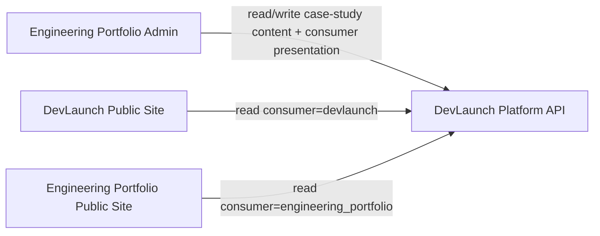
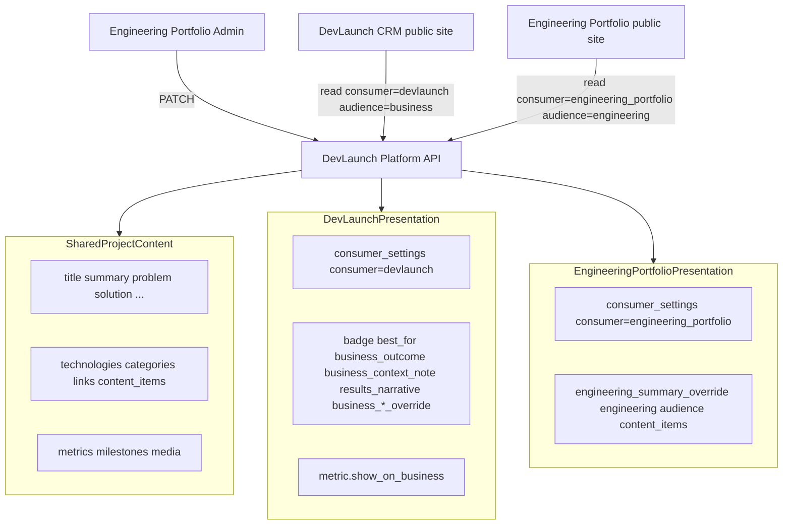

# Engineering Portfolio — Management Completion Plan

**M0 COMPLETE.** Planning/documentation only until next milestone authorization.

---

## M0 operator sign-off — COMPLETE

**Status:** `M0 COMPLETE` — field inventory and consumer architecture approved by operator (2026-09-07).

### Architecture boundary (locked)

Engineering Portfolio admin manages:

- **Platform-owned shared project/case-study content**
- **Platform-owned consumer presentation** for both `engineering_portfolio` and `devlaunch`

The Engineering Portfolio **MUST NOT** read from or write to the DevLaunch CRM for project/case-study management.

**Dependency direction:**

```
Engineering Portfolio admin  →  DevLaunch Platform API
DevLaunch public site        →  DevLaunch Platform API
```

There is **no** Engineering Portfolio → CRM project-content dependency.

General DevLaunch marketing content (homepage hero, services, About, pricing, etc.) remains **outside this plan** and may later be managed through the CRM.



### Locked operator decisions (M0)

| # | Decision | Status |
|---|----------|--------|
| 1 | **Platform API** remains sole authority for shared project/case-study content | Locked |
| 2 | **Navigation bridge:** use only the minimum transitional Portfolio-local bridge required by current admin routing (`/admin/portfolio/[id]`). Bridge contains **no authoritative shared content** and must **not** restore Prisma content writes. Transitional until M7 moves admin authority/navigation fully toward Platform | Locked |
| 3 | **`business_deliverable` / `platform_capability` editor support** remains **deferred** unless an implementation dependency proves it necessary. DevLaunch public project UI does not currently require these | Locked |
| 4 | **`HOME_FEATURED_SLUGS`** is transitional only. M6 makes Platform `engineering_portfolio` consumer featured/order authoritative. Temporary fallback during migration is acceptable; hardcoded list must not remain long-term source of truth | Locked |
| 5 | **Unarchive** remains deferred | Locked |
| 6 | **Default consumer settings for newly created projects** (draft-first; no automatic public exposure): | Locked |
| | `devlaunch.is_visible` = `false` | |
| | `devlaunch.is_featured` = `false` | |
| | `engineering_portfolio.is_visible` = `false` | |
| | `engineering_portfolio.is_featured` = `false` | |
| | `sort_order` = safe end-of-list/default per Platform conventions | |
| | Publication and consumer visibility are **deliberate operator actions** | |

---

## Scope statement

The Engineering Portfolio admin is **not only** an editor for Engineering Portfolio presentation.

It is the **management UI** for:

1. **Platform-owned shared project/case-study content** (edited once, authoritative in Platform, consumed by both Engineering Portfolio and DevLaunch Systems)
2. **DevLaunch Systems public-site presentation** of that shared content (visibility, featured, order, business projection fields)
3. **Engineering Portfolio presentation** of that shared content (visibility, featured, order, engineering projection fields)

**Target outcome:** Changing a project's DevLaunch presentation from the Engineering Portfolio admin updates Platform state; the DevLaunch public site reflects that Platform state **without a source-code edit**.

**Explicitly out of scope:** General DevLaunch marketing copy (homepage hero, services, About, pricing, unrelated site content). Only **project/case-study** presentation governed by Platform case-study state.

**M17 boundary preserved:** shared-content writes frozen to `PROJECT_WRITE_SOURCE=platform-api`; Prisma rows remain read-only snapshot + navigation bridge.

---

## Content model (three layers)



| Layer | Edited | Authority | Consumed by |
|-------|--------|-----------|-------------|
| **Shared project content** | Once in admin | Platform `case_studies` + child tables | Both consumers |
| **DevLaunch presentation** | Per-project in admin | `consumer_settings` row for `devlaunch` + business projection scalars + `show_on_business` on metrics | DevLaunch `/projects`, homepage Recent Work |
| **Engineering Portfolio presentation** | Per-project in admin | `consumer_settings` row for `engineering_portfolio` + engineering overrides | Engineering `/projects`, homepage featured |

Do **not** invent field names or duplicate fields already represented elsewhere. Use authoritative Platform schema only.

---

## M0 audit results — Platform API authoritative fields

**Sources (read-only):** `devlaunch-platform-api/app/schemas/admin.py`, `app/db/models/consumer_setting.py`, `app/db/models/enums.py` (`ConsumerName`), `app/services/projection_filters.py`, `app/services/projection_detail.py`, `app/services/projection_list.py`, `docs/consumers/v1/integration-guide.md`.

**Valid consumer identifiers:** `engineering_portfolio`, `devlaunch` (`ConsumerName` enum).

### A. `consumer_settings` (PATCH full-replace collection on case study)

Each element is `AdminConsumerSettingInput` / stored in `case_study_consumer_settings`:

| Field | Type | DevLaunch use | Engineering Portfolio use |
|-------|------|---------------|---------------------------|
| `consumer` | string | `"devlaunch"` | `"engineering_portfolio"` |
| `is_visible` | bool | Inclusion on DevLaunch list/detail (404 when false) | Inclusion on Engineering list/detail |
| `is_featured` | bool | Homepage Recent Work eligibility (`featured=true` filter) | Engineering homepage featured eligibility |
| `sort_order` | int | `/projects` list order (join order_by) | Engineering list order |

**Not in `consumer_settings`:** `badge`, `best_for`, `business_outcome`, `business_context_note` — these are **case-study scalars**, not per-consumer settings.

### B. Business / DevLaunch projection scalars (PATCH partial on case study)

| Platform field | Public projection (`audience=business`) | Notes |
|----------------|----------------------------------------|-------|
| `badge` | List + detail | Business audience only |
| `best_for` | Detail | Business audience only |
| `business_outcome` | Detail | Business audience only |
| `business_context_note` | Detail | Operator term "business context" maps to this field |
| `results_narrative` | Detail | Mapped to CRM `results` |
| `business_summary_override` | Merged into `summary` | Overrides shared `summary` for business audience |
| `business_problem_override` | Merged into `problem` | Overrides shared `problem` for business audience |
| `business_solution_override` | Merged into `solution` | Overrides shared `solution` for business audience |

Shared scalars (`summary`, `problem`, `solution`, etc.) remain **shared content**; business overrides are **DevLaunch presentation divergence** when set.

### C. Engineering Portfolio projection scalars (PATCH partial)

| Platform field | Public projection (`audience=engineering`) |
|----------------|--------------------------------------------|
| `engineering_summary_override` | Merged into `summary` |
| `architecture`, `challenges` | Engineering detail only |
| `content_items` kinds `feature`, `responsibility`, `capability` | Engineering audience (already partially mapped in Portfolio M3) |

### D. Metric `show_on_business` (child metric PATCH/POST — not case-study PATCH)

| Field | Type | Effect |
|-------|------|--------|
| `show_on_business` | bool | Business projection includes metric only when true (`filter_metrics` in Platform) |

**Portfolio gap today:** `buildPlatformMetricCreateRequest` hardcodes `show_on_business: true`; update mapper does not expose the field; admin metric UI has no toggle.

### E. Content-item kinds (deferred)

Platform supports `business_deliverable`, `platform_capability` in addition to engineering kinds. **Operator decision (locked):** editor support for these kinds remains **deferred** unless an implementation dependency proves it necessary. DevLaunch public project UI does not currently require them.

### F. Fields explicitly NOT DevLaunch project presentation

- Homepage hero, services, About, pricing (CRM marketing pages — out of scope)
- `internal_notes`, `legacy_img_url`, lifecycle/publish (shared operational — existing LifecycleControls)
- CRM `HOMEPAGE_FEATURED_CASE_STUDY_COUNT` (layout: how many featured cards to show — presentation constant, not content authority)

---

## M0 audit results — DevLaunch CRM consumer (read-only, no CRM changes)

**Sources:** `devlaunch-crm/lib/marketing/case-studies/platform-content-client.ts`, `case-studies-provider.ts`, `map-platform-case-study.ts`, `components/marketing/case-studies/*`, `app/(marketing)/projects/page.tsx`.

### What DevLaunch consumes from Platform (`consumer=devlaunch`, `audience=business`)

| Platform projection | CRM field / usage |
|---------------------|-------------------|
| List visibility + order | `getCaseStudies()` — full list, Platform `sort_order` |
| Featured eligibility | `getFeaturedCaseStudies()` — `featured=true` query param |
| `title`, `summary`, `problem`, `solution`, `results_narrative` | Read model core |
| `badge`, `best_for`, `business_outcome`, `business_context_note` | Optional read model fields |
| `categories`, `links` (live), `media` (hero/cover) | Detail/list presentation |
| `lessons_learned`, `future_improvements` | Optional detail sections |
| `metrics` | **Not consumed** — CRM mapper does not map metrics; no metric UI on public case-study pages |

### Remaining hardcoded / presentation-local behavior in DevLaunch CRM

| Behavior | Hardcoded? | Classification |
|----------|------------|----------------|
| **Project inclusion** | No (platform-api mode) | Platform `is_visible` for `devlaunch` |
| **Featured selection (which projects)** | No (platform-api mode) | Platform `is_featured` + `featured=true` API filter |
| **Featured card count (how many)** | Yes — `HOMEPAGE_FEATURED_CASE_STUDY_COUNT = 2` | **CRM presentation layout** — acceptable; not content authority |
| **List ordering** | No (platform-api mode) | Platform `sort_order` via list API |
| **Badge / business copy** | No (platform-api mode) | Platform scalars via `map-platform-case-study.ts` |
| **Metric visibility** | N/A on CRM site today | Platform filters `show_on_business` in API; CRM does not render metrics |
| **Cover gradient** | Yes — `case-study-gradient.ts` slug-hash palette | **CRM presentation styling** — not Platform content |
| **Static fallback data** | Yes — `data/case-studies.ts` when `CASE_STUDIES_READ_SOURCE=static` | Rollback mode only; platform-api mode fails closed |
| **Parity baseline slugs** | Yes — `M2_PARITY_BASELINE_SLUGS` in tests/scripts | Test reference only |
| **Projects page hero/intro copy** | Yes — inline in `projects/page.tsx` | General marketing copy — **out of scope** |

**Conclusion:** In `platform-api` read mode, DevLaunch project inclusion, featured eligibility, ordering, and business copy are **already Platform-driven**. No CRM code changes are required for the target outcome. Remaining hardcoding is presentation layout (card count, gradients) or out-of-scope marketing copy.

### Engineering Portfolio hardcoding (separate consumer — addressed in M6)

| Behavior | Location | Target |
|----------|----------|--------|
| Homepage featured slugs | `src/lib/portfolio/home-featured.ts` `HOME_FEATURED_SLUGS` | **Resolved M6** — Platform `engineering_portfolio` `is_featured` + `sort_order` in platform-api mode; `HOME_FEATURED_SLUGS` retained for database read fallback only |

---

## Current Portfolio admin gaps (relevant to DevLaunch presentation)

| Gap | Evidence |
|-----|----------|
| ~~`consumer_settings` not typed/mapped~~ | **Resolved M5** — [`platform-presentation-types.ts`](src/lib/project-write/platform-presentation-types.ts), [`platform-presentation-mapper.ts`](src/lib/project-write/platform-presentation-mapper.ts), full-replace `consumer_settings` in PATCH |
| ~~Business projection scalars not in editor/mapper~~ | **Resolved M5** — case-study scalars in PATCH via `buildPresentationPatchFromExtended` |
| ~~`show_on_business` not editable~~ | **Resolved M5** — metric create/update mapper + `MetricRow` / `MetricEditor` checkbox |
| ~~Admin load types omit consumer_settings + business scalars~~ | **Resolved M5** — [`platform-admin-types.ts`](src/lib/project-write/platform-admin-types.ts) extends `PlatformApiPresentationScalars`; admin load merges via `mapPlatformPresentationToEditorFields` |
| Create/reorder still blocked | M2–M4 create/metric/milestone/gallery reorder restored; M5 presentation management added |

---

## Milestones

### M0 — Contract reconciliation + field inventory sign-off — COMPLETE

- **Status:** COMPLETE (operator sign-off 2026-09-07)
- **Deliverables:** Field inventory (sections above); DevLaunch CRM read-only consumption audit; architecture boundary locked; operator decisions recorded
- **Acceptance:** Operator confirmed consumer split, scalar vs `consumer_settings` placement, metric `show_on_business` ownership, and no Portfolio→CRM dependency

### M1 — Platform API: create + atomic reorder (Platform repo) — COMPLETE

**Status:** COMPLETE / ACCEPTED / MERGED / LIVE (operator confirmation 2026-09-07).

**Objective:** Implement or complete Platform-native contracts required before Portfolio wiring:

- `POST /api/v1/admin/case-studies` — minimal create with operator default consumer settings
- Atomic metric reorder
- Atomic milestone reorder
- Atomic gallery-media reorder

**Scope:** Platform API repo only. No Portfolio or CRM changes.

**Create defaults (per M0 operator decision):** draft publish state, active lifecycle, both consumers `is_visible=false` / `is_featured=false`, safe default `sort_order`.

### M2 — Portfolio: project creation workflow — ACCEPTED

**Status:** ACCEPTED (Engineering Portfolio repo, operator confirmation 2026-09-07).

**Objective:** Restore Add Project → Platform authoritative create → minimal Prisma navigation bridge → existing editor.

**Bridge strategy (transitional, M7 debt):** `createPortfolioNavigationBridge()` inserts minimum `portfolio` row: `slug`, `caption` (title), `projectType`, `publishStatus=draft`, `lifecycleStatus=active`, `createdBy`, plus non-authoritative placeholders (`img=/`, stub `description`, `category=["bridge"]`). No shared content duplicated.

**Implementation evidence:**

- UI: `CreateProjectForm` on `/admin/portfolio/new` (platform-api mode); Add Project always visible on `/admin/portfolio`
- Server action: `createPortfolioProjectAction` → `createPortfolioProjectViaPlatform`
- Platform client: `PlatformApiAdminClient.createCaseStudy` POST `/api/v1/admin/case-studies`
- Payload: `{ title, project_type }` + optional `slug` only when operator provides (never locally generated)
- Navigation: `router.push(/admin/portfolio/${portfolioLocalId})` using bridge Prisma UUID; editor loads Platform detail via slug bridge
- Partial failure: `PlatformProjectBridgeError` preserves Platform case study; no unsafe delete
- Legacy: `createPortfolioAction` + full `ProjectEditor` create remain database-mode only (`assertPlatformProjectCreateAllowed` blocks platform-api)
- Tests: `platform-m2-create.test.ts`, `platform-project-create.test.ts`, `create-portfolio-project-input.test.ts`, `platform-api-admin-client` create tests; M17/M9 freeze tests updated

**Validation evidence (2026-09-07):**

- Mechanism: GitHub CI-equivalent pipeline — `npm run ci` with the same env vars as [`.github/workflows/ci.yml`](.github/workflows/ci.yml)
- Database: ephemeral `postgres:16-alpine` container on port 5434
- Results: compilation ✓, TypeScript ✓, static generation ✓ (22/22 pages), exit code 0 ✓

### M3 — Portfolio: atomic metric/milestone reorder — ACCEPTED

**Status:** ACCEPTED (Engineering Portfolio repo, operator confirmation 2026-09-07).

**Objective:** Restore metric/milestone Move up/down controls via Platform atomic reorder endpoints.

**Platform endpoints wired:**

- `PUT /api/v1/admin/case-studies/{case_study_id}/metrics/reorder` — body `{ ordered_ids: string[] }`
- `PUT /api/v1/admin/case-studies/{case_study_id}/milestones/reorder` — body `{ ordered_ids: string[] }`

**Implementation evidence:**

- Client: `PlatformApiAdminClient.reorderMetrics` / `reorderMilestones` (child client PUT helpers)
- Write layer: `reorderPortfolioMetricsViaPlatform`, `reorderProjectVersionsViaPlatform`
- Case-study resolution: `resolvePlatformCaseStudyWriteContext` → `resolvePlatformCaseStudyIdBySlug` (existing M2 bridge path)
- Ordered ID construction: `buildChildReorderOrderedIds` applies one up/down move to complete current Platform UUID list; single atomic PUT (no sequential PATCH/swap)
- Post-success: refetch `getCaseStudyById` and remap authoritative `sort_order`
- UI: `shouldDisableChildReorder` now returns `false`; existing Move up/down buttons in `MetricEditor` / `ProjectEvolutionEditor` re-enabled; optimistic reorder with rollback on failure; `isReordering` guard prevents concurrent requests
- Stale/exact-set failures: Platform 422 surfaced via existing `toPlatformProjectWriteUserMessage`; UI restores previous order
- Gallery reorder: deferred to M4 (now complete — see below)
- Database mode: legacy `reorderPortfolioMetric` / `reorderProjectVersion` Prisma paths retained in server actions when `PROJECT_WRITE_SOURCE=database`
- Tests: `platform-m3-reorder.test.ts`, `platform-child-reorder-order.test.ts`, updated `platform-child-reorder-policy.test.ts`, `platform-api-admin-client` surface tests

**Validation evidence (2026-09-07):**

- `bun test`: 400 pass, 1 skip, 0 fail (401 tests)
- `npm run lint`: pass
- CI-equivalent `npm run ci` with `postgres:16-alpine` on port 5434: compilation ✓, TypeScript ✓, static generation ✓, exit code 0 ✓

**Next authorized candidate:** M5 — consumer settings + business projection UI.

### M4 — Portfolio: gallery reorder + media polish — COMPLETE

**Status:** COMPLETE (Engineering Portfolio repo, 2026-09-07).

**Objective:** Restore gallery atomic reorder and polish supported Platform media workflows.

**Platform endpoint wired:**

- `PUT /api/v1/admin/case-studies/{case_study_id}/media/gallery/reorder` — body `{ ordered_ids: string[] }` (`media:write`)

**Implementation evidence:**

- Client: `PlatformApiAdminClient.reorderGalleryMedia` → `reorderGalleryCaseStudyMedia` in media child client
- Write layer: `reorderProjectGalleryMediaViaPlatform` — loads gallery-role media only (`role: "gallery"`), builds complete `ordered_ids` via `buildChildReorderOrderedIds`, single atomic PUT, refetches gallery list
- Action: `reorderProjectGalleryMediaAction` (platform-api only) with cache invalidation after success
- UI: `GalleryEditor` Move up/down controls; optimistic reorder + rollback; `isReordering` guard; gallery-role ID labeling
- Blocked path preserved: `sort_order` PATCH rejected in platform-api mode (`PLATFORM_GALLERY_SORT_ORDER_PATCH_BLOCKED_MESSAGE`) — no sequential swap
- Upload/register: existing presign/register Platform flow unchanged (server-only credentials)
- Hero: replacement via upload remains; clear-without-replacement unsupported (message shown in `MediaSection`)
- OG: replacement via upload remains; **Remove OG image** added (`deleteProjectPlatformMediaAction` — metadata relationship only, not R2 deletion)
- Deferred: hero clear, media role mutation, generalized/polymorphic media architecture, R2 object deletion
- Tests: `platform-m4-gallery-reorder.test.ts`, updated `platform-media-reorder-policy.test.ts`, `platform-m7-invalidation` gallery reorder invalidation test

**Validation evidence (2026-09-07):**

- `bun test`: 414 pass, 1 skip, 0 fail (415 tests)
- `npm run lint`: pass
- CI-equivalent `npm run ci` with `postgres:16-alpine` on port 5434: compilation ✓, TypeScript ✓, static generation ✓, exit code 0 ✓

**Next authorized candidate:** M6 — Engineering Portfolio featured migration (`HOME_FEATURED_SLUGS`).

### M5 — DevLaunch + Engineering presentation UI — COMPLETE

**Objective:** Admin can manage **all Platform-supported fields** that control how a project appears on DevLaunch Systems **and** Engineering Portfolio, from the Engineering Portfolio admin UI — via Platform API only (no CRM).

**Implementation (2026-09-07):**

- **Types:** [`platform-presentation-types.ts`](src/lib/project-write/platform-presentation-types.ts) — `PlatformApiConsumerSetting`, `PlatformApiAdminConsumerSettingInput`, presentation scalars
- **Load mapper:** `mapPlatformPresentationToEditorFields` — maps admin detail → editor form; `managePresentation` enabled only when `consumer_settings.length > 0` (prevents PATCH without authoritative rows)
- **PATCH mapper:** `buildConsumerSettingsFromExtended` + `buildPresentationPatchFromExtended` — full-replace `consumer_settings` collection (both `devlaunch` and `engineering_portfolio` rows always sent together); business/engineering scalars as case-study PATCH fields (not nested in `consumer_settings`)
- **Null/clear semantics:** empty/whitespace override strings normalize to `null` via `normalizeNullablePresentationText`
- **Update path:** `buildPlatformCaseStudyPatchRequest` spreads presentation patch when `managePresentation` is true
- **UI:** [`PresentationSection.tsx`](src/components/Admin/portfolio/sections/PresentationSection.tsx) — two cards (DevLaunch public site, Engineering Portfolio); **Presentation** tab in `ProjectEditor` (platform-api mode only)
- **Metrics:** `showOnBusiness` on `PortfolioMetric`; create/update mappers; checkbox in `MetricRow` and create form in `MetricEditor` (no longer hardcoded `true` on create when operator sets false)
- **Tests:** [`platform-m5-presentation.test.ts`](tests/unit/project-write/platform-m5-presentation.test.ts) — cross-consumer preservation, scalar load/save/clear, metric toggle, boundary checks; updated [`platform-update-mapper.test.ts`](tests/unit/project-write/platform-update-mapper.test.ts), [`platform-metric-mapper.test.ts`](tests/unit/project-write/platform-metric-mapper.test.ts)

**consumer_settings full-replace behavior:**

1. Load both authoritative rows from Platform admin detail
2. Editor holds both consumers in form state
3. On save, `buildConsumerSettingsFromExtended` emits complete collection — untouched consumer row preserved from current editor state (not defaults, not copied from edited consumer)

**DevLaunch presentation (admin UI — "DevLaunch public site" card):**

- `consumer_settings` for `consumer=devlaunch`: `is_visible`, `is_featured`, `sort_order`
- Business projection scalars: `badge`, `best_for`, `business_outcome`, `business_context_note`, `results_narrative`
- Business audience overrides: `business_summary_override`, `business_problem_override`, `business_solution_override`
- Per-metric `show_on_business` toggle (PATCH metric child route)

**Engineering Portfolio presentation (separate card):**

- `consumer_settings` for `consumer=engineering_portfolio`: `is_visible`, `is_featured`, `sort_order`
- `engineering_summary_override`

**Acceptance:**

- Operator can toggle DevLaunch visibility/featured/order from admin
- Operator can edit badge, best-for, business context note, business outcome, results narrative, and business overrides
- Operator can set `show_on_business` per metric
- No Prisma presentation authority; no CRM dependency; credentials server-only
- Cross-site E2E verification remains M7

**Validation evidence (2026-09-07):**

- `bun test`: 460 pass, 1 skip, 0 fail (461 tests)
- `npm run lint`: pass
- CI-equivalent `npm run ci`: compilation ✓, TypeScript ✓, production build ✓, static generation ✓, exit code 0 ✓

**Next authorized candidate:** M7 — Platform-backed admin list + full regression.

### M6 — Engineering Portfolio featured migration — COMPLETE

**Objective:** Replace [`HOME_FEATURED_SLUGS`](src/lib/portfolio/home-featured.ts) authoritative homepage selection with Platform `engineering_portfolio` consumer `is_featured` + `sort_order`.

**Previous behavior:** Homepage featured cards selected by hardcoded slug list `HOME_FEATURED_SLUGS` in `pickHomeFeaturedProjects`, independent of Platform presentation state.

**Implementation (2026-09-07):**

- **Platform read:** `PlatformApiListItem` extended with `sort_order`; `mergePlatformListPresentation` maps `is_featured` → `PortfolioItem.isFeatured` and `sort_order` → `PortfolioItem.sortOrder` from engineering consumer list projection
- **Featured selection:** `pickPlatformEngineeringFeaturedProjects` filters `isFeatured === true`, orders by `sortOrder` ASC (slug tie-break)
- **Homepage:** `PortfolioSection` calls `pickHomeFeaturedProjects(items, getProjectReadSource())` — platform-api uses Platform fields; database read retains legacy slug list
- **Cache:** `public-project-cache-policy` invalidates homepage on platform-api `content` writes (presentation/featured changes no longer depend on slug allowlist); database read unchanged
- **`HOME_FEATURED_SLUGS`:** Retained only for `PROJECT_READ_SOURCE=database` legacy fallback and export script documentation — **not** used in platform-api homepage production path
- **Tests:** `platform-m6-home-featured.test.ts`, updated `home-featured.test.ts`, `public-project-cache-policy.test.ts`, `platform-api-mapper.test.ts`

**Not in M6:** DevLaunch featured — owned by M5 `devlaunch` consumer_settings. No DevLaunch CRM/homepage changes.

**Validation evidence (2026-09-07):**

- `bun test`: 483 pass, 1 skip, 0 fail (484 tests)
- `npm run lint`: pass
- CI-equivalent `npm run ci`: compilation ✓, TypeScript ✓, production build ✓, static generation ✓, exit code 0 ✓

**Next authorized candidate:** M7 — Platform-backed admin list + full regression acceptance.

### M7 — Admin list authority + full regression — IMPLEMENTATION COMPLETE / PENDING PRODUCTION E2E

**Objective:** Platform-backed admin list; move admin authority/navigation toward Platform; full management regression; document operator production smoke.

**Implementation (2026-09-07):**

- **Admin list:** `loadAdminPortfolioListItems()` — Platform admin list (paginated) for display; Prisma bridge `{ id, slug }` join for `/admin/portfolio/[id]` routing only
- **Hero thumbnails:** Platform admin media list (`role=hero`, `upload_status=confirmed`, paginated) joined by `case_study_id`; no Prisma `img` authority
- **Mapper:** `mapPlatformAdminListItemToPortfolioListRow` — title, summary, categories, publish/lifecycle status, `sort_order`, `is_featured`, hero `img` from Platform media
- **Pagination:** `listAllPlatformAdminCaseStudies` shared by admin list + `resolvePlatformCaseStudyIdBySlug`
- **Bridge reduction:** Admin list no longer uses `getAllPortfolioItems()` in platform-api mode; bridge retained for routing, M2 create, slug→Platform UUID resolution
- **Report:** [`docs/phase-11/m7-management-completion-report.md`](docs/phase-11/m7-management-completion-report.md) — production smoke checklist (operator, post-deploy)
- **Tests:** `platform-m7-admin-list.test.ts`, `platform-m7-admin-list-hero.test.ts`, `platform-m7-management-completion.test.ts`

**M7 regression (operator review, 2026-09-07):** Initial list mapper hardcoded `img: "/"`, breaking `next/image` on `/admin/portfolio`. Fixed by loading Platform confirmed hero media and guarding `PortfolioList` for imageless projects.

**Additional acceptance checks (operator production smoke — not local):**

- New Platform project with `devlaunch` `is_visible=true` appears on DevLaunch `/projects` without CRM code change
- DevLaunch featured/order change from Portfolio admin reflected on DevLaunch homepage Recent Work after revalidation
- Cloudflare/R2 media upload/register in production
- M17 freeze tests unchanged

**Validation evidence (local, 2026-09-07):**

- `bun test`: see final count below
- `npm run lint`: pass
- CI-equivalent `npm run ci`: pass

**Status:** IMPLEMENTATION COMPLETE / PENDING PRODUCTION E2E — do not mark plan final ACCEPTED until operator smoke passes.

---

## Final acceptance criteria

Administrator can, entirely through Engineering Portfolio admin UI (via Platform API only — no CRM):

1. Create a new Platform case study and open it in the editor (M2)
2. Edit all **shared** content fields currently supported by PATCH
3. CRUD and **reorder** metrics and milestones atomically (M3)
4. Upload/manage media including gallery order (M4)
5. **Manage DevLaunch Systems public-site presentation:** visibility, featured, display order, badge, best-for, business context (`business_context_note`), business outcome, results narrative, business audience overrides, and per-metric `show_on_business`
6. **Manage Engineering Portfolio presentation:** visibility, featured, display order, engineering summary override
7. Publish/unpublish/archive with correct cache behavior
8. **Verify:** DevLaunch public site reflects Platform DevLaunch presentation state without CRM source edit (platform-api read mode)
9. Never write shared content to Prisma
10. Full test suite + production build green with M17 env

**Does not require:** Editing DevLaunch homepage hero, services, About, pricing, or unrelated marketing pages.

---

## Explicit exclusions

- Contact/inquiry implementation
- DevLaunch CRM code changes for project/case-study management (CRM reads Platform only; Portfolio never reads/writes CRM for this domain)
- General DevLaunch marketing copy management
- `business_deliverable` / `platform_capability` editor UI (deferred per operator decision)
- Notification retries, CRM handoff, outbox, CAPTCHA, OTel
- Polymorphic media architecture
- Prisma shared-content write restoration
- Hard delete / unarchive (deferred)
- Portfolio/CRM changes during M1 (Platform repo only)
- Admin shell visual redesign

---

## Open items (post-M0)

None blocking closure. Operator production smoke remains before final ACCEPTED/CLOSED.

---

## Confirmation

**M0 COMPLETE.** Operator sign-off recorded; architecture boundary and decisions locked.

**M1 COMPLETE / LIVE** in `devlaunch-platform-api` (operator confirmation 2026-09-07).

**M2 ACCEPTED** in Engineering Portfolio (operator confirmation 2026-09-07). Project creation restored via Platform API with transitional Prisma navigation bridge only.

**M3 ACCEPTED** in Engineering Portfolio (operator confirmation 2026-09-07). Metric and milestone reorder restored via Platform atomic reorder endpoints.

**M4 ACCEPTED** in Engineering Portfolio (operator confirmation 2026-09-07). Gallery atomic reorder restored; supported media UX polish applied; hero clear and role mutation remain deferred per Platform contract.

**M5 ACCEPTED** in Engineering Portfolio (operator confirmation 2026-09-07). DevLaunch + Engineering presentation management UI; full-replace `consumer_settings`; business projection scalars; metric `show_on_business` toggle.

**M6 ACCEPTED** in Engineering Portfolio (operator confirmation 2026-09-07). Engineering homepage featured driven by Platform `engineering_portfolio` `is_featured` + `sort_order`.

**M7 IMPLEMENTATION COMPLETE / PENDING PRODUCTION E2E** in Engineering Portfolio (2026-09-07). Platform-backed admin list; bridge reduced to routing-only; operator production smoke documented in `docs/phase-11/m7-management-completion-report.md`.

**Final plan status:** PENDING operator production smoke — do not mark CLOSED until post-deploy E2E passes.

**Plan file:** [`.cursor/plans/engineering_portfolio_management_completion.plan.md`](.cursor/plans/engineering_portfolio_management_completion.plan.md)
