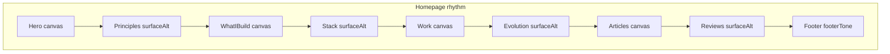
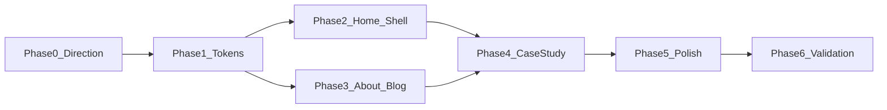

# Engineering Portfolio Platform — Visual Redesign Plan

**Status:** **Approved and closed** (Phases 0–6, sign-off 2026-08-22). V1 design system foundation unchanged. Deferred items remain documented for future product iteration—not program scope.

**Foundation:** [docs/design-system.md](docs/design-system.md) (V1 complete). This plan **extends** tokens/variants and **redesigns** domain presentation—it does not replace layers or introduce parallel component systems.

**Rules applied:** [.cursor/rules.mdc](.cursor/rules.mdc) — single-agent, no subagents, no schema/API/admin changes, server-first, extend-before-create.

---

## 1. Redesign strategy

**Goal:** Make the public site read as an **Engineering Portfolio Platform**—a senior engineer who designs and evolves production software—while keeping V1 architecture intact.

**Approach:**

1. **Token-first visual language** — charcoal/near-black rhythm, restrained accent, light/dark parity via semantic tokens (not per-section hex).
2. **Composition over new systems** — extend `Section`, `Surface`, `Heading`, `ProjectCard`, `ArticleCard`; add thin domain shells (`SiteFooter`, `SiteHeader` refinements) only where ≥2 routes need them.
3. **Content truth** — real DB/MDX content, `sortOrder`, `projectType`, article `tags`; no fake metrics, years, or screenshots.
4. **IA preserved** — case-study section order stays in [case-study-layout.ts](src/lib/portfolio/case-study-layout.ts); homepage/blog/about IA can evolve visually and in copy.
5. **Debt absorption in redesign** — legacy `globals.css`, aliases, `BLOG_ARTICLE_CLASS`, animation module, TechStack icons, hero scale—only when touched by a phase’s route work.

**Out of scope:** Prisma/schema, Case Study API, admin shell redesign, new patterns without 2+ consumers, V1.1 cleanup-only phase, CI Storybook, new animation frameworks.

---

## 2. Current-state visual audit

### Global / theme ([globals.css](src/app/globals.css), [tokens.css](src/design-system/tokens/tokens.css))

| Issue | Impact |
|-------|--------|
| Legacy Vite-era globals (`body { place-items: center }`, `#root`, `.catch-phrase`, carousel breakpoints) | Layout centering fights full-width platform feel |
| Global `h1` rules + media queries | Conflicts with `Heading` scale ([ProjectDetailHero](src/components/Portfolio/ProjectDetailHero.tsx) uses ad hoc sizes) |
| Global `a { color: darkcyan }` | Bypasses `Link` token styling |
| Dark `--primary` = blue (`oklch(0.62 0.11 235)`) used for bullets, subtitles, hovers | **Hue spread** across non-interactive UI (Phase 1 mistake per user) |
| Single `--background` canvas everywhere | No alternating section rhythm |
| Legacy aliases in `tokens.css` still bridged | Deferred from V1; safe to resolve in token phase |
| Fonts: Geist + Geist Mono ([layout.tsx](src/app/layout.tsx)) | Acceptable engineering tone; no mandatory font change |

### Public routes

| Route | Current state | Positioning gap |
|-------|---------------|-----------------|
| **Home** ([page.tsx](src/app/page.tsx)) | Hero + Nav inside main `Container`; sections: Philosophy, TechStack icons, WhatIEnjoyBuilding, all projects grid, featured articles, reviews | Reads as developer portfolio: icon wall, duplicate “four areas” content, no evolution narrative, no footer, nav lacks platform CTAs |
| **About** ([About/page.tsx](src/app/About/page.tsx)) | Long centered bio + skills badges; animated paragraphs | Biography landing page vs engineering profile; Banana layout (hero + cards + philosophy + grouped skills + CTA) not reflected |
| **Blogs** ([blogs/page.tsx](src/app/blogs/page.tsx)) | Minimal heading + grid; MDX `getAllPosts` | No intro eyebrow, no tag filters (data: `tags[]` on Article exists), weak platform framing |
| **Blog post** ([blogs/[slug]/page.tsx](src/app/blogs/[slug]/page.tsx)) | `BLOG_ARTICLE_CLASS` string in client component | Prose not integrated with typography/ContentWidth tokens |
| **Case study** ([projects/[slug]/page.tsx](src/app/projects/[slug]/page.tsx)) | `CaseStudyPage` in `Container`; functional IA | Hero/metrics/story density below Banana reference; gallery/IA behavior correct |

### Navigation ([Navigation.tsx](src/components/Nav/Navigation.tsx), [navigationLinks.ts](src/components/Nav/navigationLinks.ts))

- Links: Home, About, Blogs only — no Work/Projects anchor, Reviews, Contact, Resume, Hire me.
- No brand mark (`> Clayton Cripe` from references).
- No site footer on any public route.

### Design-system usage (good)

- Layout/typography/patterns wired on public routes (V1 Phase 9).
- Case study IA + gallery behavior stable.
- ESLint boundaries intact.

### Client boundaries (preserve)

- Keep client islands: `Navigation`, `TechStack`, `PortfolioSectionClient`, `BlogGrid`, `BlogPostClient`, `AboutContentClient`, gallery/dialog, Framer `AnimatedSection` wrappers.
- Do not wrap full pages in `"use client"` for styling.

### Content supporting senior/platform positioning (real)

- Hero/About copy already mentions operational software, SaaS, architecture ([Hero.tsx](src/components/Hero/Hero.tsx), [AboutContentClient](src/components/about/AboutContentClient.tsx)).
- Rich case-study fields: problem/solution/architecture, metrics, versions, platform features, gallery JSON.
- Engineering projects identifiable via `projectType === "engineering"`.
- Article `tags` + `featured` for blog hierarchy.
- Portfolio ordering via `sortOrder` ([portfolio.ts](src/lib/data/portfolio.ts)) — no `featured` flag on Portfolio model.

### Content gaps (copy/asset, not schema)

- **Senior** title framing (“Senior Full-Stack Engineer”) — copy update.
- **Homepage curated featured work** — use `sortOrder` + optional `projectType` filter; editorial pick list in code constant if needed (no DB change).
- **System evolution narratives** — static curated content component (real project arcs, not DB-driven).
- **Nav Resume** — no resume PDF in `public/` today; link deferred or asset added manually.
- **Contact / Hire me** — mailto or external URL; confirm in Phase 0.
- **Blog read time** — compute from content length client/server; optional display only.
- **Review attribution** — `Review.title` used as label; no separate client name field.

---

## 3. Target product positioning

**Visitor takeaway:** Clayton designs, builds, and evolves **production software platforms**—operational systems, SaaS, internal tools—with explicit architecture, metrics, and iteration evidence.

**Avoid:** logo walls, generic “digital experiences,” freelance-template hero, marketing mega-headlines, fake proof.

**Platform framing:** Visual density, structured narratives, metrics/timelines, and admin-backed content signal an **engineered system** presenting engineering work—not a static site generator output.

---

## 4–7. Information architecture by route

### Homepage ([page.tsx](src/app/page.tsx))

Proposed section order with **alternating tone** (tokens, not hardcoded colors):

| # | Section | Tone | Component strategy |
|---|---------|------|-------------------|
| 1 | Site header | sticky nav on canvas | Extend `Navigation` |
| 2 | Hero | charcoal (`canvas`) | Refine `Hero` — senior title, platform summary, evidence line, CTAs (projects + contact), retain `TerminalLoader` with accent-only coloring |
| 3 | Engineering principles | near-black (`surface-alt`) | Refine `EngineeringPhilosophy` — eyebrow, concise bullets, business-first themes |
| 4 | What I build | charcoal | Merge/refine `WhatIEnjoyBuilding` — 2×2 capability cards (reuse `Surface`) |
| 5 | Engineering stack | near-black | Replace `TechStack` icon wall with **capability groups** (static config in component) |
| 6 | Featured engineering work | charcoal | `PortfolioSection` — curated grid; extend `ProjectCard` presentation |
| 7 | System evolution | near-black | **New domain section** `PlatformEvolution` — 3 concise project arcs (static content) |
| 8 | Engineering articles | charcoal | `FeaturedArticles` — eyebrow, tighter cards |
| 9 | Client validation | near-black | `ReviewComponent` — smaller quote treatment |
| 10 | Footer | darker neutral | **New** `SiteFooter` |

Remove redundant duplicate bullet list between Philosophy and WhatIEnjoyBuilding during composition pass.

### About ([About/page.tsx](src/app/About/page.tsx))

| Block | Banana alignment | Reuse |
|-------|------------------|-------|
| Eyebrow + identity hero | ABOUT + name + role | `Heading`, `Text`, profile image |
| Social + contact CTAs | LinkedIn, GitHub, Get in touch | `Button`, `Link` |
| What I build grid | FOCUS cards | Content from `WhatIEnjoyBuilding` / About copy |
| Philosophy | PRINCIPLES list | Existing About values list |
| Technical expertise | grouped badges | `AboutSkillsGroup`, `skillsArr`, `engineeringArr` |
| CTA band | Let's build together | `Section` + buttons |
| Footer | shared | `SiteFooter` |

Layout: editorial split (image + narrative) vs current centered wall of paragraphs.

### Blog index ([blogs/page.tsx](src/app/blogs/page.tsx))

| Element | Approach |
|---------|----------|
| Intro | Eyebrow WRITING + title + platform description |
| Filters | Pill `Button`/`Badge` toggles over **existing `tags`** (client state in `BlogGrid` wrapper); “All” default |
| Grid | `ArticleCard` styling refresh; show tag + date |
| Metadata | Article count from posts length |
| Footer | `SiteFooter` |

No new recommendation engine.

### Blog article ([blogs/[slug]/page.tsx](src/app/blogs/[slug]/page.tsx))

| Element | Approach |
|---------|----------|
| Header | Eyebrow, title, date, tags via `Heading`/`Label` |
| Body | Replace `BLOG_ARTICLE_CLASS` with `ContentWidth` + prose utility class in tokens/globals |
| Width | `ContentWidth width="article"` |
| Footer | `SiteFooter` |

### Case study ([CaseStudyPage](src/components/Portfolio/CaseStudyPage.tsx))

**IA unchanged** (preview → hero → summary → metrics → story → evolution → platform → gallery → links).

Visual upgrades per Banana reference:

- Stronger hero (image + context + actions) — [ProjectDetailHero](src/components/Portfolio/ProjectDetailHero.tsx)
- Summary/metrics elevated near top — [ProjectSummary](src/components/Portfolio/ProjectSummary.tsx), [ProjectMetrics](src/components/Portfolio/ProjectMetrics.tsx)
- Story blocks with eyebrows — [ProjectStory](src/components/Portfolio/ProjectStory.tsx), `ProjectPageSection`
- Timeline polish — [ProjectEvolution](src/components/Portfolio/ProjectEvolution.tsx) + `Timeline` pattern
- Platform capabilities — [ProjectPlatformShowcase](src/components/Portfolio/ProjectPlatformShowcase.tsx) (domain checklist, not new `FeatureChecklist` pattern unless 2+ consumers emerge)
- Gallery as evidence — existing [EngineeringGallery](src/components/patterns/EngineeringGallery.tsx)
- Section alternating inside case study optional (subtle) via `ProjectPageSection` + section tone prop

---

## 8. Token / palette proposal (Phase 1 — approve before visual work)

Introduce **accent separation** from neutral `--primary` (buttons can stay on accent token).

### Semantic additions (in [tokens.css](src/design-system/tokens/tokens.css) + [globals.css](src/app/globals.css))

| Token | Role | Dark (initial proposal) | Light (initial proposal) |
|-------|------|-------------------------|---------------------------|
| `--ds-canvas` | default page band | `oklch(0.20 0 0)` charcoal | `oklch(0.97 0 0)` soft neutral |
| `--ds-surface-alt` | alternating section | `oklch(0.16 0 0)` near-black | `oklch(0.99 0 0)` white |
| `--ds-surface` | cards/elevated | existing `--card` | existing `--card` |
| `--ds-elevated` | nested | existing `--secondary` | existing `--secondary` |
| `--ds-border-subtle` | borders | existing `--border` | existing `--border` |
| `--ds-text-primary` | body headings | existing `--foreground` | existing `--foreground` |
| `--ds-text-muted` | secondary | existing `--muted-foreground` | existing `--muted-foreground` |
| `--ds-accent` | **restrained accent** | `oklch(0.82 0.18 128)` lime (Banana-inspired) | `oklch(0.55 0.16 128)` darker lime for contrast |
| `--ds-accent-foreground` | on accent | `oklch(0.18 0 0)` | `oklch(0.99 0 0)` |
| `--ds-accent-muted` | labels/links at rest | accent @ 70% opacity or muted chroma | same |
| `--primary` | **neutral interactive** (optional) | high-contrast neutral button fill OR map to accent for primary CTA only | same |

**Accent decision gate (Phase 0/1 STOP):** Compare refined **lime** (Banana) vs **cool blue** (current). Recommendation: adopt **lime accent token** for labels/links/active states; stop using `--primary` blue for bullets and body emphasis. Validate WCAG pairs in Storybook token swatches.

**Tailwind mapping:** Extend `@theme inline` with `--color-accent`, `--color-canvas-alt`, wire `bg-canvas-alt` utilities—avoid raw hex in components.

**Shadow/glow policy:** Subtle border-first cards; no page-wide glow; optional `shadow-sm` on elevated surfaces only.

**Radius:** Keep `--radius: 0.625rem`; cards `rounded-xl` via `Surface`.

---

## 9. Typography proposal

**Keep** `Heading`, `Text`, `Label`, `Caption` — no replacement system.

| Change | Rationale |
|--------|-----------|
| Add `Heading` variant `display` (optional) | Hero name — large but capped (~`text-4xl`–`text-5xl`, not 80px marketing) |
| Tighten eyebrow usage | `Label` or `Heading variant="eyebrow"` with `text-ds-accent` token |
| `Text variant="lead"` (optional) | Hero sublines — one new variant if repeated across 4 pages |
| Remove reliance on `text-primary` for non-links | Use `text-foreground` + accent only for eyebrows |

**Editorial density:** Slightly smaller section descriptions; more line-length control via `ContentWidth`.

---

## 10. Section / surface rhythm proposal

**Implementation:** Extend `Section` with optional `tone?: 'canvas' | 'surfaceAlt' | 'default'` applying `bg-background` vs `bg-canvas-alt` via tokens; full-bleed sections use `className` on wrapper outside `Container` (pattern: tone band → inner `Container`).

**Do not** add per-section arbitrary Tailwind backgrounds.

---

## 11. Responsive strategy

| Area | Mobile | Tablet | Desktop |
|------|--------|--------|---------|
| Nav | hamburger + full-screen menu (existing) | inline links | brand left, links center, CTAs right (Banana) |
| Hero | stack: terminal above or below copy per readability test | 2-col | 2-col with metric/terminal secondary |
| Project grid | 1 col | 2 col | 3 col; featured hero card optional for top `sortOrder` project |
| Principles | single column | single | split label + list (Banana) |
| Tech groups | stacked categories | 2-col groups | horizontal groups |
| Metrics | 2-col | 3-col | 3-col |
| Timeline | vertical (existing) | vertical | vertical with more horizontal space |
| Gallery thumbs | 1-col | 2-col | 2-col (keep Phase 7 behavior) |
| Article reading | `ContentWidth article`, 16px base | same | max ~720px prose |

Use existing `Container`, `Section` spacing; tune `py-*` only via tokens if needed.

---

## 12. Motion strategy

| Allow | Avoid |
|-------|-------|
| Existing `AnimatedSection` entry on home (optional reduce stagger) | Parallax, ambient loops |
| Card hover lift on `ProjectCard`/`ArticleCard` (CSS) | New framer parents around server sections |
| Gallery/lightbox (unchanged) | Decorative terminal typing expansion |
| `prefers-reduced-motion` in tokens.css | Motion-only client wrappers for static layout |

**Phase 5:** Audit animation module — consolidate into Tailwind transitions where possible; keep one CSS module only if needed.

---

## 13. Accessibility checklist (all phases)

- [ ] Accent/canvas pairs ≥ 4.5:1 for text (lime on dark validated in Phase 1)
- [ ] Focus rings use `--ring` / accent — not removed for minimal aesthetic
- [ ] Heading order: one `h1` per route; section `h2`/`h3` logical
- [ ] Nav keyboard + `aria-expanded` on mobile (existing)
- [ ] Gallery: alt text, dialog trap, Escape (unchanged)
- [ ] Touch targets: `Button size="icon"` 44px (unchanged)
- [ ] Reduced motion honored
- [ ] External links: `Link` sr-only pattern
- [ ] Tag filter pills: `aria-pressed` state
- [ ] Star ratings: retain `aria-label` on [ReviewCard](src/components/patterns/ReviewCard.tsx)

---

## 14. Performance considerations

- Server Components for all new section wrappers and footer.
- Homepage evolution section: static server component (no fetch).
- Blog tag filter: client filter on server-fetched list — small island only.
- Images: keep `next/image`, bounded sizes, R2 URLs.
- No new CSS-in-JS or animation libraries.
- Remove dead global CSS reduces parse size.
- Avoid loading SimpleIcons CDN in TechStack (eliminate external img requests).

---

## 15. V1 components reused (no replacements)

**Tokens:** `--ds-*` aliases (extended)

**UI:** Button, Dialog, Link, Alert, Badge, Card (admin), Input, Textarea, Tabs, Separator, Spinner, LoadingState

**Layout:** Container, Section (+ tone variant), Surface, Stack, Inline, ContentWidth

**Typography:** Heading (+ optional display/lead), Text, Label, Caption

**Patterns:** MetricGrid, Timeline, ProjectCard (+ layout props), ArticleCard (+ metadata slots), ReviewCard, EmptyState, EngineeringGallery, GalleryLightbox

**IA:** case-study-layout.ts, CaseStudyPage

---

## 16. Proposed variants / extensions (minimal)

| Component | Extension | Consumers |
|-----------|-----------|-----------|
| `Section` | `tone?: 'canvas' \| 'surfaceAlt'` | Home, About, Blog, Case study bands |
| `Heading` | optional `display` size | Hero (home, about) |
| `Text` | optional `lead` | Hero intros |
| `ProjectCard` | optional `eyebrow`, `meta`, `emphasis` slots | Portfolio grid, homepage featured |
| `ArticleCard` | optional `category`, `readTime` | Blog index, home featured |
| `ReviewCard` | toned-down variant class via prop | Reviews section |
| **New domain** `SiteFooter` | layout shell | All 4 public routes |
| **New domain** `PlatformEvolution` | static narratives | Home only (defer pattern until 2nd consumer) |
| **Refactor** `TechStack` → `EngineeringStack` | capability groups | Home (rename in place, same file or swap export) |

**Rejected (still):** `TechnologyBadgeList`, `FeatureChecklist`, `PortfolioCardV2`, parallel layout systems.

---

## 17. Deferred debt — absorbed vs retained

| Debt | Absorb in phase | Notes |
|------|-----------------|-------|
| Legacy `globals.css` (Vite rules, global h1, links) | Phase 1 | Delete dead selectors |
| Legacy token aliases | Phase 1 | Remove bridges after remapping `Heading` |
| `--primary` blue hue spread | Phase 1 | Migrate to `--ds-accent` |
| `ProjectDetailHero` ad hoc title scale | Phase 4 | Use `Heading display` |
| `BLOG_ARTICLE_CLASS` | Phase 3 | Prose tokens + ContentWidth |
| `animations.module.css` | Phase 5 | Simplify if animations reduced |
| TechStack CDN icons | Phase 2 | Replace with grouped text/badges |
| Blog not-found | Phase 3 | Light touch if time in phase |
| Login page | **Retained** | Out of public redesign scope unless trivial token pass |
| Related Articles / ProjectTechnologies section | **Retained** | Still deferred per V1 |

---

## 18. Banana / Figma cross-page review

Reference assets: workspace images (Homepage, About, Blog, Project Detail).

### Common across all four (accept)

- Dark engineering/product aesthetic; charcoal + near-black alternation
- Restrained **lime** accent on eyebrows, CTAs, active states, checkmarks
- `> Brand` mark with accent chevron
- Strong typographic hierarchy (eyebrow → title → muted body)
- Sticky top nav + bottom footer with social links
- Card surfaces with subtle border, minimal shadow
- Dense but structured engineering content
- Primary green CTA (“Hire me” / “Get in touch”)

### Page-specific (accept)

| Page | Accept | Map to V1 |
|------|--------|-----------|
| **Home** | Hero + terminal/metrics, principles split, featured work grid, evolution concept, articles row, reviews | Domain sections + patterns |
| **About** | Profile hero, capability cards, philosophy, grouped skills, CTA band | AboutContent restructure |
| **Blog** | WRITING intro, category pills, article cards with meta | tags + ArticleCard |
| **Case study** | Hero image, metrics grid, story blocks, timeline, capabilities checklist, gallery | Existing IA components |

### Reject / do not copy

- Fake metrics (e.g. “6+ years”, “30+ apps”, fabricated counts)
- Fake screenshots and stock profile mismatches
- Invented projects/clients not in DB
- Inaccurate tech claims
- Inconsistent nav labels across mocks (normalize to real routes)
- Oversized testimonial cards dominating homepage
- Literal duplication of marketing sites layout without engineering content
- Full-width accent tinting on backgrounds

### Cohesion strategy

One token set, one nav/footer, shared eyebrows and spacing scale—but **route-specific layout compositions** (About editorial, Blog filter grid, Case study long-form).

---

## 19. Phased implementation plan

### Phase 0 — Visual/content audit + design direction

**Goal:** Lock palette, accent, homepage IA, copy outline, and Banana accept/reject list.

**Files:** Planning doc only + optional `docs/visual-redesign-direction.md` (short); update nothing in production.

**Outputs:** Signed token table, section rhythm map, featured project selection rules (`sortOrder` + engineering filter), evolution narrative outline (3 projects), nav/footer link targets, tag inventory for blog filters.

**Validation:** Stakeholder review of token swatches in Storybook (manual token preview stories already exist).

**STOP gate:** Approve accent color, section rhythm tokens, homepage IA, and copy strategy before Phase 1.

#### Phase 0 — Final approvals (signed off)

_Status: **COMPLETE** — all items below approved. Phase 1 may proceed._

| Decision | Status |
|----------|--------|
| **Accent** | **Candidate C — Refined Green — APPROVED** (theme-tuned dark/light values below) |
| Section rhythm | APPROVED — alternating canvas / surface-alt / footer via semantic tokens + `Section` tone (Phase 2) |
| Homepage IA | APPROVED — 9-section canonical order |
| Featured projects (4) | APPROVED — DevLaunch CRM, IntelliTaskPro, Ghost Mammoth Pickleball, Engineering Portfolio Management System (Tournament excluded from homepage featured) |
| System evolution (3) | APPROVED — DevLaunch CRM, Engineering Portfolio Platform, Ghost Mammoth Pickleball (static, from real version data) |
| Engineering Stack direction | APPROVED — capability groups, text/badges, no CDN icon wall (Phase 2) |
| Navigation | APPROVED — Home, Work, About, Writing, Get in touch CTA (Phase 2) |
| Contact expansion | DEFERRED — keep existing LinkedIn destination; no new mailto |
| Resume | DEFERRED — no nav/CTA until PDF exists |
| TerminalLoader | APPROVED — retain; accent-only refinement |
| About / Blog / Case Study | APPROVED — four-route redesign per Phase 0 plan |
| Banana/Figma references | Reference only — accept engineering aesthetic; reject fake content |

**Phase 0 Storybook:** `Phase0AccentReview.stories.tsx` removed after Phase 1 production tokens shipped in `Design System/Tokens` stories.

#### Phase 0 — Finalized design direction (deliverables)

_Status: complete — Phase 0 signed off. Phase 1 implemented; awaiting Phase 1 STOP review._

**Storybook (review-only):** `src/design-system/tokens/Phase0AccentReview.stories.tsx` — **A lime, B cool blue, C refined green** side-by-side in dark and light (same examples per candidate). Remove or merge into `Tokens.stories.tsx` in Phase 1 after accent sign-off.

---

##### 1–3. Accent comparison, recommendation, and token values

**Neutral interface (all candidates — unchanged in Phase 1 proposal):**

| Role | Dark | Light |
|------|------|-------|
| Canvas (`--ds-canvas`) | `oklch(0.20 0 0)` | `oklch(0.97 0 0)` |
| Surface-alt (`--ds-surface-alt`) | `oklch(0.16 0 0)` | `oklch(0.99 0 0)` |
| Card (`--ds-surface`) | `oklch(0.22 0 0)` | `oklch(1 0 0)` |
| Elevated (`--ds-elevated`) | `oklch(0.28 0.005 250)` | `oklch(0.97 0 0)` |
| Text primary | `oklch(0.96 0 0)` | `oklch(0.145 0 0)` |
| Text muted | `oklch(0.68 0 0)` | `oklch(0.556 0 0)` |
| Border | `oklch(0.35 0 0)` | `oklch(0.922 0 0)` |

**Candidate A — refined lime (Banana-inspired):**

| Token | Dark | Light |
|-------|------|-------|
| `--ds-accent` | `oklch(0.82 0.18 128)` | `oklch(0.55 0.16 128)` |
| `--ds-accent-hover` | `oklch(0.88 0.19 128)` | `oklch(0.50 0.17 128)` |
| `--ds-accent-muted` | `oklch(0.72 0.10 128)` | `oklch(0.92 0.04 128)` |
| `--ds-accent-foreground` | `oklch(0.18 0 0)` | `oklch(0.99 0 0)` |
| `--ds-accent-muted-foreground` | `oklch(0.18 0 0)` | `oklch(0.32 0.10 128)` |
| `--ds-focus-ring` | `oklch(0.82 0.18 128)` | `oklch(0.55 0.16 128)` |

**Candidate B — refined cool blue (current hue family, isolated from neutral `--primary`):**

| Token | Dark | Light |
|-------|------|-------|
| `--ds-accent` | `oklch(0.68 0.12 235)` | `oklch(0.48 0.11 235)` |
| `--ds-accent-hover` | `oklch(0.74 0.13 235)` | `oklch(0.42 0.12 235)` |
| `--ds-accent-muted` | `oklch(0.58 0.06 235)` | `oklch(0.90 0.04 235)` |
| `--ds-accent-foreground` | `oklch(0.99 0 0)` | `oklch(0.99 0 0)` |
| `--ds-accent-muted-foreground` | `oklch(0.99 0 0)` | `oklch(0.30 0.08 235)` |
| `--ds-focus-ring` | `oklch(0.68 0.12 235)` | `oklch(0.48 0.11 235)` |

**Candidate C — refined green (theme-tuned; same identity family, optimized per mode):**

Rationale: dark stays close to successful lime treatment; light uses a **deeper, less yellow** green (hue ~152, lower chroma) for authoritative engineering tone—not neon lime, not eco-branding.

| Token | Dark | Light |
|-------|------|-------|
| `--ds-accent` | `oklch(0.80 0.15 134)` | `oklch(0.42 0.10 152)` |
| `--ds-accent-hover` | `oklch(0.85 0.16 134)` | `oklch(0.38 0.11 152)` |
| `--ds-accent-muted` | `oklch(0.70 0.09 134)` | `oklch(0.88 0.03 152)` |
| `--ds-accent-foreground` | `oklch(0.18 0 0)` | `oklch(0.99 0 0)` |
| `--ds-accent-muted-foreground` | `oklch(0.18 0 0)` | `oklch(0.30 0.08 152)` |
| `--ds-focus-ring` | `oklch(0.80 0.15 134)` | `oklch(0.42 0.10 152)` |

Dark C is intentionally **not** identical numerically to A: hue 134 vs 128, chroma 0.15 vs 0.18—slightly greener, less neon, while preserving terminal/CTA strength. Light C is **not** “darker A”; it is a separate semantic accent tuned for soft-neutral canvas (hue 152, L 0.42, C 0.10).

**Accent usage rules (all candidates):** links, eyebrows, focus rings, active nav, selected filter pills, primary CTA fill, terminal prompt lines, small status/metric emphasis. **Not** for canvas, body text, all headings, all borders, or section backgrounds.

**Three-way evaluation (1–5, higher = stronger):**

| Criterion | A lime | B blue | C green |
|-----------|--------|--------|---------|
| Dark-mode quality | 5 | 3 | 5 |
| Light-mode quality | 3 | 5 | 4–5 |
| Senior / professional | 4 | 5 | 5 |
| Engineering / systems identity | 4 | 3 | 5 |
| Distinctiveness | 4 | 2 | 4 |
| Readability / accessibility | 4 | 4 | 5 |
| Home / About / Blog / Case study fit | 4 | 4 | 5 |
| Long-term brand flexibility | 3 | 4 | 5 |

**Stakeholder review notes (Storybook):** dark green/lime preferred over blue for identity; light blue currently looks more polished than light lime; light lime reads bright/yellow/playful—Candidate C addresses that without defaulting to blue.

**Accessibility findings (WCAG contrast ratios, normal text target ≥ 4.5):**

| Pair | A | B | C |
|------|---|---|---|
| CTA text on accent (dark) | 7.70 ✓ | 6.11 ✓ | 6.67 ✓ |
| Link / eyebrow / terminal on canvas (dark) | 7.67 ✓ | 3.18 large-text | 6.65 ✓ |
| Badge text on muted (dark) | 3.59 large | 11.49 ✓ | 3.18 large |
| CTA text on accent (light) | 12.22 ✓ | 14.87 ✓ | 16.89 ✓ |
| Link / eyebrow / terminal on canvas (light) | 10.72 ✓ | 13.04 ✓ | 14.81 ✓ |
| Badge text on muted (light) | 12.10 ✓* | 10.77 ✓* | 9.33 ✓ |

\*A and B require separate `--ds-accent-muted` + `--ds-accent-muted-foreground` (not reusing CTA foreground on muted fills). Phase 1 must map badge/chip roles explicitly—do not force one raw accent into every role.

**Recommendation:** **Candidate C — Refined Green — APPROVED for production.** Implemented in Phase 1 via `tokens.css` + shadcn `--primary` / `--ring` mapping.

---

##### 4. Section rhythm decision

**Confirmed alternating sequence** (maps to current real sections):

| # | Section | Tone | Notes |
|---|---------|------|-------|
| 1 | Hero | `canvas` | Full-bleed; nav sticky on canvas |
| 2 | Engineering principles | `surfaceAlt` | Split label + list (Banana) |
| 3 | What I build | `canvas` | 2×2 capability cards — replaces bullet duplicate |
| 4 | Engineering stack | `surfaceAlt` | Capability groups, not logos |
| 5 | Featured engineering work | `canvas` | Curated 4-card grid |
| 6 | System evolution | `surfaceAlt` | Static 3-arc summary |
| 7 | Engineering articles | `canvas` | Featured row + link to index |
| 8 | Client validation | `surfaceAlt` | Smaller quote treatment |
| 9 | Footer | `footerTone` | Slightly darker than `surfaceAlt` on dark (`oklch(0.14 0 0)`); light `oklch(0.95 0 0)` |

**Anti-striping:** Differences are **subtle** (4–6% lightness steps), border-first cards, no accent tinting. Adjacent bands differ by one step only; card surfaces provide internal contrast within bands.

**Full-bleed pattern (Phase 2):** outer wrapper applies tone (`w-full` + semantic bg); inner `Container` holds content. Do not nest alternating tones inside `Container` only.

**Section tone prop:** defer implementation to Phase 2 (`Section tone?: 'canvas' | 'surfaceAlt' | 'default'`).

---

##### 5. Homepage IA (final order)

1. Hero — identity, senior engineering positioning, evidence line, CTAs  
2. Engineering principles — how Clayton thinks  
3. What I build — system categories (cards)  
4. Engineering stack — capability groups  
5. Featured engineering work — proof (4 projects)  
6. System evolution — evolution narrative (3 arcs)  
7. Engineering articles — writing/thinking  
8. Client validation — external quotes  
9. Footer — next-step links  

**Removals/consolidation:** Drop redundant bullet list between principles and What I build (cards only). TechStack icon wall replaced by stack section. Full portfolio grid remains accessible via Work nav / “View all projects” — homepage shows curated subset only.

---

##### 6. Homepage copy outline

| Section | Eyebrow | Heading | Intent (1–2 sentences) | Source | CTA | Tone |
|---------|---------|---------|------------------------|--------|-----|------|
| Hero | — | Clayton Cripe | Senior full-stack engineer who designs and delivers operational software, SaaS, and internal systems—with architecture, workflows, and long-term evolution in mind. | Hero.tsx + About | View work; Get in touch | Editorial + evidence |
| Hero sub | — | Senior Full-Stack Engineer | Role line; avoid repeating “platform” as branding. | Copy update | — | Technical |
| Hero lead | — | — | Building software that solves operational problems—from internal business systems to production SaaS. | Existing Hero | — | Evidence |
| Hero evidence | — | — | Recent work: multi-tenant SaaS, Stripe billing, realtime collaboration (defensible from IntelliTask/Ghost summaries). | Hero.tsx / DB summaries | — | Evidence |
| Principles | PRINCIPLES | Engineering principles | How systems are designed: server-first, clear state ownership, relational modeling, performance, pragmatic tools. | EngineeringPhilosophy.tsx | — | Technical |
| What I build | FOCUS | What I build | Four capability areas: operational software, SaaS, internal tools, backend systems. | WhatIEnjoyBuilding.tsx | — | Editorial |
| Stack | STACK | Engineering stack | Grouped capabilities across the stack—not a logo wall. | skills.ts + project tech | — | Technical |
| Featured work | WORK | Featured engineering work | Four systems that demonstrate different engineering concerns (ops, SaaS, realtime, content architecture). | DB curated list | View all projects | Evidence |
| Evolution | EVOLUTION | How systems evolve | Three concise arcs showing intentional architecture change over time. | Static `PlatformEvolution` content from DB evolution fields | — | Evidence |
| Articles | WRITING | Engineering articles | Algorithms, data structures, and engineering practice—not marketing blog. | FeaturedArticles + MDX | View all articles | Technical |
| Reviews | VALIDATION | Client feedback | Short quotes; supporting validation, not homepage hero. | ReviewComponent / DB | — | Validation |
| Footer | — | — | Navigation, social, copyright. | New SiteFooter | Get in touch | — |

---

##### 7. Featured project recommendation

**Selection rules (Phase 2 code):**

1. `publishStatus === "published"` and `slug` present (detail link).  
2. Prefer `projectType` in order: `saas`, `engineering`, then strong `client` ops systems.  
3. Homepage cap: **4 cards** (not full grid).  
4. Optional code constant `HOME_FEATURED_SLUGS` overrides sort for editorial curation when `sortOrder` ties (many items share `sortOrder: 0` today).  
5. Client marketing sites remain in full portfolio; do not feature on homepage unless they demonstrate ops engineering.

**Recommended homepage featured set (4):**

| Project | Slug | Engineering signal |
|---------|------|-------------------|
| DevLaunch CRM | `devlaunch-crm` | Business workflows, invoicing, reporting, authorization hardening, codebase/platform evolution |
| IntelliTaskPro | `intellitaskpro` | Multi-tenant SaaS, RBAC, integrations, Stripe billing, AI/automation, realtime collaboration |
| Ghost Mammoth Pickleball | `ghost-mammoth-pickle-ball` | Membership + Stripe, realtime court/queue domain logic, production hardening |
| Engineering Portfolio Management System | `engineering-portfolio-management-system` | Content architecture, admin tooling, media, case-study IA, design-system evolution |

**Not on homepage featured row:** Tournament system (strong ops story but overlaps Ghost Mammoth event/realtime themes—keep in full portfolio), Royal Canine, Downriver Renovations (client marketing sites).

---

##### 8. System evolution outline (static `PlatformEvolution` — 3 arcs)

Purpose: communicate “I design systems that can evolve” without duplicating full case-study timelines.

**Arc 1 — DevLaunch CRM** (`devlaunch-crm`)

1. Business administration — leads, clients, projects, invoices (foundation CRM).  
2. Operations expansion — Stripe, financial tracking, client access flows.  
3. Project management integration — shared delivery data with task/kanban workflows.  
4. Security & authorization architecture — middleware, RBAC, CI guardrails.  
5. Reporting & operational intelligence — automated weekly reports, PDF output.

_Lesson:_ Operational software accretes workflows; architecture must absorb new domains without splitting into disconnected apps.

**Arc 2 — Engineering Portfolio Management System** (`engineering-portfolio-management-system`)

1. Static portfolio — manual project pages.  
2. React modernization — component structure, articles.  
3. Next.js + Prisma + admin — SSR, dynamic content, PostgreSQL.  
4. Media infrastructure — R2, media library, hero images.  
5. Engineering case-study system — metrics, evolution, platform showcase, public IA.

_Lesson:_ The portfolio itself became a engineered content system—not a marketing site refactor.

**Arc 3 — Ghost Mammoth Pickleball** (`ghost-mammoth-pickle-ball`)

1. MVP — membership + Supabase + Stripe foundations.  
2. Queue/court system — domain-specific assignment logic beyond CRUD.  
3. Production hardening — auth, email, notifications, accessibility.  
4. Architecture refactor — server/client boundaries, shared queue modules.  
5. Advanced rotation + membership-connected events — configurable domain rules.

_Lesson:_ Realtime operational domains require explicit domain modeling, not generic admin patterns.

---

##### 9. Engineering stack grouping

**Replace** `TechStack` icon wall with **capability groups** (static config in component; rename export to `EngineeringStack` in Phase 2).

| Group | Items (from actual work) | Presentation |
|-------|--------------------------|--------------|
| Frontend / rendering | Next.js, React, TypeScript, Tailwind CSS, SSR | Text list; optional `Badge variant="secondary"` per item |
| Backend / APIs | Node.js, REST APIs | Same |
| Data / persistence | PostgreSQL, Prisma, Neon | Same |
| Auth / billing | Authentication, RBAC, Stripe | Same |
| Realtime / async | Realtime collaboration, background jobs, email (Resend) | Text only — no logo CDN |
| Infrastructure | Cloud-hosted Postgres, object storage (R2), CI | Text only |
| Testing / quality | Playwright, lint/CI guardrails | Text only |
| AI-assisted engineering | AI-assisted workflows (from portfolio/IntelliTask scope) | Single line, not hype |

**Presentation decision:** **Grouped text lists** with light `Badge` chips—no SimpleIcons CDN, no large logos. Lowest visual noise that still scans on mobile (stacked groups).

---

##### 10. About page IA

**Target structure (engineering profile, not biography wall):**

| Block | Action on existing content |
|-------|---------------------------|
| Identity hero | **Adapt** — eyebrow ABOUT, name, Senior Full-Stack Engineer, short lead; profile image left, narrative right |
| Social + contact | **Keep** — GitHub, LinkedIn; add Get in touch button (LinkedIn until mailto exists) |
| What I build | **Move/condense** — reuse 4 focus cards from home (shared copy source) |
| Engineering principles | **Condense** — bullet list from About values + Philosophy overlap; single PRINCIPLES block |
| Technical expertise | **Keep** — `AboutSkillsGroup` core + engineering arrays |
| Mentoring / leadership | **Keep** — one paragraph from “mentor developers, write articles…” |
| Business understanding | **Condense** — merge operational-software paragraphs into hero/lead; remove repeated four-area bullet list |
| Current focus | **Add short line** — operational SaaS, internal tools, evolving systems (from existing copy, tightened) |
| CTA band | **Add** — “Let’s build together” / Get in touch → LinkedIn |
| Footer | **Add** — shared `SiteFooter` |

**Remove:** Centered “About Me” wall of sequential animated paragraphs; duplicate four-area bullet list; excessive vertical scroll before skills.

---

##### 11. Blog IA

**Index**

- Eyebrow: WRITING  
- Heading: Engineering articles  
- Description: Technical writing on algorithms, data structures, migrations, and engineering practice.  
- Tag filter pills (client island on server-fetched list): **All**, **Algorithms**, **Data Structures**, **TypeScript**, **Next.js**  
- Skip generic tags `Programming` / `Coding` as filters (appear on almost every post).  
- Card metadata: title, date, **primary tag** (first tag or best match), optional read time.  
- Article count in intro (“12 articles”).  
- Footer: `SiteFooter`.

**Tag distribution (published DB):** Algorithms (6+), Data Structures (3), TypeScript (5), Next.js (2), Migration (2), JavaScript (3). Five filter pills + All is sufficient; no recommendation engine.

**Read time:** **Include** — compute from MDX word count server-side or at build; display on cards and article header. No DB field.

**Article page**

- Header: eyebrow, title, date, tags, read time.  
- Body: `ContentWidth width="article"` + prose tokens (Phase 3 replaces `BLOG_ARTICLE_CLASS`).  
- Footer: `SiteFooter`.

---

##### 12. Case-study visual objectives (IA order unchanged)

| Section | Visual objective | Later variant needs |
|---------|------------------|---------------------|
| Preview banner | Unchanged admin warning styling | — |
| Hero | Strong identity: hero image, subtitle, engineering context, primary/secondary actions; `Heading` display size | `Heading` display variant |
| Summary | Elevated near top; category badges restrained | Surface tone optional |
| Metrics | Evidence grid; eyebrows on labels; no decorative numbers | MetricCard presentation |
| Story | Problem / solution / architecture / challenges as scannable blocks with eyebrows | `ProjectPageSection` tone prop optional |
| Evolution | Timeline polish; clear stage titles | Timeline spacing |
| Platform | Capability checklist; engineering features only when populated | — |
| Gallery | Evidence screenshots; **no behavior change** to lightbox/fit/100% | — |
| Links | Restrained footer actions; external + GitHub | — |

---

##### 13. Navigation and footer

**Brand:** `> Clayton Cripe` (accent on `>` chevron) — links to `/`.

**Nav items:**

| Label | Target | Notes |
|-------|--------|-------|
| Home | `/` | — |
| Work | `/#projects` | Homepage featured + full grid section id |
| About | `/About` | — |
| Writing | `/blogs` | Not “Blogs” in nav |
| Get in touch | `https://linkedin.com/in/claytoncripe` | Primary CTA in nav (external) |

**Deferred:** Resume (no PDF in `public/`). **Reviews:** homepage section only, not nav.

**CTA wording:** **Get in touch** (senior engineering tone—not “Hire me”).

**Footer content:** Brand line, Home, Work, About, Writing, GitHub, LinkedIn, copyright © Clayton Cripe, optional “Engineering Portfolio Platform” as site descriptor (once, not repeated in body copy).

---

##### 14. Light-mode strategy

- Same accent identity (lime or blue per approval) in both themes.  
- Canvas `oklch(0.97 0 0)` vs surface-alt `oklch(0.99 0 0)` — **minimal step**; rely on borders and card surfaces for separation.  
- Footer tone `oklch(0.95 0 0)` — slightly darker than canvas, not gray striping.  
- Text hierarchy: foreground on canvas ≥ 4.5:1; muted text for secondary only.  
- Primary CTA: use darker lime on light (`oklch(0.55 0.16 128)`) with white on-accent text.  
- No accent-tinted section backgrounds in light mode.

---

##### 15. Banana / Figma accept / adapt / reject matrix

| Element | Homepage | About | Blog | Case study |
|---------|----------|-------|------|------------|
| Charcoal + near-black rhythm | ACCEPT | ACCEPT | ACCEPT | ADAPT (subtle bands inside long page) |
| Lime accent on eyebrows/CTA | ACCEPT | ACCEPT | ACCEPT | ACCEPT |
| `> Brand` mark | ACCEPT | ACCEPT | ACCEPT | ACCEPT (smaller) |
| Sticky nav + footer | ACCEPT | ACCEPT | ACCEPT | ACCEPT |
| Eyebrow → title → muted body | ACCEPT | ACCEPT | ACCEPT | ACCEPT |
| Card borders, minimal shadow | ACCEPT | ACCEPT | ACCEPT | ACCEPT |
| Hero + terminal/metrics | ACCEPT | ADAPT (no fake metrics) | — | ADAPT |
| Capability cards | ACCEPT | ACCEPT | — | — |
| Tag/category pills | — | — | ACCEPT | — |
| Metrics grid near top | ADAPT | — | — | ACCEPT |
| Timeline / evolution | ADAPT (3 arcs) | — | — | ACCEPT |
| Profile hero layout | — | ACCEPT | — | — |
| Grouped skills | — | ACCEPT | — | — |
| Dense engineering content | ACCEPT | ACCEPT | ACCEPT | ACCEPT |
| Fake metrics / years / counts | REJECT | REJECT | REJECT | REJECT |
| Fake screenshots / stock profile | REJECT | REJECT | REJECT | REJECT |
| Invented clients/projects | REJECT | REJECT | REJECT | REJECT |
| Oversized testimonial cards | REJECT | — | — | — |
| Full-page accent tinting | REJECT | REJECT | REJECT | REJECT |
| Inconsistent nav labels | REJECT — normalize to routes above | | | |

---

##### 16. Open decisions requiring approval

1. ~~**Accent color**~~ — **RESOLVED:** Candidate C — Refined Green — APPROVED and implemented (Phase 1).  
2. **Featured project list:** confirm 4 slugs above or swap Tournament for Ghost Mammoth on homepage — **RESOLVED:** current four approved; Tournament excluded from homepage featured.  
3. **Contact destination:** LinkedIn-only — **DEFERRED** (no new mailto in this program phase).  
4. **Resume:** defer until PDF asset exists — **DEFERRED**.  
5. **Hero terminal:** keep `TerminalLoader` with accent-only coloring — **APPROVED**.

**Phase 1 STOP gate:** Visual token approval in Storybook (`Design System/Tokens`). Phase 2 requires explicit approval after Phase 1 sign-off.

---

### Phase 1 — Token / theme redesign

**Goal:** Implement semantic palette, light/dark parity, accent separation, remove legacy global conflicts.

**Status:** **IMPLEMENTED** — STOP gate for visual review in Storybook.

**Affected:** [globals.css](src/app/globals.css), [tokens.css](src/design-system/tokens/tokens.css), [Tokens.stories.tsx](src/design-system/tokens/Tokens.stories.tsx), [Heading.tsx](src/components/typography/Heading.tsx) (remove `--heading-color` bridge usage).

**Primitives reused:** token layer only.

**Variants:** `--ds-accent*`, `--ds-surface-alt`, Tailwind theme extensions.

**Scope boundaries:** No route layout changes yet; Storybook swatch update.

**Responsive/a11y:** Contrast verification light/dark.

**Performance:** CSS-only.

**Acceptance:** No global `h1`/link overrides; legacy aliases removed or documented; accent not used for body bullets; `npm run lint`, `tsc`, `build` pass.

**Deferred:** Route-specific composition.

**STOP gate:** Visual token approval in Storybook.

---

### Phase 2 — Global shell + homepage

**Goal:** Platform nav/footer, alternating homepage rhythm, senior positioning, stack + featured work + evolution.

**Affected:** [Navigation.tsx](src/components/Nav/Navigation.tsx), [NavigationMobile.tsx](src/components/Nav/NavigationMobile.tsx), [navigationLinks.ts](src/components/Nav/navigationLinks.ts), new `SiteFooter`, [page.tsx](src/app/page.tsx), [Hero.tsx](src/components/Hero/Hero.tsx), [EngineeringPhilosophy.tsx](src/components/EngineeringPhilosophy/EngineeringPhilosophy.tsx), [WhatIEnjoyBuilding.tsx](src/components/WhatIEnjoyBuilding/WhatIEnjoyBuilding.tsx), [TechStack.tsx](src/components/TechStack/TechStack.tsx), [PortfolioSection.tsx](src/components/PortfolioSection/PortfolioSection.tsx), [PortfolioSectionClient.tsx](src/components/PortfolioSection/PortfolioSectionClient.tsx), [ProjectCard.tsx](src/components/patterns/ProjectCard.tsx), new `PlatformEvolution` (domain), [FeaturedArticles](src/components/FeaturedArticles/FeaturedArticles.tsx), [ReviewComponent](src/components/ReviewComponent/ReviewComponent.tsx), [Section.tsx](src/components/layout/Section.tsx).

**Copy work:** Hero senior title, principles themes, evolution bullets (real arcs).

**Responsive:** Nav breakpoints, hero stack, project grid.

**Acceptance:** Homepage matches IA table; alternating tones visible; no CDN tech icons; featured projects curated; footer on home; no fake metrics.

**STOP gate:** Homepage visual review desktop + mobile.

---

### Phase 3 — About + blog experience

**Goal:** Engineering profile About page; blog index + article reading integrated with platform system.

**Affected:** [About/page.tsx](src/app/About/page.tsx), [AboutContentClient.tsx](src/components/about/AboutContentClient.tsx), [AboutSkillsGroup.tsx](src/components/about/AboutSkillsGroup.tsx), [blogs/page.tsx](src/app/blogs/page.tsx), [blogWrapper.tsx](src/components/blogWrapper/blogWrapper.tsx), [ArticleCard.tsx](src/components/patterns/ArticleCard.tsx), [BlogPostClient.tsx](src/components/BlogPostClient/BlogPostClient.tsx), [blogs/[slug]/page.tsx](src/app/blogs/[slug]/page.tsx), optional [not-found.tsx](src/app/blogs/[slug]/not-found.tsx).

**Variants:** ArticleCard category/readTime; blog tag filter (client island).

**Scope:** No related-articles feature; tags only if present in data.

**Acceptance:** About matches Banana structure with real copy; blog filters work on tags; prose uses ContentWidth; footer present.

**STOP gate:** About + blogs visual review.

---

### Phase 4 — Case study visual redesign

**Goal:** Banana-informed case study presentation without IA reorder.

**Affected:** [ProjectDetailHero.tsx](src/components/Portfolio/ProjectDetailHero.tsx), [ProjectSummary.tsx](src/components/Portfolio/ProjectSummary.tsx), [ProjectMetrics.tsx](src/components/Portfolio/ProjectMetrics.tsx), [ProjectStory.tsx](src/components/Portfolio/ProjectStory.tsx), [ProjectPageSection.tsx](src/components/Portfolio/ProjectPageSection.tsx), [ProjectEvolution.tsx](src/components/Portfolio/ProjectEvolution.tsx), [ProjectPlatformShowcase.tsx](src/components/Portfolio/ProjectPlatformShowcase.tsx), [ProjectPageFooter.tsx](src/components/Portfolio/ProjectPageFooter.tsx), [MetricCard.tsx](src/components/patterns/MetricCard.tsx) (presentation only), [projects/[slug]/page.tsx](src/app/projects/[slug]/page.tsx) (wrapper tone only).

**Gallery:** No behavior changes to lightbox/fit/100%.

**Acceptance:** All IA sections render with improved hierarchy; metrics/story readable; timeline/gallery polished; hero uses typography variants not ad hoc classes.

**STOP gate:** Case study review on 2+ real projects (engineering + client site).

---

### Phase 5 — Responsive, accessibility, performance polish

**Goal:** Cross-route QA, motion reduction, animation CSS cleanup, contrast/focus audit.

**Affected:** Touch targets, reduced-motion paths, [animations.module.css](src/components/Animations/animations.module.css), [TerminalLoader.tsx](src/components/TerminalLoader/TerminalLoader.tsx) accent classes, any hover-only affordances.

**Acceptance:** Mobile/tablet/desktop pass on all 4 routes; a11y checklist complete; no new client boundaries; bundle not regressed (manual check).

**STOP gate:** QA sign-off list.

---

### Phase 6 — Final validation + documentation

**Goal:** Ship-ready validation; update design-system changelog for **visual/token variants** only.

**Affected:** [docs/design-system-changelog.md](docs/design-system-changelog.md) (token/variant entries), optional short note in [docs/design-system.md](docs/design-system.md) for `Section tone` and accent tokens.

**Validation:** `bun test`, `npm run lint`, `tsc`, `build`; manual smoke all routes; Storybook spot-check.

**Acceptance:** Program complete; V1 architecture untouched; no schema changes.

**STOP gate:** Final redesign sign-off (separate from V1 program).

---

## 20. Final acceptance criteria (program-level)

- [ ] All four public route families feel like one **Engineering Portfolio Platform** (shared nav, footer, tokens, typography).
- [ ] Positioning reads **senior platform engineer**, not generic portfolio.
- [ ] Alternating section rhythm via semantic tokens (light + dark).
- [ ] Accent restrained to interactive/emphasis roles; no full-page hue spread.
- [ ] V1 layers reused; no parallel design system; ESLint boundaries unchanged.
- [ ] Case study IA order unchanged; gallery behavior unchanged.
- [ ] No schema migrations; no fake metrics/content.
- [ ] Server-first; client islands not expanded for styling alone.
- [ ] Accessibility checklist passed.
- [ ] Deferred V1 debt items either resolved or explicitly still deferred with reason.
- [ ] Changelog documents token/variant additions.

---

## Dependency diagram (redesign on V1)

**No implementation until Phase 0 STOP is approved.**
