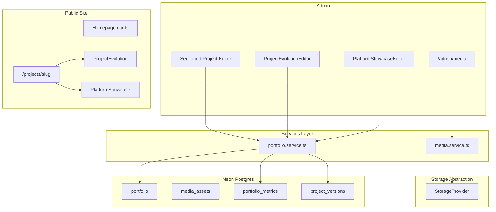
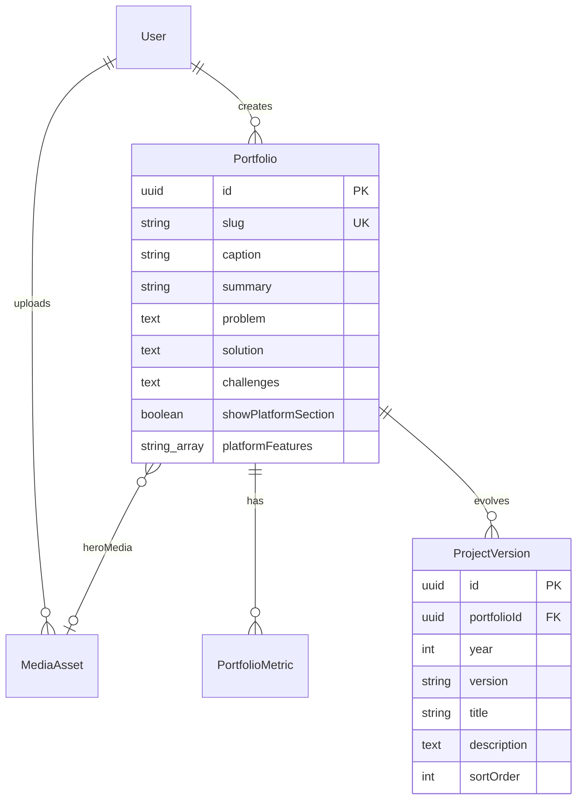

# Portfolio Admin V2 — Refined Architecture (v3)

**System type:** Engineering Portfolio Management System — not a generic CMS.

**Single source of truth for:** portfolio projects, engineering metrics, project evolution, project media, articles, reviews, and future case studies.

**Guiding principles:** simple architecture, minimal normalization, reusable systems only where they solve real workflow pain, maintainability over flexibility.

---

## 1. Updated Architecture

### Target data flow



### v3 additions (this enhancement)

| Addition | Decision |
|----------|----------|
| Project evolution timeline | **`ProjectVersion` table** — queried/sorted per project; replaces `releaseHistory` JSON |
| `<ProjectEvolution />` | Reusable public component; **renders nothing** when zero versions |
| Built With This Platform | **`showPlatformSection` + `platformFeatures[]`** on `Portfolio`; optional per project |
| Portfolio as a project | **Seed row** in Phase 2 with full story + 5 evolution entries + platform showcase enabled |
| Admin | Evolution + platform editors **inside existing ProjectEditor tabs** — no separate admin page |

### Layer responsibilities (unchanged)

- **Routes / actions:** validate → call service → revalidate
- **Services:** business rules, version CRUD, platform feature validation, slug generation
- **Data (`lib/data`):** Prisma queries only
- **Components:** rendering only; timeline logic stays in service/types

---

## 2. Revised Database Model

### Normalize only what is queried independently

**Normalized tables:** `MediaAsset`, `PortfolioMetric`, **`ProjectVersion`**

**JSON on `Portfolio`:** features, gallery, responsibilities (not evolution — that's a table)

**Boolean + array on `Portfolio`:** platform showcase toggle + checklist items

**Text columns on `Portfolio`:** engineering story (problem, solution, architecture, challenges, lessons, future)

### Entity diagram



### `ProjectVersion` (new — replaces `releaseHistory` JSON)

```prisma
model ProjectVersion {
  id          String    @id @default(uuid())
  portfolioId String    @map("portfolio_id")
  year        Int
  version     String    // e.g. "Version 1", "V2"
  title       String
  description String    @db.Text
  sortOrder   Int       @default(0) @map("sort_order")
  portfolio   Portfolio @relation(fields: [portfolioId], references: [id], onDelete: Cascade)

  @@index([portfolioId, sortOrder])
  @@map("project_versions")
}
```

**Query pattern:** `findMany({ where: { portfolioId }, orderBy: { sortOrder: 'asc' } })`

**Optional:** index `(portfolioId, year)` if filtering by year later — not required v1.

### Platform showcase fields on `Portfolio`

| Field | Type | Purpose |
|-------|------|---------|
| `showPlatformSection` | `Boolean @default(false)` | Hide section entirely when false |
| `platformFeatures` | `String[] @default([])` | Checklist items shown when enabled |

**Catalog (constants in code, not DB):** admin UI presents predefined options; selected items stored in `platformFeatures[]`. Allows custom strings later without schema change.

Default catalog (initial):

- Technical Articles
- Engineering Case Studies
- Portfolio Projects
- Client Reviews
- Image Management
- Project Timelines
- Engineering Metrics
- SEO Content
- Admin Dashboard

### `Portfolio` field reference (consolidated)

**Keep:** `caption`, `description`, `category[]`, `url`, `github`, `keyFeatures`, `role`, `highlights`, `projectType`, `img`, timestamps, `createdBy`

**Add:** `slug`, `subtitle`, `summary`, `heroMediaId`, `gallery` (Json), `lifecycleStatus`, `publishStatus`, `startedAt`, `completedAt`, `sortOrder`, `docsUrl`, engineering story text fields, `features` (Json), `responsibilities` (Json), `seoTitle`, `seoDescription`, `ogMediaId`, **`showPlatformSection`**, **`platformFeatures`**

**Removed from plan:** `releaseHistory` Json — use **`ProjectVersion`** instead

### `PortfolioMetric` (unchanged)

```prisma
model PortfolioMetric {
  id           String    @id @default(uuid())
  portfolioId  String    @map("portfolio_id")
  label        String
  value        String
  description  String?   @db.Text
  displayOrder Int       @default(0) @map("display_order")
  portfolio    Portfolio @relation(fields: [portfolioId], references: [id], onDelete: Cascade)

  @@index([portfolioId, displayOrder])
  @@map("portfolio_metrics")
}
```

### Table count (still simple)

| Table | Purpose |
|-------|---------|
| `portfolio` | Evolved in place |
| `media_assets` | Media library |
| `portfolio_metrics` | Engineering metrics |
| **`project_versions`** | Evolution timeline |

Four tables touched; no `PortfolioProject` fork.

### Migration strategy

1. **Migration A:** `media_assets`, `portfolio_metrics`, **`project_versions`**, new nullable `portfolio` columns
2. **Migration B:** backfill slugs, register hero images as media assets
3. **Migration C (seed):** insert **Engineering Portfolio Management System** project + 5 `ProjectVersion` rows (see §11)
4. **Migration D:** admin + public read new fields; legacy columns remain as fallbacks

---

## 3. Project Evolution — Component & Data Design

### `<ProjectEvolution />`

**Location:** [`src/components/Portfolio/ProjectEvolution.tsx`](src/components/Portfolio/ProjectEvolution.tsx) (new)

**Props:**

```typescript
interface ProjectEvolutionProps {
  versions: ProjectVersionRecord[];
}
```

**Behavior:**

- If `versions.length === 0` → return `null` (section omitted)
- Render vertical timeline: year → version label → title → description
- Connector line between entries (↓ visual flow)
- Dark theme: use existing `border-border`, `text-muted-foreground`, accent dot markers
- Mobile: single column, full width; no horizontal scroll

**Visual structure:**

```
● 2022                          ← year (muted label)
  Version 1                     ← version badge
  Static HTML/CSS Portfolio     ← title (font-semibold)
  Started as a static website…  ← description

        ↓                       ← connector

● 2023
  Version 2
  Migrated to React
  …
```

**Reuse:** `Card` section wrapper, existing typography scale from [`PortfolioSectionClient`](src/components/PortfolioSection/PortfolioSectionClient.tsx), lucide `Circle` or custom dot — no new design system.

**Accessibility:** ordered list semantics (`<ol>`) or `role="list"` with visible year headings.

### Data loading

- Server Component on `/projects/[slug]` loads portfolio + `versions` in one service call
- Pass serialized versions to `<ProjectEvolution />`
- No client fetch

---

## 4. Built With This Platform — Component & Data Design

### `<PlatformShowcase />`

**Location:** [`src/components/Portfolio/PlatformShowcase.tsx`](src/components/Portfolio/PlatformShowcase.tsx) (new)

**Props:**

```typescript
interface PlatformShowcaseProps {
  enabled: boolean;
  features: string[];
}
```

**Behavior:**

- If `!enabled || features.length === 0` → return `null`
- Section heading: **Built With This Platform**
- Grid of checkmark items (✓ prefix or lucide `Check`)
- 2-column grid on md+, 1 column on mobile

**Only the portfolio platform project** (and future meta-projects) should enable this by default. Client/SaaS projects leave `showPlatformSection = false`.

---

## 5. Portfolio Platform — First-Class Project (Seed Data)

**Title (`caption`):** Engineering Portfolio Management System

**Slug:** `engineering-portfolio-management-system`

**NOT:** "Portfolio Website"

**Summary:**

> A custom-built developer portfolio platform that has evolved over multiple years into a full content management system for engineering projects, technical articles, case studies, reviews, and media management.

**projectType:** `engineering`

**lifecycleStatus:** `active` (or `production`)

**publishStatus:** `published`

**showPlatformSection:** `true`

**platformFeatures:** full catalog (all 9 items)

### Engineering story (seed content)

| Field | Content |
|-------|---------|
| **problem** | Managing projects, articles, screenshots, and technical content required editing source code and redeploying for every update. |
| **solution** | Built a custom engineering portfolio platform with an integrated CMS allowing projects, articles, media, and technical documentation to be managed without modifying code. |
| **challenges** | Multiple framework migrations; database evolution; authentication; admin architecture; SEO; dynamic routing; content modeling; media management; performance optimization. |
| **role** | Full architecture, design, implementation, deployment and continuous evolution. |
| **category[]** | Next.js, TypeScript, PostgreSQL, Neon, Prisma, Auth.js, Server Actions, SSR, Image Optimization |

### `ProjectVersion` seed rows (5 entries)

| year | version | title | description (summary) |
|------|---------|-------|------------------------|
| 2022 | Version 1 | Static HTML/CSS Portfolio | Started as a static website while learning web development. |
| 2023 | Version 2 | Migrated to React | Improved maintainability through reusable components and modern frontend architecture. |
| 2024 | Version 3 | Migrated to Next.js | Added SSR, routing improvements, SEO, and production architecture. |
| 2025 | Version 4 | Portfolio CMS | Added database-backed admin for projects, articles and reviews. |
| 2026 | Version 5 | Engineering Portfolio Management System | Added media library, engineering metrics, project case studies, improved CMS workflow and structured project management. |

**Delivery:** idempotent seed script in [`scripts/seed-portfolio-platform.ts`](scripts/seed-portfolio-platform.ts) (runs after Phase 2 migration; skips if slug exists).

**Suggested metrics (optional seed):** e.g. "Framework migrations" → "4", "Admin modules" → "4", "Years in production" → "4+"

---

## 6. Admin CMS — Evolution & Platform Editors

Integrated into **ProjectEditor tabs** — no separate routes.

### New editor tabs

| Tab | Component | Capabilities |
|-----|-----------|--------------|
| **Evolution** | `ProjectEvolutionEditor` | Add/remove version rows; edit year, version, title, description; drag-and-drop reorder (`sortOrder`); live mini-preview of timeline |
| **Platform** | `PlatformShowcaseEditor` | Toggle `showPlatformSection`; checkbox list from catalog + optional custom item; preview checklist |

### `ProjectEvolutionEditor`

- Uses shared `SortableList` (same as gallery reorder)
- Inline form rows: year (number), version (text), title, description (textarea)
- "Add version" appends row with next `sortOrder`
- Delete row with `ConfirmDialog`
- **Preview:** collapsed `<ProjectEvolution />` preview below editor (client island with draft state before save)

### `PlatformShowcaseEditor`

- Switch: "Show Built With This Platform section"
- When off, `platformFeatures` ignored on public page
- Checkbox grid from `PLATFORM_FEATURE_CATALOG` constant
- Optional: one custom text input to append ad-hoc feature string

### Save & preview flow

- Versions and platform fields saved with **same Save action** as rest of project (single server action payload)
- Server action validates versions array via Zod (`ProjectVersionInputSchema[]`)
- **Preview before save:** desktop "Preview" opens `/projects/[slug]?preview=1` with draft data (Phase 3 stretch) OR inline component preview in editor (minimum v1)
- Revalidate `/projects/[slug]` on publish

### Updated ProjectEditor tab list

| Tab | Contents |
|-----|----------|
| Overview | title, subtitle, summary, status, dates, sort |
| Media | hero, gallery |
| Metrics | MetricEditor |
| Story | problem, solution, architecture, challenges, lessons, future |
| Details | features, responsibilities, categories |
| **Evolution** | ProjectEvolutionEditor |
| **Platform** | PlatformShowcaseEditor |
| Links & SEO | urls, metadata, og image |

---

## 7. Public Project Page — Updated Section Order

`/projects/[slug]` sections (top to bottom):

1. Hero + title + subtitle + lifecycle badge
2. Summary
3. Technologies (`category[]`)
4. Metrics (stat cards)
5. Engineering story (problem → solution → …)
6. Features
7. Project dates (`startedAt` / `completedAt`)
8. **`<ProjectEvolution />`** — only if versions exist
9. Gallery
10. **`<PlatformShowcase />`** — only if enabled + items exist
11. Links

Homepage cards unchanged: hero, title, summary, badges, links, **View project** CTA.

---

## 8. Media & Storage Architecture

(Unchanged from v2 — see prior sections in implementation.)

**Phase 1 remains highest priority** — media unblocks hero images for the portfolio platform project seed.

---

## 9. Component Hierarchy (updated)

```
src/components/Portfolio/           # public domain
├── ProjectEvolution.tsx
├── ProjectEvolutionItem.tsx        # single timeline node
├── PlatformShowcase.tsx
├── ProjectMetrics.tsx
├── ProjectDetailHero.tsx
└── …

src/components/Admin/portfolio/     # admin domain
├── ProjectEditor.tsx
├── ProjectEvolutionEditor.tsx
├── ProjectEvolutionRow.tsx
├── PlatformShowcaseEditor.tsx
├── MetricEditor.tsx
└── sections/…

src/lib/portfolio/
├── platform-feature-catalog.ts     # PLATFORM_FEATURE_CATALOG constant
└── …

src/lib/services/
├── portfolio.service.ts            # version CRUD, platform validation
└── media.service.ts
```

**Tests (per project rules):** `tests/unit/portfolio/project-version.test.ts`, `tests/unit/portfolio/platform-showcase.test.ts` — service/Zod validation only.

---

## 10. Simplified Implementation Plan (revised phases)

### Phase 1 — Media system (~1.5 weeks) — UNCHANGED, FIRST

StorageProvider, MediaAsset, library, MediaPicker, replace `/api/upload`.

### Phase 2 — Schema + platform seed (~1 week)

- Additive `portfolio` columns + `portfolio_metrics` + **`project_versions`**
- `platform.service` / extend `portfolio.service`: version CRUD, platform feature validation
- Backfill existing projects with slugs
- **Seed script:** Engineering Portfolio Management System + 5 versions + platform showcase + story fields
- Zod schemas: `ProjectVersionSchema`, `PlatformShowcaseSchema`

**Exit:** Portfolio platform project visible in admin and (after Phase 4) on public site with full data in DB — **no hardcoded timeline**.

### Phase 3 — Admin editor (~2 weeks)

- Sectioned `ProjectEditor` with **Evolution** and **Platform** tabs
- `SortableList` for version reorder
- Inline `<ProjectEvolution />` preview in Evolution tab
- MetricEditor, story sections, admin shell, auth hardening
- Single save action includes versions + platform fields

**Exit:** Any project's evolution editable in admin; platform section toggleable.

### Phase 4 — Public pages (~1 week)

- `/projects/[slug]` with `<ProjectEvolution />` and `<PlatformShowcase />`
- Slim homepage cards + CTA
- Portfolio platform project detail page is the **showcase** for all new sections
- SEO metadata

**Exit:** Vertical timeline renders for portfolio platform; hidden for projects with zero versions.

### Phase 5 — Expansion (~ongoing)

- Article cover media
- Legacy `/public` asset migration
- Metric icons / visibility
- Draft preview mode (`?preview=1`)
- Remove [`portfolioItems.ts`](src/lib/portfolioItems.ts) legacy dependency

---

## 11. Engineering Standards (this enhancement)

| Standard | Application |
|----------|-------------|
| Reuse existing UI | `Card`, `Badge`, `Button`, `Label`, `Textarea` from [`src/components/ui/`](src/components/ui/); match dark theme tokens |
| Mobile responsive | Timeline and showcase grid stack on small screens |
| Database-first | All evolution content in `project_versions`; no hardcoded timeline in components |
| Optional sections | Components return `null` when no data — no empty placeholders |
| Extensible | New portfolio Version 6 added via admin only; catalog extensible via constant |
| No separate admin page | Evolution + platform live inside ProjectEditor |
| Lint / types | Zero new ESLint/TS errors; fix source not config |
| File placement | Public components → `components/Portfolio/`; admin → `components/Admin/portfolio/`; services → `lib/services/` |

---

## 12. Future Expansion

| Need | Approach |
|------|----------|
| Version 6 (2027+) | Add row via admin Evolution tab |
| Case studies | Same `Portfolio` row; richer story fields |
| Roadmap visualization | `ProjectVersion` data already structured — optional horizontal layout variant |
| Cross-project evolution queries | `ProjectVersion` table supports `findMany({ where: { year: 2024 } })` if needed later |
| Custom platform features | Append to `platformFeatures[]` without schema change |

---

## 13. Risks

| Risk | Mitigation |
|------|------------|
| Seed script duplicates project | Idempotent upsert on `slug` |
| Evolution tab complexity | Reuse SortableList + row component; cap row component ~80 lines |
| Platform section on wrong projects | Default `showPlatformSection = false`; only seed enables for meta-project |
| JSON vs table drift | **Dropped `releaseHistory` JSON** — single source: `ProjectVersion` |

---

## 14. Success Criteria (updated)

- Admin is the only workflow for portfolio updates
- **Portfolio platform is a first-class project** with full engineering story
- **Project evolution timeline is DB-driven** and reusable on any project
- **Built With This Platform** is configurable and hidden by default
- Media upload requires zero manual `/public` management
- Public detail pages tell an engineering story in under 60 seconds
- Schema stays simple: **3 new tables** + 1 evolved table

---

## 15. Implementation Gate

**Do not begin implementation until explicit approval.**

When approved, start with **Phase 1 (Media)** unless directed otherwise.

After each phase: completion report per project rules (modified files, dependencies, verification, risks) → stop for review.

---

## Key files (reference)

| Concern | Current | V2 target |
|---------|---------|-----------|
| Schema | [`prisma/schema.prisma`](prisma/schema.prisma) | + `MediaAsset`, `PortfolioMetric`, **`ProjectVersion`**; evolve `Portfolio` |
| Evolution UI | none | `components/Portfolio/ProjectEvolution.tsx` |
| Platform UI | none | `components/Portfolio/PlatformShowcase.tsx` |
| Admin evolution | none | `components/Admin/portfolio/ProjectEvolutionEditor.tsx` |
| Seed | [`scripts/migrate-content.ts`](scripts/migrate-content.ts) | `scripts/seed-portfolio-platform.ts` |
| Public detail | none | `app/projects/[slug]/page.tsx` |
