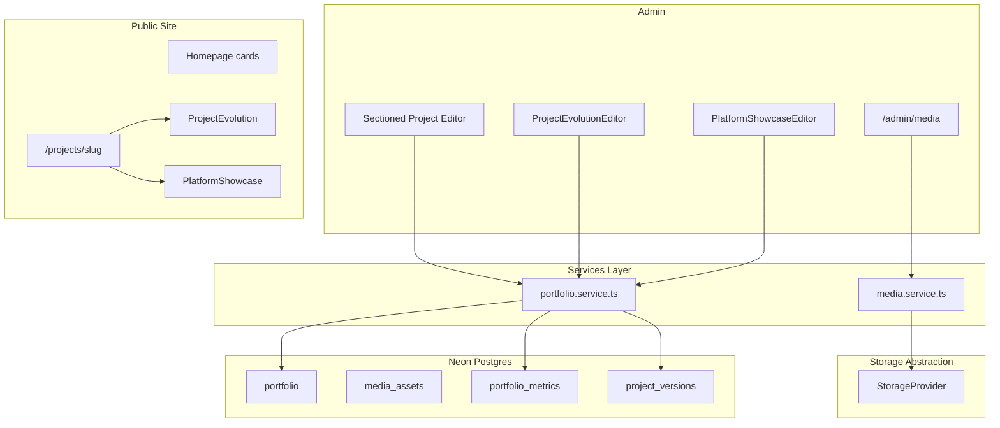
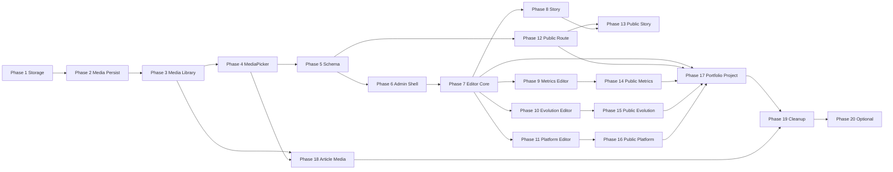

# Portfolio Admin V2 — Refined Architecture (v3.1)

**Repository:** This standalone portfolio codebase only. Authoritative workflow: [`.cursor/rules.mdc`](.cursor/rules.mdc). No references to external repos.

**System type:** Engineering Portfolio Management System — not a generic CMS.

**Single source of truth for:** portfolio projects, engineering metrics, project evolution, project media, articles, reviews, and future case studies.

**Guiding principles:** simple architecture, minimal normalization, reusable systems only where they solve real workflow pain, maintainability over flexibility.

**Implementation status:** Planning complete. **No implementation has begun** until explicit phase approval.

---

## 1. Updated Architecture

*(Unchanged from v3 — architecture is approved.)*

### Target data flow

### Approved feature decisions

| Feature | Decision |
|---------|----------|
| Portfolio model | **Evolve existing `Portfolio`** — no `PortfolioProject` table |
| Project evolution | **`ProjectVersion` table** + `<ProjectEvolution />` (optional render) |
| Platform showcase | **`showPlatformSection` + `platformFeatures[]`** on `Portfolio` |
| Metrics | **`PortfolioMetric` table** — label, value, description, displayOrder |
| Media | **`MediaAsset` table** + `StorageProvider` abstraction |
| Portfolio as project | Created via **admin in Phase 17** (optional dev seed helper only) |

### Layer responsibilities

- **Routes / actions:** validate → call service → revalidate
- **Services (`src/lib/` by domain):** business rules, validation, orchestration
- **Data (`src/lib/data/`):** Prisma queries only
- **Components:** rendering + interaction wiring only
- **Tests:** `tests/unit/<domain>/` — never colocated in `lib/`

---

## 2. Revised Database Model

*(Unchanged from v3 — see prior sections for full field reference, ER diagram, and Prisma models.)*

**Normalized tables:** `MediaAsset`, `PortfolioMetric`, `ProjectVersion`

**JSON on `Portfolio`:** features, gallery, responsibilities

**Platform showcase:** `showPlatformSection` (boolean) + `platformFeatures` (string[])

**Engineering story:** text columns — problem, solution, architecture, challenges, lessonsLearned, futureImprovements

**Migration principle:** additive only during Phases 2 and 5; no destructive drops until Phase 19.

**Slug backfill:** Phase 5 only — programmatic script, not manual.

---

## 3–9. Component, Media, Storage, Public Layout, Admin UX

*(Architecture sections unchanged — component hierarchy, public section order, storage interface, engineering standards, future expansion, and risks remain as documented in v3.)*

**Public section order (final target):** Hero → Summary → Tech → Metrics → Story → Features → Dates → Evolution → Gallery → Platform Showcase → Links

**Key file placement (per rules.mdc):**

| Layer | Path |
|-------|------|
| Storage | `src/lib/storage/` |
| Media service | `src/lib/media/` or `src/lib/services/media/` |
| Portfolio service | `src/lib/portfolio/` |
| Public UI | `src/components/Portfolio/` |
| Admin portfolio UI | `src/components/Admin/portfolio/` |
| Admin media UI | `src/components/Admin/media/` |
| Tests | `tests/unit/storage/`, `tests/unit/media/`, `tests/unit/portfolio/` |

---

## 10. Phase Rules (All Phases)

Every implementation phase MUST:

1. Have **one primary objective**
2. List **dependencies** on prior phases
3. List **in-scope** and **explicit out-of-scope** work
4. Define **verification steps** and **exit criteria**
5. Keep migrations **additive** where applicable
6. **Preserve current production behavior** for unrelated features
7. **Not refactor unrelated code** merely because it is nearby
8. Follow [`.cursor/rules.mdc`](.cursor/rules.mdc) — file placement, services, lint, no ESLint config changes

**After each phase completes, stop and report:**

1. Applicable tests run
2. Typecheck (`npx tsc` / build typecheck as applicable)
3. Lint (`npm run lint`)
4. Modified files + why
5. Schema / dependency / env changes
6. Verification performed
7. Known risks and deferred items

**Then STOP — wait for explicit approval before the next phase.**

**Dependency changes:** require explicit user approval per rules.mdc before `npm install`.

---

## 11. Dependency Chain

Phases 8–11 depend on Phase 7 but are **independent of each other** (may be implemented in any order after Phase 7).

Phases 13–16 depend on Phase 12 and their respective admin editor phases.

---

## 12. Deviations From Requested Phase Boundaries

| Requested | Adjustment | Reason |
|-----------|--------------|--------|
| Phase 4 sets `heroMediaId` | Phase 4 sets **`img` from `MediaAsset.publicUrl`** only; **`heroMediaId` added in Phase 5** with backfill | `heroMediaId` column does not exist until Phase 5 schema migration |
| Phase 5 before admin uses new fields | Confirmed — schema before editor redesign | Correct dependency order |
| Phase 17 seed script | **Primary workflow: enter content via admin**; optional `scripts/seed-portfolio-platform.ts` for dev/CI only | User requirement: demonstrate finished admin, not seed-driven production content |
| Phase 2 `@aws-sdk/client-s3` | Listed as **dependency approval required** before install | rules.mdc git/dependency policy |
| Phase 6 fixes `getPortfolioItemById` | Included in Phase 6 (admin shell bugfix) | Known bug; safe before editor rebuild |

No other architecture changes.

---

## 13. Implementation Phases (20)

---

### Phase 1 — Storage Foundation

**Primary objective:** Establish the storage abstraction only.

**Depends on:** nothing

**In scope:**

- `StorageProvider` interface (`upload`, `delete`, `getPublicUrl`, optional `getSignedUploadUrl`)
- `LocalStorageProvider` (dev)
- `S3StorageProvider` (Neon / AWS S3 / R2 via env — single implementation, multiple configs)
- `getStorageProvider()` factory
- Env vars documented (no secrets committed): `STORAGE_PROVIDER`, `S3_*`
- Unit tests: `tests/unit/storage/` — factory selection, local upload/delete round-trip (temp dir)

**Out of scope:**

- Prisma models, media APIs, admin UI, portfolio forms
- `@aws-sdk/client-s3` install until explicit dependency approval

**Likely files:**

- `src/lib/storage/types.ts`
- `src/lib/storage/local.provider.ts`
- `src/lib/storage/s3.provider.ts`
- `src/lib/storage/factory.ts`
- `tests/unit/storage/*.test.ts`

**Verification:**

- Unit tests pass
- Manual: instantiate local provider, upload buffer, read public URL, delete
- `npm run lint`; typecheck clean

**Exit criteria:** Storage providers can be instantiated and exercised independently.

**STOP for review.**

---

### Phase 2 — Media Persistence & Upload

**Primary objective:** First-class persisted media uploads.

**Depends on:** Phase 1

**In scope:**

- `MediaAsset` Prisma model + additive migration
- `src/lib/media/media.service.ts` (or domain-equivalent per rules)
- Upload validation (type, size)
- `POST /api/media/upload` (multipart, admin auth)
- `POST /api/media/presign` if required for S3 prod path
- Persist metadata row after storage upload
- Minimal dev verification page or admin-only test route acceptable

**Out of scope:**

- Full media library UI, MediaPicker, portfolio form changes
- Deprecating `/api/upload` (Phase 19)

**Likely files:**

- `prisma/schema.prisma`, `prisma/migrations/*`
- `src/lib/media/media.service.ts`
- `src/lib/data/media.ts`
- `src/lib/types/media.ts`
- `src/app/api/media/upload/route.ts`
- `src/app/api/media/presign/route.ts` (if needed)

**Verification:**

- Authenticated POST upload → object in storage + `MediaAsset` row
- Invalid file rejected
- `npm run lint`; typecheck; optional unit test for validation logic

**Exit criteria:** Admin upload creates storage object + valid DB row.

**STOP for review.**

---

### Phase 3 — Media Library

**Primary objective:** Admin can manage uploaded assets.

**Depends on:** Phase 2

**In scope:**

- `/admin/media` page
- Media grid/list: preview, filename, dimensions, date
- Edit alt text / caption (server action or PATCH route)
- Delete with `ConfirmDialog`; block or warn if referenced (simple count on portfolio `img` / future FK)
- Loading, error, empty states
- Nav link in existing admin layout (minimal — full shell is Phase 6)

**Out of scope:**

- MediaPicker, portfolio integration
- Bulk operations, tagging, usage tracking table

**Likely files:**

- `src/app/admin/media/page.tsx`
- `src/components/Admin/media/MediaGrid.tsx`
- `src/components/Admin/media/MediaMetadataForm.tsx`
- `src/lib/actions/media.ts`

**Verification:**

- Upload → appears in library → edit metadata → delete
- Empty library state renders
- Public site and portfolio CRUD unchanged

**Exit criteria:** Media uploaded, browsed, edited, safely deleted through admin.

**STOP for review.**

---

### Phase 4 — MediaPicker & Portfolio Hero Workflow

**Primary objective:** Eliminate `/public` + relative-path workflow for project heroes.

**Depends on:** Phase 3

**In scope:**

- Reusable `MediaPicker` (modal: browse library + inline upload)
- Integrate into existing [`PortfolioForm`](src/components/Admin/PortfolioForm.tsx) / primary fields
- Hero image preview in form
- On select: set `img` = `MediaAsset.publicUrl` (compatibility period)
- Hide or deprecate manual path input + old [`ImageUpload`](src/components/Admin/ImageUpload.tsx) path workflow
- Legacy `/public` assets untouched

**Out of scope:**

- `heroMediaId` column (Phase 5) — picker stores URL only until then
- Gallery, new sectioned editor, public pages

**Likely files:**

- `src/components/Admin/media/MediaPicker.tsx`
- `src/components/Admin/portfolio-form/PortfolioFormPrimaryFields.tsx`
- `src/components/Admin/ImageUpload.tsx` (deprecate or redirect)

**Verification:**

- Create/edit portfolio item: pick image from library, save, preview on list/card
- No manual path paste required
- Existing projects with old `img` paths still render

**Exit criteria:** Project hero requires zero manual `/public` copy/paste.

**STOP for review.**

---

### Phase 5 — Portfolio Schema Foundation

**Primary objective:** Evolve Portfolio data model without changing public UI or rebuilding admin editor.

**Depends on:** Phase 4 (media URLs exist; backfill can link assets)

**In scope:**

- Additive `Portfolio` columns (slug, subtitle, summary, story fields, lifecycle/publish status, dates, sortOrder, gallery JSON, features JSON, responsibilities JSON, platform fields, seo fields, **`heroMediaId`**, **`ogMediaId`**)
- `PortfolioMetric`, `ProjectVersion` tables + migration
- Zod schemas in `src/lib/types/portfolio.ts`
- `src/lib/portfolio/portfolio.service.ts` — CRUD for metrics/versions, slug generation, platform validation
- Extend `src/lib/data/portfolio.ts` reads/writes
- Slug backfill script for existing rows
- Backfill `heroMediaId` where `img` matches a `MediaAsset.publicUrl`

**Out of scope:**

- New admin editor tabs, public `/projects/[slug]`, seed content (Phase 17)
- Removing legacy columns

**Likely files:**

- `prisma/schema.prisma`, migrations
- `scripts/backfill-portfolio-slugs.ts`
- `src/lib/portfolio/portfolio.service.ts`
- `src/lib/types/portfolio.ts`

**Verification:**

- Existing portfolio CRUD still works via current form
- Programmatic/service test: create metric + version rows for a project
- Slugs unique; legacy `img`/`caption`/`description` intact

**Exit criteria:** New structures readable/writable without breaking legacy data or public site.

**STOP for review.**

---

### Phase 6 — Admin Shell & Authentication Hardening

**Primary objective:** Coherent admin foundation before large editor.

**Depends on:** Phase 5 (optional for shell alone; recommended before Phase 7)

**In scope:**

- Admin sidebar + active route states
- Breadcrumbs on edit pages
- Shared primitives: `PageHeader`, `FormSection`, `FormField`, `EmptyState`, `ConfirmDialog`
- `requireAdmin()` enforces `role === 'admin'`
- Login/session cleanup (NextAuth patterns, env doc for `AUTH_SECRET`)
- Login rate limiting ([`rateLimit.ts`](src/lib/rateLimit.ts))
- Remove redundant auth redirects (middleware vs layout — single clear gate)
- Fix edit page: [`getPortfolioItemById`](src/lib/data/portfolio.ts) instead of loading all rows

**Out of scope:**

- Metrics/Evolution/Platform editors, public pages, MediaPicker changes

**Likely files:**

- `src/app/admin/layout.tsx`
- `src/components/Admin/layout/*`
- `src/lib/permissions.ts`, `src/lib/auth.ts`, `middleware.ts`
- `src/app/admin/portfolio/[id]/page.tsx`

**Verification:**

- Login/logout flow works
- Non-admin blocked
- Nav highlights active section
- Edit portfolio loads single item

**Exit criteria:** Admin navigation coherent; auth passes planned security checks.

**STOP for review.**

---

### Phase 7 — Project Editor Core

**Primary objective:** Sectioned editor shell replacing long form (initial tabs only).

**Depends on:** Phases 5, 6

**In scope:**

- `ProjectEditor` with tabs: **Overview**, **Media**, **Details**, **Links & SEO**
- Overview: title (caption), subtitle, summary, lifecycleStatus, publishStatus, projectType, sortOrder, dates
- Media: hero MediaPicker, gallery (JSON + picker)
- Details: categories, features/responsibilities JSON editors (basic)
- Links & SEO: url, github, docs, seo fields, og MediaPicker
- Single save via existing server actions extended through portfolio service
- Replace [`PortfolioForm`](src/components/Admin/PortfolioForm.tsx) on create/edit routes

**Out of scope:**

- Story tab, Metrics, Evolution, Platform tabs
- Public project pages

**Likely files:**

- `src/components/Admin/portfolio/ProjectEditor.tsx`
- `src/components/Admin/portfolio/sections/*`
- `src/lib/actions/portfolio.ts`

**Verification:**

- Create + edit project through new editor; all legacy fields preserved
- Homepage cards unchanged in behavior

**Exit criteria:** Full existing project info editable without functionality loss.

**STOP for review.**

---

### Phase 8 — Engineering Story Editor

**Primary objective:** Structured engineering narrative in admin.

**Depends on:** Phase 7

**In scope:**

- **Story** tab: problem, solution, architecture, challenges, lessonsLearned, futureImprovements
- Responsibilities + features editing (as planned in Details or Story — consolidate cleanly)
- Validation via Zod partial schemas
- Save with main project action

**Out of scope:**

- Public story rendering (Phase 13)
- Metrics, Evolution, Platform tabs

**Likely files:**

- `src/components/Admin/portfolio/sections/StorySection.tsx`

**Verification:**

- All story fields save and reload on edit
- Empty fields allowed (optional content)

**Exit criteria:** Engineering story fully maintainable in admin.

**STOP for review.**

---

### Phase 9 — Metrics Editor

**Primary objective:** Project metrics as standalone admin capability.

**Depends on:** Phase 7

**In scope:**

- **Metrics** tab + `MetricEditor` / `MetricRow`
- Add, edit, delete metrics
- `displayOrder` reorder (simple up/down or SortableList)
- Persistence via portfolio service
- Zod validation

**Out of scope:**

- Public `ProjectMetrics` (Phase 14)
- Metric icons, evidence, visibility (Phase 20)

**Likely files:**

- `src/components/Admin/portfolio/MetricEditor.tsx`
- `tests/unit/portfolio/portfolio-metric.test.ts`

**Verification:**

- CRUD metrics for a project; order persists

**Exit criteria:** Metrics completely manageable from admin.

**STOP for review.**

---

### Phase 10 — Project Evolution Editor

**Primary objective:** Version history maintained in admin.

**Depends on:** Phase 7

**In scope:**

- **Evolution** tab + `ProjectEvolutionEditor` + `ProjectEvolutionRow`
- Add/edit/delete `ProjectVersion` rows (year, version, title, description, sortOrder)
- Reorder versions
- Optional inline preview using `ProjectEvolution` component with draft state

**Out of scope:**

- Public timeline (Phase 15)
- Hardcoded timeline content

**Likely files:**

- `src/components/Admin/portfolio/ProjectEvolutionEditor.tsx`
- `src/components/Portfolio/ProjectEvolution.tsx` (preview-capable)
- `tests/unit/portfolio/project-version.test.ts`

**Verification:**

- Version rows CRUD + order; preview renders when rows exist

**Exit criteria:** Any project's evolution maintainable entirely from admin.

**STOP for review.**

---

### Phase 11 — Platform Showcase Editor

**Primary objective:** Optional "Built With This Platform" configuration.

**Depends on:** Phase 7

**In scope:**

- **Platform** tab + `PlatformShowcaseEditor`
- Toggle `showPlatformSection`
- Checkbox grid from `PLATFORM_FEATURE_CATALOG` constant
- Optional custom feature string
- Admin preview of checklist

**Out of scope:**

- Public `PlatformShowcase` (Phase 16)
- Enabling by default on non-meta projects

**Likely files:**

- `src/lib/portfolio/platform-feature-catalog.ts`
- `src/components/Admin/portfolio/PlatformShowcaseEditor.tsx`
- `tests/unit/portfolio/platform-showcase.test.ts`

**Verification:**

- Toggle off → features ignored; toggle on + selections persist
- Default false for existing projects

**Exit criteria:** Section configurable per project; disabled by default elsewhere.

**STOP for review.**

---

### Phase 12 — Public Project Route Foundation

**Primary objective:** Introduce `/projects/[slug]` with core sections only.

**Depends on:** Phase 5 (slugs), Phase 7 recommended (published content)

**In scope:**

- `src/app/projects/[slug]/page.tsx`
- Server load by slug; `publishStatus === published'` only (404 otherwise)
- Sections: hero, summary, technologies, links
- `generateMetadata` (seoTitle/description fallback)
- Homepage card **View project** CTA → slug route
- Slim homepage cards (no metrics/story on cards)

**Out of scope:**

- Story, metrics, evolution, platform, gallery on detail page (later phases)

**Likely files:**

- `src/app/projects/[slug]/page.tsx`
- `src/components/Portfolio/ProjectDetailHero.tsx`
- `src/components/PortfolioSection/PortfolioSectionClient.tsx`

**Verification:**

- Published project → valid detail page
- Draft → 404 public
- Legacy homepage still works

**Exit criteria:** Every published project has a valid detail page; drafts hidden.

**STOP for review.**

---

### Phase 13 — Public Engineering Story

**Primary objective:** Expose case-study narrative on detail pages.

**Depends on:** Phases 8, 12

**In scope:**

- Story sections on detail page: problem → solution → architecture → challenges → lessons → future
- Features, responsibilities, project dates where data exists
- Omit empty subsections (no placeholder headings)
- Responsive layout; dark theme

**Out of scope:**

- Metrics, evolution, platform sections

**Likely files:**

- `src/components/Portfolio/ProjectStory.tsx` (or split subcomponents)

**Verification:**

- Project with story content renders cleanly; empty story omits block

**Exit criteria:** Detail pages communicate engineering story responsively.

**STOP for review.**

---

### Phase 14 — Public Metrics

**Primary objective:** Display project metrics on detail pages.

**Depends on:** Phases 9, 12

**In scope:**

- `ProjectMetrics` + `ProjectMetricCard`
- Ordered stat cards from `PortfolioMetric`
- Responsive grid; omit section when zero metrics

**Out of scope:**

- Icons, evidence images, public/private filtering (Phase 20)

**Likely files:**

- `src/components/Portfolio/ProjectMetrics.tsx`

**Verification:**

- Metrics render in order; no metrics → section absent

**Exit criteria:** Metrics render cleanly without clutter.

**STOP for review.**

---

### Phase 15 — Public Evolution

**Primary objective:** Reusable vertical evolution timeline on detail pages.

**Depends on:** Phases 10, 12

**In scope:**

- Finalize `ProjectEvolution` + `ProjectEvolutionItem`
- Accessible vertical timeline (dark theme, mobile stack)
- Omit when `versions.length === 0`

**Out of scope:**

- Admin editor changes
- Horizontal roadmap variant (Phase 20)

**Likely files:**

- `src/components/Portfolio/ProjectEvolution.tsx`
- `src/components/Portfolio/ProjectEvolutionItem.tsx`

**Verification:**

- Project with versions → timeline; without → nothing rendered

**Exit criteria:** Evolution renders correctly or not at all.

**STOP for review.**

---

### Phase 16 — Public Platform Showcase

**Primary objective:** Expose "Built With This Platform" on detail pages.

**Depends on:** Phases 11, 12

**In scope:**

- `PlatformShowcase` — checklist/grid with check icons
- Hidden unless `showPlatformSection && platformFeatures.length > 0`

**Out of scope:**

- Admin editor changes

**Likely files:**

- `src/components/Portfolio/PlatformShowcase.tsx`

**Verification:**

- Enabled + populated → section shows; otherwise absent

**Exit criteria:** Only configured projects display the section.

**STOP for review.**

---

### Phase 17 — Portfolio as a First-Class Project

**Primary objective:** Create **Engineering Portfolio Management System** through the completed admin.

**Depends on:** Phases 7–11 (admin), 12–16 (public reference page)

**In scope:**

- Manually enter via admin (primary workflow):
  - Title, summary, engineering story, technologies, metrics, evolution (2022→2026), platform showcase, media
  - Slug: `engineering-portfolio-management-system`
  - `projectType`: engineering; `showPlatformSection`: true
- Public page acts as **reference implementation** for all sections
- Optional: `scripts/seed-portfolio-platform.ts` for dev/CI only — **not** production workflow

**Out of scope:**

- Hardcoded timeline in React components
- Replacing admin entry with seed as primary path

**Likely files:**

- Admin usage only; optional `scripts/seed-portfolio-platform.ts`

**Verification:**

- Entire project maintainable by editing in admin only
- Public page demonstrates all sections

**Exit criteria:** Portfolio project created/maintained via admin; serves as system showcase.

**STOP for review.**

---

### Phase 18 — Article Media

**Primary objective:** Reuse media system for article covers.

**Depends on:** Phases 3, 4; Phase 5 for `coverMediaId` column on `Article`

**In scope:**

- `Article.coverMediaId` migration (additive)
- MediaPicker in [`ArticleEditor`](src/components/Admin/ArticleEditor.tsx)
- Cover preview in admin
- Public article rendering uses cover when set

**Out of scope:**

- Inline article images in MDX body

**Likely files:**

- `prisma/schema.prisma`
- `src/components/Admin/article-editor/*`
- Blog card / post header components

**Verification:**

- Set cover via picker; displays on blog list/post

**Exit criteria:** Article covers use media library.

**STOP for review.**

---

### Phase 19 — Legacy Migration & Cleanup

**Primary objective:** Remove obsolete workflows after replacements proven.

**Depends on:** Phases 4, 17, 18

**In scope:**

- Migrate selected `/public` assets to object storage (optional script)
- Remove deprecated [`/api/upload`](src/app/api/upload/route.ts)
- Remove [`portfolioItems.ts`](src/lib/portfolioItems.ts) runtime dependency
- Remove manual `img` path UI remnants
- Drop compatibility fields **only when safe** (document each drop)
- Dead code cleanup; verify no broken images

**Out of scope:**

- Unrelated refactors

**Likely files:**

- `scripts/migrate-public-assets.ts`
- deletions per audit

**Verification:**

- Full site smoke: homepage, projects, blogs, admin CRUD
- `npm run ci` if approved

**Exit criteria:** Legacy workflows removed; content intact.

**STOP for review.**

---

### Phase 20 — Optional Enhancements

**Primary objective:** Non-blocking improvements.

**Depends on:** Phase 19 complete (V2 core done)

**Examples (pick individually after approval):**

- Metric icons, evidence images, `isPublic` visibility
- Draft preview route (`?preview=1`)
- Autosave in editor
- Media usage tracking table
- PDF media type
- Case-study layout variants
- Horizontal evolution timeline

**Exit criteria:** N/A — each sub-feature is its own mini-phase with separate approval.

---

## 14. Success Criteria (Program-Level)

Unchanged from v3:

- Admin is the only workflow for portfolio updates
- Portfolio platform is a first-class project (via admin, Phase 17)
- Evolution DB-driven; platform showcase optional per project
- Zero manual `/public` management for new content (Phase 4+)
- Public detail pages tell engineering story in under 60 seconds
- Schema: 3 new tables + 1 evolved `Portfolio`
- Storage swappable via env

---

## 15. Implementation Gate

**No implementation has begun.**

When approved, start with **Phase 1 — Storage Foundation** only.

Do not batch phases. Do not skip review gates.

---

## Key Files (Reference)

| Concern | Current | Target |
|---------|---------|--------|
| Schema | [`prisma/schema.prisma`](prisma/schema.prisma) | Phases 2, 5, 18 |
| Storage | none | `src/lib/storage/*` Phase 1 |
| Media | [`src/app/api/upload/route.ts`](src/app/api/upload/route.ts) | `src/lib/media/*`, `/api/media/*` Phases 2–3 |
| Portfolio form | [`src/components/Admin/PortfolioForm.tsx`](src/components/Admin/PortfolioForm.tsx) | `ProjectEditor` Phases 7–11 |
| Public detail | none | `/projects/[slug]` Phases 12–16 |
| Rules | [`.cursor/rules.mdc`](.cursor/rules.mdc) | authoritative for all phases |
