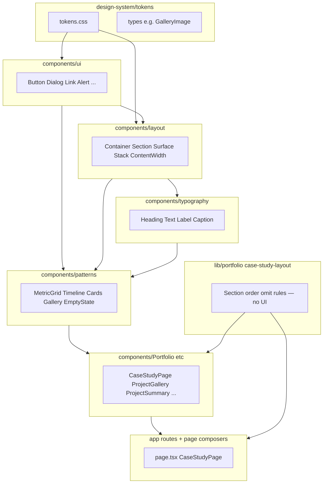

# Design System (V1)

Contributor guide for the **engineering portfolio** presentation layer. This documents what was **shipped** in the V1 design-system program—not aspirational architecture.

**Living catalog:** run `npm run storybook` (port 6006). Storybook covers `ui/`, `layout/`, `typography/`, `patterns/`, and token swatches. Domain components (`Portfolio/`, home sections) are intentionally **not** cataloged.

**Program plan:** `.cursor/plans/engineering_design_system.plan.md`  
**API history:** `docs/design-system-changelog.md`  
**Application architecture (data, actions, Prisma):** `docs/ARCHITECTURE.md`

---

## Purpose

The design system keeps the **public portfolio** visually consistent and maintainable: home narrative, case studies, articles, About, and shared navigation. It borrows **engineering discipline** (layers, review gates, ESLint boundaries) without enterprise scale—no package publishing, no token build pipelines, no component governance committees.

**North star:** Visitors feel cohesion; they do not notice a “design system.”

### Principles

| Principle | Practice |
|-----------|----------|
| **Consistency over novelty** | Reuse primitives and patterns before inventing new shells |
| **Composition over inheritance** | Domain wrappers compose patterns; avoid mega-configurable components |
| **Server-first** | Layout, typography, and presentation patterns stay Server Components unless interaction requires client state |
| **Extend before Create** | Add a `Button` variant or `Surface` slot before a new component |
| **Lightweight by Design** | New abstractions need **2–3 real consumers** and must reduce maintenance |
| **Domain-first Composition** | Prefer `ProjectCard` over `<Card variant="portfolio" />` |
| **Deletion budget** | Replacing legacy styling removes the old path in the same change |

---

## Layer architecture

Dependency flows **down** the stack. Higher layers may import lower layers; not the reverse.



### Folder map

| Layer | Path | Role |
|-------|------|------|
| Tokens | `src/design-system/tokens/` | Semantic CSS variables (`tokens.css`) |
| Types | `src/design-system/types/` | Cross-layer presentation contracts (e.g. `GalleryImage`) |
| Primitives | `src/components/ui/` | Interactive and form shells (shadcn + extensions) |
| Layout | `src/components/layout/` | Page shell, section rhythm, surfaces, spacing |
| Typography | `src/components/typography/` | Heading scale, body, labels, captions |
| Patterns | `src/components/patterns/` | Reusable compositions with ≥2 consumers |
| Domain | `src/components/Portfolio/`, home sections, etc. | Data mapping + section wiring |
| IA config | `src/lib/portfolio/case-study-layout.ts` | Case study section order and omit rules (**no UI**) |

### ESLint boundaries

`eslint.config.mjs` enforces:

- `design-system`, `ui`, `layout`, `typography`, `patterns` **must not** import `@/lib/data`, `@/lib/db`, or `@/lib/actions`
- `patterns` additionally blocked via `no-restricted-imports` on those paths
- `components` must not import `lib-data` or `lib-db` directly

Story files disable boundary rules for Storybook convenience; production layers remain protected.

---

## What does **not** belong in the design system

Do not place these in `ui/`, `layout/`, `typography/`, or `patterns/`:

| Excluded | Where it belongs |
|----------|------------------|
| Portfolio-domain logic | `src/components/Portfolio/`, `src/lib/portfolio/` |
| Data fetching, Prisma, repositories | `src/lib/data/`, `src/lib/db/` |
| Server actions | `src/lib/actions/` |
| Project-specific business rules | `src/lib/portfolio/`, domain components |
| Speculative one-consumer abstractions | Keep inline in the single domain component until a second consumer exists |
| Admin shell redesign | Admin reuses primitives opportunistically; full admin UI is out of V1 scope |

**Intentionally rejected or deferred (do not document as shipped):**

- `TechnologyBadgeList` pattern — rejected at Architecture Review (single-consumer overlap not justified)
- `FeatureChecklist` pattern — rejected (platform/story shapes did not warrant shared pattern)
- Dedicated `ProjectTechnologies` case study section — deferred; summary shows category badges today
- Related Articles on case studies — deferred (no schema consumer on project pages)

---

## Semantic token model

**Source files:** `src/app/globals.css` (shadcn `oklch` theme) + `src/design-system/tokens/tokens.css` (semantic aliases).

### Semantic tokens (`--ds-*`)

| Token | Role | Maps to |
|-------|------|---------|
| `--ds-canvas` | Page background | `--background` |
| `--ds-surface` | Cards / panels | `--card` |
| `--ds-elevated` | Nested surfaces | `--secondary` |
| `--ds-border-subtle` | Subtle borders | `--border` |
| `--ds-text-primary` | Primary text | `--foreground` |
| `--ds-text-muted` | Secondary text | `--muted-foreground` |

Tailwind theme tokens (`bg-background`, `text-muted-foreground`, `border-border`, etc.) are the **primary** authoring surface in components.

### Legacy aliases (still present — do not remove in drive-by changes)

Bridged in `tokens.css` for migration compatibility: `--site-bg-color`, `--blog-card-border`, `--card-inner-bg`, `--heading-color`, `--review-card-bg`, `--blog-card-bg`, `--skill-bg`, etc.

`Heading` still references `text-[var(--heading-color)]`. Token cleanup is **deferred** to a future visual redesign.

---

## UI primitives (`src/components/ui/`)

shadcn-based, presentation-only. **No** data or action imports.

| Component | Notes |
|-----------|--------|
| `Button` | Variants: `default`, `destructive`, `outline`, `secondary`, `ghost`, `link`. Sizes: `default`, `sm`, `lg`, `icon` (44px min touch target for gallery/admin) |
| `Dialog` | Modal: focus trap, Escape, scroll lock. Used by gallery lightbox and admin confirm flows |
| `Link` | Next.js link; external URLs get icon + sr-only “opens in new tab” |
| `Alert` | Inline banner; `warning` variant for preview banner |
| `Badge` | Status and technology chips |
| `Card` | shadcn card — **admin forms**; public cards prefer `Surface` + patterns |
| `Input`, `Textarea`, `Label` | Form fields (admin) |
| `Tabs` | Tabbed admin UI |
| `Separator` | Horizontal / vertical divider |
| `Spinner` | `role="status"`, `aria-label="Loading"` |
| `LoadingState` | Spinner + label, `role="status"` |

Extend `Button` for icon controls—do not add `GalleryButton` or `HeroButton`.

---

## Layout primitives (`src/components/layout/`)

Server-safe. No hooks.

| Component | Purpose |
|-----------|---------|
| `Container` | `max-w-7xl` page container; optional `as="main"` |
| `Section` | Vertical rhythm (`py-12 md:py-14`), `scroll-mt-20`, optional `id` + `labelledBy` |
| `Surface` | Variants: `card`, `elevated`, `inner`, `panel`; optional `padding` |
| `Stack` / `Inline` | Flex gaps: `sm`, `md`, `lg` |
| `ContentWidth` | `narrow`, `article`, `wide`, `full` max-width presets |

---

## Typography (`src/components/typography/`)

Distinct from `ui/Label` (form labels).

| Component | Purpose |
|-----------|---------|
| `Heading` | Levels 1–6 + `variant="eyebrow"` |
| `Text` | `body`, `bodyLarge`, `description`, `muted` |
| `Label` | Metric eyebrows / uppercase labels |
| `Caption` | Figcaptions, supporting captions |

---

## Engineering content patterns (`src/components/patterns/`)

Presentation-only. **≥2 consumers** required to add a new pattern.

| Pattern | Consumers (examples) |
|---------|----------------------|
| `MetricGrid` + `MetricCard` | Case study metrics |
| `Timeline` + `TimelineItem` | Case study evolution |
| `ProjectCard` | Home portfolio grid |
| `ArticleCard` | Home featured articles, blog list |
| `ReviewCard` | Home reviews |
| `EmptyState` | Admin lists (re-exported from patterns) |
| `EngineeringGallery` | Case study gallery (via `ProjectGallery` adapter) |
| `GalleryLightbox` + subcomponents | Thumbnail grid, lightbox shell, navigation, viewport |

### Gallery contract

Domain maps portfolio JSON → `GalleryImage[]` before calling patterns:

```ts
// src/design-system/types/gallery.ts
export interface GalleryImage {
  url: string;
  alt: string;      // required
  caption?: string;
}
```

`ProjectGallery` maps gallery data → `EngineeringGallery`. Lightbox supports **Fit** / **100%** zoom, keyboard prev/next, Escape to close, and `aria-live` counter.

Storybook: `Patterns/EngineeringGallery`, `Patterns/GalleryLightbox (controlled)` — manual interaction checklist documented (no `@storybook/test`).

---

## Domain components

Live under `src/components/Portfolio/`, home sections, `Nav/`, etc. They:

- Fetch or receive data from routes / server loaders
- Map records to pattern props
- Wire case study sections via `CaseStudyPage`

**Do not** import Prisma or `@/lib/data` inside `patterns/`.

---

## Case study IA

**Registry:** `src/lib/portfolio/case-study-layout.ts`  
**Composer:** `src/components/Portfolio/CaseStudyPage.tsx`

Canonical section order (omit when empty):

1. Preview banner (admin preview only)
2. Hero
3. Summary (`#summary`)
4. Metrics (`#metrics`)
5. Engineering story (`#story`)
6. Timeline (`#evolution`)
7. Platform capabilities (`#platform`)
8. Case study media / gallery (`#gallery`)
9. Project links (`#links`)

### Adding a new case study section

1. Add omit/include logic and registry entry in `case-study-layout.ts` (lib layer, no UI).
2. Implement or extend a **domain** component in `Portfolio/`.
3. Add a `switch` branch in `CaseStudyPage.renderCaseStudySection`.
4. Add unit tests for section keys in `tests/unit/portfolio/case-study-layout.test.ts`.
5. Use existing layout/typography/patterns—do not add a pattern unless ≥2 consumers exist.
6. Record API changes in `docs/design-system-changelog.md`.

Do **not** reorder sections in `projects/[slug]/page.tsx` directly—the page should delegate to `CaseStudyPage`.

---

## Server vs client components

| Stay server | Typical client islands |
|-------------|------------------------|
| `Container`, `Section`, `Surface`, `Stack`, `Heading`, `Text` | `EngineeringGallery`, `GalleryLightbox`, `Dialog` |
| `MetricGrid`, `Timeline`, card patterns (static) | `Navigation`, mobile nav, `PortfolioSectionClient` |
| `CaseStudyPage` shell (server page imports it) | `BlogPostClient`, `AboutContentClient` (animations) |
| Route `page.tsx` files (except `login`) | Framer Motion wrappers in `Animations/` |

**Rule:** `src/app/**/page.tsx` must not use `"use client"` (ESLint). Push interactivity into small client children.

Keep client boundaries **small**—do not wrap entire sections in `"use client"` for styling alone.

---

## Storybook

```bash
npm run storybook      # dev catalog on :6006
npm run build-storybook  # static output → storybook-static/ (local only; not in CI)
```

- **Theme toolbar:** light / dark in Storybook preview
- **Viewports:** `sm`, `md`, `lg` presets + width decorators on layout stories
- **Coverage:** all `ui/` primitives, grouped `Layout` and `Typography` overviews, all shipped patterns, token swatches
- **Not installed:** `@storybook/addon-a11y`, `@storybook/test` (manual interaction docs for gallery/dialog)
- **Bundle size:** large dev bundles are acceptable (dev-only)

---

## Accessibility expectations

| Area | Expectation |
|------|-------------|
| Focus | `focus-visible` rings on interactive primitives (`Button`, `Link`, gallery thumbnails) |
| Dialog / lightbox | Focus trap, Escape closes, labelled controls |
| Gallery | Descriptive `alt` on every `GalleryImage`; thumbnail `aria-label`; counter `aria-live` |
| Loading | `Spinner` / `LoadingState` use `role="status"` |
| External links | sr-only “opens in new tab” on `Link` |
| Motion | `prefers-reduced-motion` scroll behavior in `tokens.css` |

Automated a11y addon is **deferred** to a future dependency review.

---

## Rules for adding or extending components

### Decision tree

1. **Variant or slot on existing primitive?** → Extend `Button`, `Surface`, `Section`, etc.
2. **Same UI in 2+ places?** → Add or extend a **pattern**.
3. **Portfolio-specific mapping?** → **Domain** wrapper composing patterns.
4. **Section order / visibility?** → `case-study-layout.ts` (lib).

### Checklist for a new pattern

- [ ] ≥2 call sites identified
- [ ] No `@/lib/data`, `@/lib/db`, or actions imports
- [ ] Server Component unless interaction required
- [ ] Storybook story under `Patterns/`
- [ ] Changelog entry in `docs/design-system-changelog.md`

### Performance budget (V1)

- No new heavy runtime dependencies for presentation
- Storybook packages are dev-only
- Avoid client parents around server-safe trees
- Patterns should not embed framer-motion (keep motion in page/animation wrappers)

---

## Admin note

Admin opportunistically reuses:

- `Dialog` (e.g. `ConfirmDialog` pilot)
- `EmptyState` from `patterns/`
- Form primitives in `ui/`

Full admin shell redesign is **out of scope** for V1.

---

## Deferred styling / follow-up (not V1)

Tracked for future redesign or cleanup—**not** part of the shipped design-system API:

- `animations.module.css` (Framer Motion wrappers)
- `BLOG_ARTICLE_CLASS` prose string in `BlogPostClient`
- Blog `not-found` and `login` routes (raw layout)
- `TechStack` external CDN `` icons
- Legacy CSS variable aliases and global `h1` rules in `globals.css`
- `ProjectDetailHero` ad hoc title scale
- Token/visual redesign using the new system

---

## Changelog

All API surface changes must be recorded in **`docs/design-system-changelog.md`** when adding variants, patterns, or breaking presentation contracts.
